TinyWebServer

## 1 前置知识

### 1.1 TCP协议Socket程序的调用过程

服务端：

* 服务端首先调用 `socket()` 函数，创建网络协议为 IPv4，以及传输协议为 TCP 的 Socket ，接着调用 `bind()` 函数，给这个 Socket 绑定一个 **IP 地址和端口**
* 绑定完 IP 地址和端口后，就可以调用 `listen()` 函数进行监听
* 服务端进入了监听状态后，通过调用 `accept()` 函数，来从内核获取客户端的连接，如果没有客户端连接，则会阻塞等待客户端连接的到来

> 在项目代码中的体现：
>
> `WebServer`类的监听函数`server.eventListen()`
>
> ```c++
> void WebServer::eventListen()
> {
>     //socket()函数
>     m_listenfd = socket(PF_INET, SOCK_STREAM, 0);
>     assert(m_listenfd >= 0);
> 	
>     //bind()函数
>     int ret = 0;
>     struct sockaddr_in address;
>     bzero(&address, sizeof(address));
>     address.sin_family = AF_INET;
>     address.sin_addr.s_addr = htonl(INADDR_ANY);
>     address.sin_port = htons(m_port);
>     ret = bind(m_listenfd, (struct sockaddr *)&address, sizeof(address));
>     assert(ret >= 0);
>     
>     //listen()函数
>     ret = listen(m_listenfd, 5);
>     assert(ret >= 0);
>     
>     /*
>     、、、
>     */
> }
> ```
>
> `WebServer`类的运行函数`server.eventLoop()`中的`bool WebServer::dealclinetdata()`函数
>
> ```c++
> bool WebServer::dealclinetdata()
> {
>     //初始化客户端连接地址
>     struct sockaddr_in client_address;
>     socklen_t client_addrlength = sizeof(client_address);
> 
>     //服务端为该连接分配的文件描述符
>     int connfd = accept(m_listenfd, (struct sockaddr *)&client_address, &client_addrlength);
>     if (connfd < 0)
>     {
>         LOG_ERROR("%s:errno is:%d", "accept error", errno);
>         return false;
>     }
>     if (http_conn::m_user_count >= MAX_FD)
>     {
>         utils.show_error(connfd, "Internal server busy");
>         LOG_ERROR("%s", "Internal server busy");
>         return false;
>     }
>     timer(connfd, client_address);
> }
> ```
>
> 对`accept()`函数的详细介绍
>
> `accept` 函数用于接受客户端连接，它通常用于服务器端套接字。以下是 `accept` 函数的详细介绍：
>
> ```c++
> int accept(int sockfd, struct sockaddr *addr, socklen_t *addrlen);
> ```
>
> 函数参数：
>
> 1. `sockfd`：是服务器套接字的文件描述符，即您希望接受连接的套接字。这通常是一个监听套接字，表示服务器正在等待客户端连接。
> 2. `addr`：是一个指向 `struct sockaddr` 结构的指针，用于存储连接的客户端地址信息。当成功接受连接时，该结构会被填充为客户端的地址信息，包括IP地址和端口号。通常，您可以将其定义为 `struct sockaddr_in` 类型的指针，并在函数调用时将其强制转换为 `struct sockaddr *`。
> 3. `addrlen`：是一个指向 `socklen_t` 类型的指针，用于指定 `addr` 缓冲区的大小。在调用 `accept` 之前，您需要将其设置为 `addr` 缓冲区的大小，表示您准备好接受足够大的地址信息。成功接受连接后，`addrlen` 会被设置为实际接受的地址信息的大小。
>
> 函数返回值：
>
> `accept` 函数的返回值是一个新的文件描述符，该描述符代表与客户端建立的连接套接字。这个新的套接字用于与特定客户端进行通信。如果 `accept` 失败，它将返回 `-1`，并设置 `errno` 来指示错误的类型。
>
> 一般情况下，您可以在成功接收连接后使用 `connfd` 这个新的套接字来进行数据的读写和与客户端的通信。接受连接后，通常需要将 `connfd` 添加到您的事件循环中，以便可以监视它的状态并响应客户端的请求。


客户端：

* 客户端在创建好 Socket 后，调用 `connect()` 函数发起连接，该函数的参数要指明服务端的 IP 地址和端口号


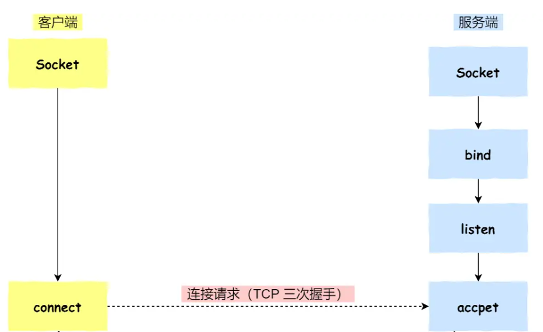

> Socket程序的调用过程流程图，客户端调用`connect()`后就是TCP三次握手的过程

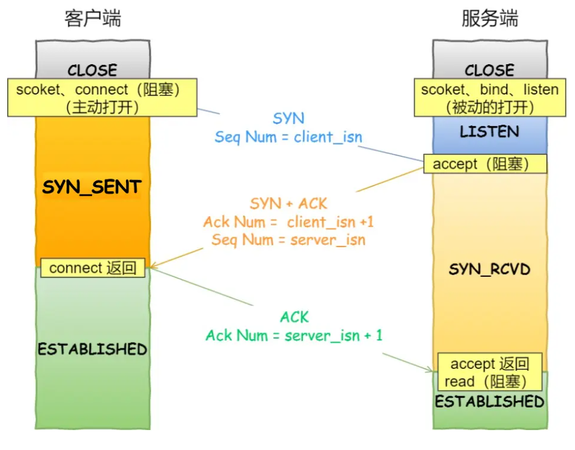

> 客户端 connect 成功返回是在第二次握手，服务端 accept 成功返回是在三次握手成功之后


在 TCP 连接的过程中，服务器的内核实际上为每个 Socket 维护了两个队列：

- 一个是「还没完全建立」连接的队列，称为 **TCP 半连接队列**，这个队列都是没有完成三次握手的连接，此时服务端处于 `syn_rcvd` 的状态；
- 一个是「已经建立」连接的队列，称为 **TCP 全连接队列**，这个队列都是完成了三次握手的连接，此时服务端处于 `established` 状态；

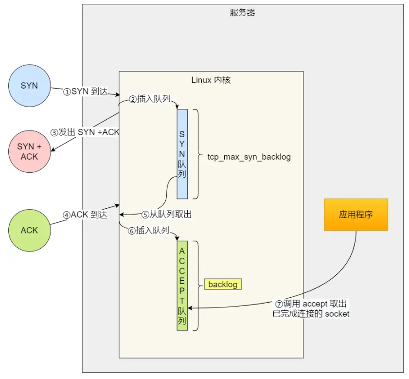

服务端的代码如下：	

```c++
/* 创建监听socket文件描述符 */
int listenfd = socket(PF_INET, SOCK_STREAM, 0);
/* 创建监听socket的TCP/IP的IPV4 socket地址 */
struct sockaddr_in address;
bzero(&address, sizeof(address));
address.sin_family = AF_INET;
address.sin_addr.s_addr = htonl(INADDR_ANY);  /* INADDR_ANY：将套接字绑定到所有可用的接口 */
address.sin_port = htons(port);

int flag = 1;
/* SO_REUSEADDR 允许端口被重复使用 */
setsockopt(listenfd, SOL_SOCKET, SO_REUSEADDR, &flag, sizeof(flag));
/* 绑定socket和它的地址 */
ret = bind(listenfd, (struct sockaddr*)&address, sizeof(address));  
/* 创建监听队列以存放待处理的客户连接，在这些客户连接被accept()之前 */
ret = listen(listenfd, 5);
```

> ```c
> int listen (int socketfd, int backlog)
> ```
>
> - 参数一 socketfd 为 socketfd 文件描述符
> - 参数二 backlog为等待连接队列的最大长度。这个参数指定了在接受连接请求后，等待处理的最大连接数。如果连接队列已满，新的连接请求将被拒绝。通常，这个值需要根据服务器的负载和性能需求来设置

补充：

在内核中 Socket 也是以「文件」的形式存在的，也是有对应的文件描述符

> 什么是文件描述符及其作用？
>
> 每一个进程都有一个数据结构 `task_struct`，该结构体里有一个指向「文件描述符数组」的成员指针。该数组里列出这个进程打开的所有文件的文件描述符。数组的下标是文件描述符，是一个整数，而数组的内容是一个指针，指向内核中**所有打开的文件的列表**，也就是说内核可以通过文件描述符找到对应打开的文件


### 1.2 服务端性能的不断改进

五种IO模型：`阻塞IO`,`非阻塞IO`,`IO多路复用`,`信号驱动IO`,`异步IO`，每一种IO模型的出现都是对前一种的升级优化。

`网络IO模型`的演变都是围绕着---**如何用尽可能少的线程去处理更多的连接**这个核心需求开始展开的。

[参考资料](https://mp.weixin.qq.com/s?__biz=Mzg2MzU3Mjc3Ng==&mid=2247483737&idx=1&sn=7ef3afbb54289c6e839eed724bb8a9d6&chksm=ce77c71ef9004e08e3d164561e3a2708fc210c05408fa41f7fe338d8e85f39c1ad57519b614e&scene=21#wechat_redirect)

这篇文章的写作思路为：

1. 以**内核空间**的视角来剖析网络数据的收发过程
2. 以**内核**的视角介绍了阻塞与非阻塞，同步与异步的概念
3. 介绍五种IO模型，重点介绍了其中的IO多路复用模型
4. 在`IO多路复用`中以技术演进的形式介绍了`select,poll,epoll`的原理和它们综合的对比
5. 以用户空间的角度介绍了IO线程模型（Reactor模型（单单、单多、多多）、Proactor模型）
6. 介绍了netty`中的`Reactor模型

> 每一个部分都写的很有深度，值得当参考资料阅读

#### 1.2.0 补充知识

内核在接收和发送网络数据包时做了什么事？

用户线程的内核态 vs 内核


非阻塞IO中线程的轮询，到底是在轮训什么？

这里轮训的是每一个socket，因为相比于阻塞IO，非阻塞IO需要达到的目的是用尽可能少的线程去处理更多的链接


阻塞IO中用户进程阻塞以及唤醒原理

进程是如何`阻塞`在`Socket`上，又是如何在`Socket`上被唤醒的？

IO调用在`tcp_recvmsg`内核函数中是如何将用户进程给阻塞掉的？

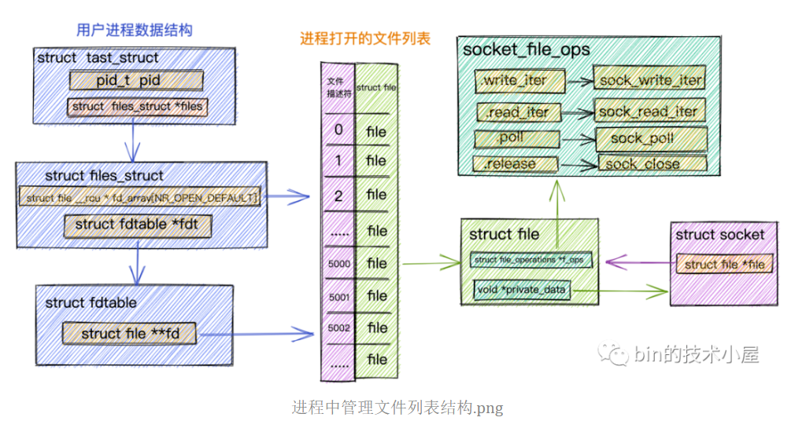

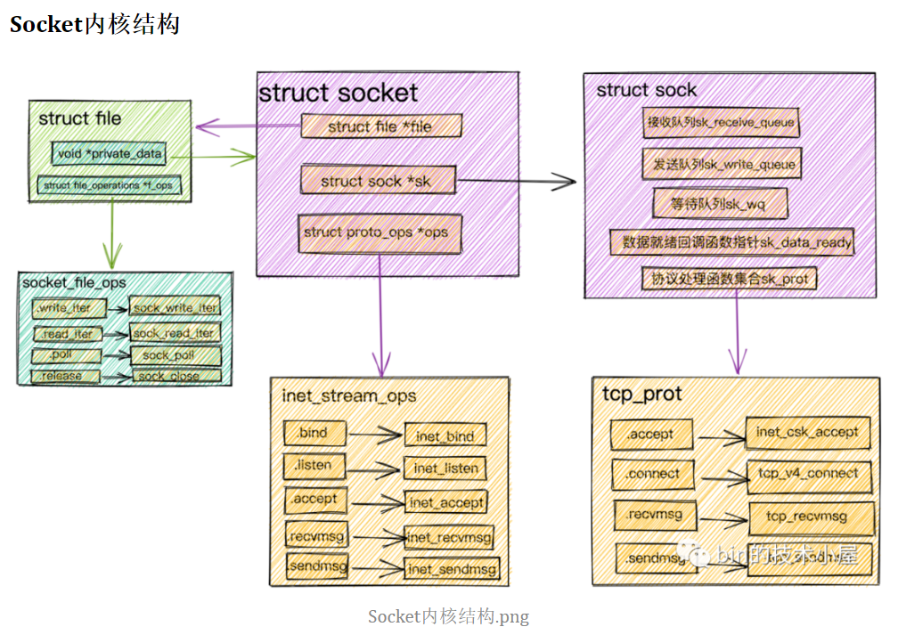

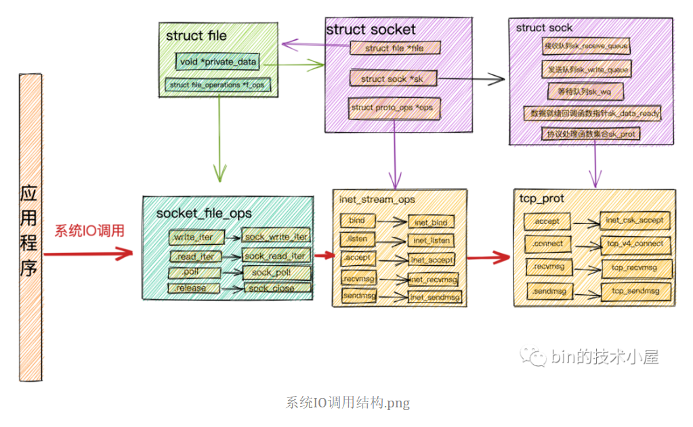

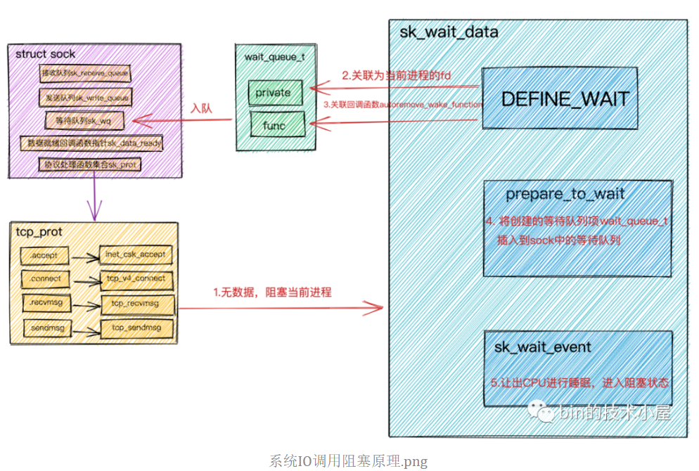


键是要理解记住`struct sock`中定义的等待队列上的等待类型`wait_queue_t`的结构

当数据包接收完毕后，用户进程是如何被唤醒的？

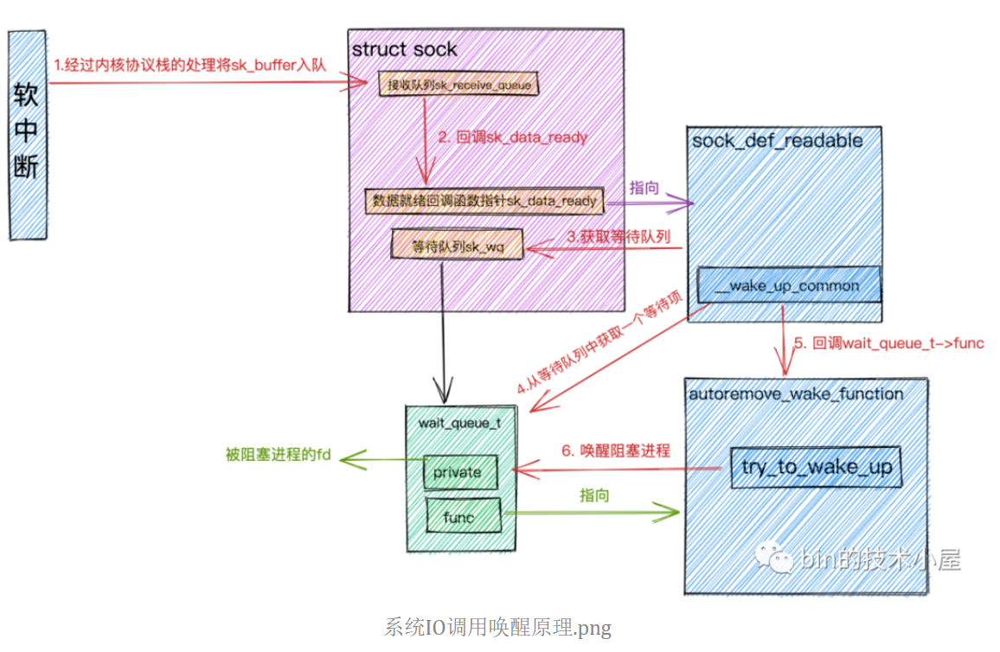


epoll_ctl向epoll对象中添加监听的Socket

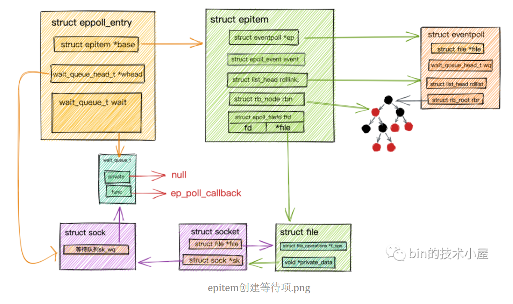


epoll_wait同步阻塞获取IO就绪的Socket

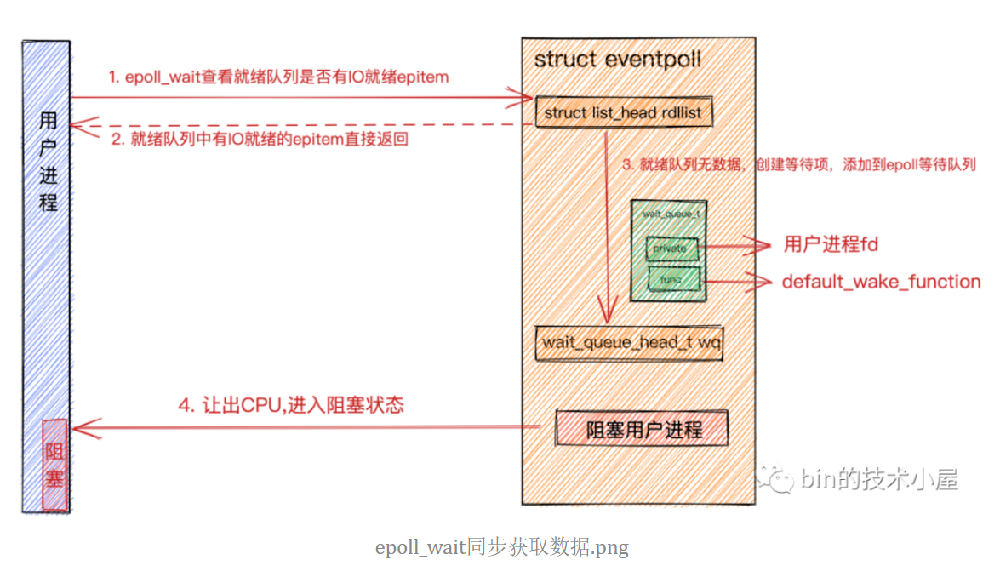


`epoll`的整个工作流程了

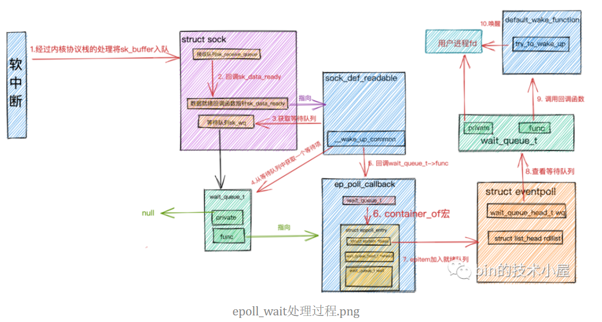


结合上边`epoll`的工作过程，再次对水平触发和边缘触发这两种模式做下解读

区分`socket`中的等待队列和`epoll`中的等待队列，两者有什么区别和联系

`内核空间`的视角来剖析网络数据的收发模型和`用户空间`的视角来看下如果对网络数据进行收发

相对`内核`来讲，`用户空间的IO线程模型`相对就简单一些。这些`用户空间`的`IO线程模型`都是在讨论当多线程一起配合工作时谁负责接收连接，谁负责响应IO 读写、谁负责计算、谁负责发送和接收，仅仅是用户IO线程的不同分工模式罢了。

#### 1.2.1 多进程模型

原理：

服务器的主进程负责监听客户的连接，一旦与客户端连接完成，accept() 函数就会返回一个「已连接 Socket」，这时就通过 `fork()` 函数创建一个子进程，实际上就把父进程所有相关的东西都**复制**一份，包括文件描述符、内存地址空间、程序计数器、执行的代码等。

缺点：

进程间上下文切换系统开销大，其切换不仅包含了虚拟内存、栈、全局变量等用户空间的资源，还包括了内核堆栈、寄存器等内核空间的资源。

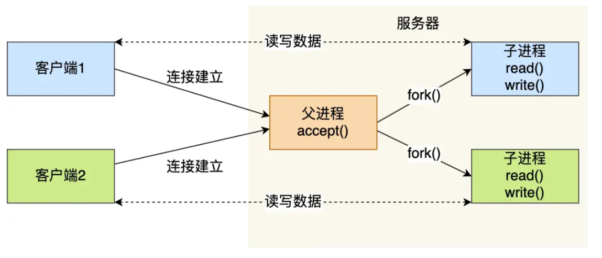

#### 1.2.2 多线程模型

原理：

单进程中可以运行多个线程，同进程里的线程可以共享进程的部分资源，比如文件描述符列表、进程空间、代码、全局数据、堆、共享库等，这些共享些资源在上下文切换时不需要切换，而只需要切换线程的私有数据、寄存器等不共享的数据，因此同一个进程下的线程上下文切换的开销要比进程小得多。

当服务器与客户端 TCP 完成连接后，通过 `pthread_create()` 函数创建线程，然后将「已连接 Socket」的文件描述符传递给线程函数，接着在线程里和客户端进行通信，从而达到并发处理的目的。

**线程池**的方式来避免线程的频繁创建和销毁

> 所谓的线程池，就是**提前**创建若干个线程，这样当由新连接建立时，将这个已连接的 Socket 放入到一个队列里，然后线程池里的线程负责从队列中取出「已连接 Socket 」进行处理，这个队列是**全局的**，每个线程都会操作，为了**避免多线程竞争**，线程在操作这个队列前要**加锁**。

缺点：

新到来一个 TCP 连接，就需要分配一个进程或者线程，当请求过万时，相当于要维护 1 万个进程/线程，操作系统就算死扛也是扛不住的。

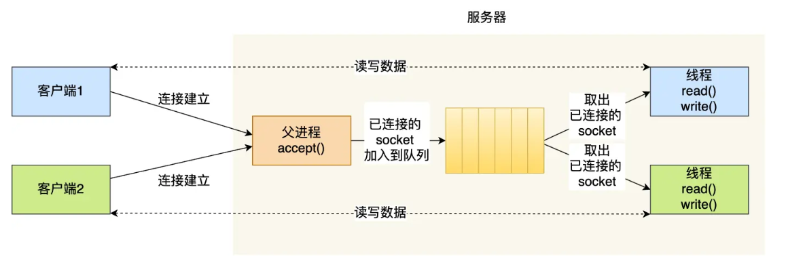


#### 1.2.3 I/O多路复用

上面的方法都是一个进程/线程维护一个Socket，当一个进程维护多个Socket并且控制对每一个Socket的最大处理时间就是I/O多路复用

一个进程虽然任一时刻只能处理一个请求，但是处理每个请求的事件时，耗时控制在 1 毫秒以内，这样 1 秒内就可以处理上千个请求

> 这里的事件是指什么？
>
> 这些事件可以包括**新的连接请求、数据可读、数据可写**等。内核会检查这些文件描述符的状态并将已准备好的文件描述符通知给用户态程序，以便用户态程序可以及时处理这些事件，而不需要等待或轮询。这样可以提高程序的性能和效率。


##### 从I/O多路复用演化到`select/poll/epoll`系统调用的过程

从I/O多路复用演化到`select/poll/epoll`系统调用的过程：

一个线程处理多个Socket，当其是同步I/O时，如果当前连接没有数据可读，那么线程会阻塞在 `read` 操作上，要解决这一个问题，最简单的方式就是将 Socket 改成非阻塞，然后线程不断地轮询调用 `read` 操作来判断是否有数据，但是轮询是要消耗 CPU ，效率低下。

上面问题的关键在于线程并不知道当前连接是否有数据可读，从而需要每次通过 `read` 去试探，而I/O 多路复用技术会用一个系统调用函数来**监听**我们所有关心的连接


实现I/O多路复用的系统调用的核心思想是：

1. 先把所有连接（文件描述符）传给内核
2. 再由内核返回产生了事件的连接
3. 然后在用户态中再处理这些连接对应的请求即可

select/poll/epoll 这是三个多路复用接口


**`epoll` 的工作方式**：

- `epoll` 是 Linux 特有的多路复用机制，它使用一组特殊的系统调用来实现高效的事件驱动模型。
- 进程通过调用 `epoll_create` 函数创建一个 epoll 实例，并通过 `epoll_ctl` 函数向实例中添加或删除套接字。
- 进程通过 `epoll_wait` 函数等待事件发生，当事件发生时，内核会通知进程，并返回就绪的文件描述符列表。
- `epoll` 具有很高的效率，因为它不需要像 `select` 和 `poll` 那样遍历整个集合，而只需要处理就绪的套接字。

> 服务器通过**epoll**这种I/O复用技术（还有select和poll）来实现对监听socket（`listenfd`）和连接socket（客户请求）的同时监听


select/poll/epoll 这是三个多路复用接口，epoll就一定是最好的吗？其分别适用于一些什么实际情况

当监测的fd数量较小，且各个fd都很活跃的情况下，建议使用select和poll；当监听的fd数量较多，且单位时间仅部分fd活跃的情况下，使用epoll会明显提升性能

> epoll和select/poll主要开销的来源
>
> 对于select和poll来说，所有文件描述符都是在用户态被加入其文件描述符集合的，每次调用都需要将整个集合拷贝到内核态；epoll则将整个文件描述符集合维护在内核态，每次添加文件描述符的时候都需要执行一个**系统调用**。系统调用的开销是很大的，而且在有**很多短期活跃连接**的情况下，epoll**由于这些大量的系统调用开销**可能会慢于select和poll
>
> select和poll的最大开销来自内核判断是否有文件描述符就绪这一过程：每次执行select或poll调用时，它们会采用遍历的方式，遍历整个文件描述符集合去判断各个文件描述符是否有活动；

疑点：什么是epoll回调函数？什么是epoll文件描述符？epoll对文件操作符的两种模式是怎么和上面这些疑问相联系的？


##### 如何由系统调用演化到两种处理模式

大佬们基于面向对象的思想，对 I/O 多路复用作了一层封装，让使用者不用考虑底层网络 API 的细节，只需要关注应用代码的编写。


两种事件处理模式：

* Reactor模式
* Proactor模式

> 两者的区别 ：
>
> - **Reactor 是非阻塞同步网络模式，感知的是就绪可读写事件**。在每次感知到有事件发生（比如可读就绪事件）后，就需要应用进程**主动调用** read 方法来完成数据的读取，也就是要应用进程主动将 socket 接收缓存中的数据读到应用进程内存中，这个过程是同步的，读取完数据后应用进程才能处理数据。
> - **Proactor 是异步网络模式， 感知的是已完成的读写事件**。在发起异步读写请求时，需要传入**数据缓冲区的地址**（用来存放结果数据）等信息，这样系统内核才可以自动帮我们把数据的读写工作完成，这里的读写工作全程由操作系统来做，并不需要像 Reactor 那样还需要应用进程主动发起 read/write 来读写数据，操作系统完成读写工作后，就会通知应用进程直接处理数据。
>
> 无论是 Reactor，还是 Proactor，都是一种基于「事件分发」的网络编程模式，区别在于 **Reactor 模式是基于「待完成」的 I/O 事件，而 Proactor 模式则是基于「已完成」的 I/O 事件**。

可惜的是，在 Linux 下的异步 I/O 是不完善的， `aio` 系列函数是由 POSIX 定义的异步操作接口，不是真正的操作系统级别支持的，而是在用户空间模拟出来的异步，并且仅仅支持基于本地文件的 aio 异步操作，网络编程中的 socket 是不支持的，这也使得基于 Linux 的高性能网络程序都是使用 Reactor 方案。

由于异步I/O并不成熟，实际中使用较少，因此在该项目中采用的是**同步I/O模拟的Proactor**事件处理模式，其工作流程如下：

- 主线程往epoll内核事件表注册socket上的读就绪事件
- 主线程调用epoll_wait等待socket上有数据可读
- 当socket上有数据可读，epoll_wait通知主线程，主线程从socket**循环**读取数据，直到没有更多数据可读，然后将读取到的数据封装成一个**请求对象**并插入请求队列
- **睡眠在请求队列上某个工作线程被唤醒**，它获得请求对象并处理客户请求，然后往epoll内核事件表中注册该socket上的写就绪事件
- 主线程调用epoll_wait等待socket可写
- 当socket上有数据可写，epoll_wait通知主线程。主线程往socket上写入服务器处理客户请求的结果

> 这里的同步I/O模拟的Proactor严格来说是单Reactor多线程处理模式
>
> 但是又有不同，单Reactor多线程是把对一个请求中的读和写于业务处理分离，读和写在主线程中，业务处理在线程池中
>
> 但是本项目中的读和写以及业务处理都是在线程池中


##### Reactor处理模式

单Reactor单线程


单Reactor多线程

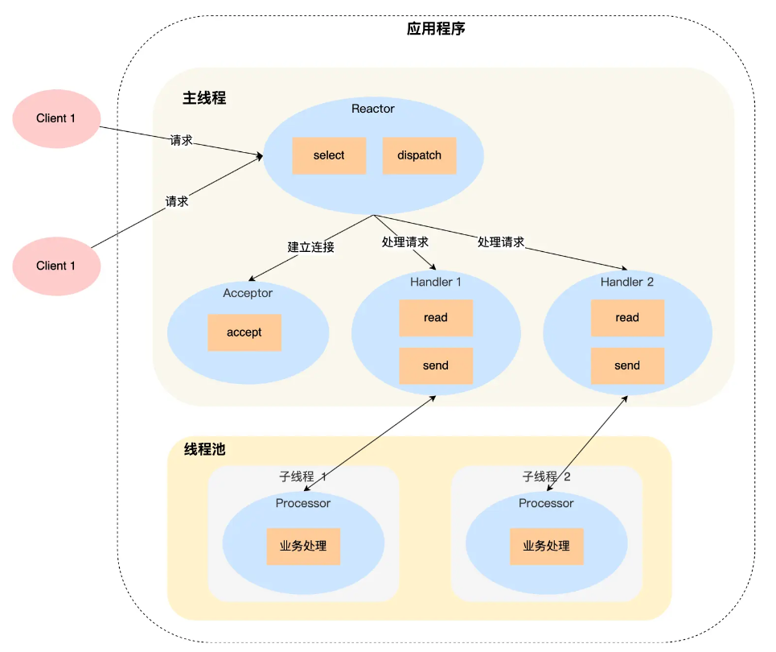


详细说一下这个方案：

- Reactor 对象通过 select （IO 多路复用接口） 监听事件，收到事件后通过 dispatch 进行分发，具体分发给 Acceptor 对象还是 Handler 对象，还要看收到的事件类型；
- 如果是连接建立的事件，则交由 Acceptor 对象进行处理，Acceptor 对象会通过 accept 方法 获取连接，并创建一个 Handler 对象来处理后续的响应事件；
- 如果不是连接建立事件， 则交由当前连接对应的 Handler 对象来进行响应；

上面的三个步骤和单 Reactor 单线程方案是一样的，接下来的步骤就开始不一样了：

- Handler 对象不再负责业务处理，只负责数据的接收和发送，Handler 对象通过 read 读取到数据后，会将数据发给子线程里的 Processor 对象进行业务处理；
- 子线程里的 Processor 对象就进行业务处理，处理完后，将结果发给主线程中的 Handler 对象，接着由 Handler 通过 send 方法将响应结果发送给 client；

单 Reator 多线程的方案优势在于**能够充分利用多核 CPU 的能**，那既然引入多线程，那么自然就带来了多线程竞争资源的问题。


##### 由两种处理模式演化到本项目所采用的方案

什么是并发模式中的同步和异步

- 同步指的是程序完全按照代码序列的顺序执行
- 异步指的是程序的执行需要由系统事件驱动


半同步/半异步工作模式：

定义：项目中主线程采用异步的工作模式，线程池中的工作线程采用同步的工作模式

- 同步线程用于处理客户逻辑
- 异步线程用于处理I/O事件
- 异步线程监听到客户请求后，就将其封装成请求对象并插入请求队列中
- 请求队列将通知某个工作在**同步模式的工作线程**来读取并处理该请求对象


半同步/半反应堆工作模式：

定义：是在半同步/半异步工作模式下将处理I/O事件改进为以I/O多路复用的方式处理

- 主线程充当异步线程，负责监听所有socket上的事件
- 若有新请求到来，主线程接收之以得到新的连接socket，然后往epoll内核事件表中注册该socket上的读写事件
- 如果连接socket上有读写事件发生，主线程从socket上接收数据，并将数据封装成请求对象插入到请求队列中
- 所有工作线程睡眠在请求队列上，当有任务到来时，通过竞争（如互斥锁）获得任务的接管权


## 2 线程同步

[参考资料1](https://xiaolincoding.com/os/4_process/pessim_and_optimi_lock.html#%E4%B9%90%E8%A7%82%E9%94%81%E4%B8%8E%E6%82%B2%E8%A7%82%E9%94%81)

[参考资料2](https://blog.csdn.net/nrsc272420199/article/details/105032873?spm=1001.2101.3001.6650.7&utm_medium=distribute.pc_relevant.none-task-blog-2%7Edefault%7EBlogCommendFromBaidu%7ERate-7-105032873-blog-124128546.235%5Ev38%5Epc_relevant_default_base3&depth_1-utm_source=distribute.pc_relevant.none-task-blog-2%7Edefault%7EBlogCommendFromBaidu%7ERate-7-105032873-blog-124128546.235%5Ev38%5Epc_relevant_default_base3&utm_relevant_index=9)

### 2.0 通过锁控制多线程的访问共享资源

多线程访问共享资源的时候，避免不了资源竞争而导致数据错乱的问题，所以我们通常为了解决这一问题，都会在访问共享资源之前加锁。

最常用的就是互斥锁，当然还有很多种不同的锁，比如自旋锁、读写锁、乐观锁等，不同种类的锁自然适用于不同的场景。

在一些高并发场景需要根据**加锁的成本开销**、**业务场景中访问共享资源的方式**、**被锁住代码的执行时间**、**并发访问共享资源时的冲突概率**等因素来选择合适的锁来减少锁对高并发性能的影响


对各种锁成本开销和适用场景分析：

1. 互斥锁：

**成本开销**：两次线程上下文切换的成本

* 当线程加锁失败时，内核会把线程的状态从「运行」状态设置为「睡眠」状态，然后把 CPU 切换给其他线程运行；
* 接着，当锁被释放时，之前「睡眠」状态的线程会变为「就绪」状态，然后内核会在合适的时间，把 CPU 切换给该线程运行。

**适用场景**：

被锁住代码的执行时间相对较长


2. 自旋锁

**原理**：通过CAS函数在「用户态」完成加锁和解锁操作，不会主动产生线程上下文切换，当发生多线程竞争锁的情况，加锁失败的线程会「忙等待」，直到它拿到锁

**成本开销**：加锁失败时通过`while` 循环等待或者CPU 提供的 `PAUSE` 指令来实现「忙等待」的开销

**适用场景**：被锁住代码的执行时间比较短，这样忙等待的成本开销就会少


3. 乐观锁与悲观锁

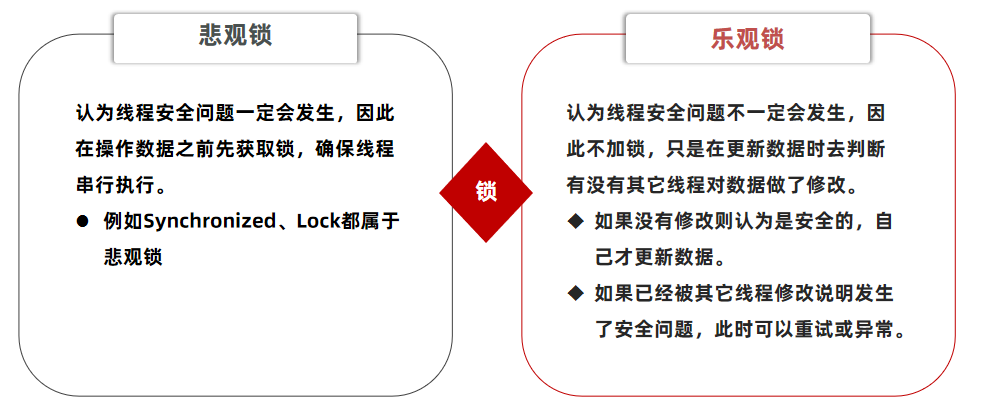

CAS其实就是乐观锁，有三个参数：内存位置的实际值、预期的内存位置的值、需要更新的新值，每次在更新新值时需要将前面两个参数的值进行比较，只有当前面两个参数的值相同时才会取进行更新

> 前面两个参数的值可以理解为版本号，只有当我们操作的版本号是我们预期的版本号时才能代表我们这次在修改之前没有其他人进行修改过，因为如果有其他人进行修改过那我们操作的版本号必然不等于我们预期的版本号


### 2.0 负载均衡的原理

[参考资料](https://xiaolincoding.com/os/8_network_system/hash.html#%E5%A6%82%E4%BD%95%E5%88%86%E9%85%8D%E8%AF%B7%E6%B1%82)

为什么要做负载均衡：

当多台服务器对外提供服务时，如何分配客户端的请求到多台服务器其中的一台上


一致性哈希算法：

引入的原因：当多台服务器组成一个分布式系统时，每一台服务器都有其对应可以处理的客户端请求集合，因此可以通过hash算法来将客户端的请求映射到其对应的服务器上。

由于服务器可能会发生故障或者需要增加服务器的数量时，客户端的请求和对应服务器的映射方式可能会发生改变，简单的hash算法可能需要进行全部映射关系的改变，这样成本很高，因此就引入了一致性哈希算法


实现的原理：

将服务器和客户端都根据其ip地址映射到一个hash环上面，客户端映射的结果值往顺时针方向找到的第一个服务器映射的结果值代表这个服务器可以处理这个请求


优势：

* 减少了数据迁移量
* 当引入虚拟服务器节点时可以提高稳定性


代码简单实现：

[参考资料](https://blog.csdn.net/qq_35102066/article/details/103153002?spm=1001.2101.3001.6650.1&utm_medium=distribute.pc_relevant.none-task-blog-2%7Edefault%7ECTRLIST%7ERate-1-103153002-blog-115457671.235%5Ev38%5Epc_relevant_default_base3&depth_1-utm_source=distribute.pc_relevant.none-task-blog-2%7Edefault%7ECTRLIST%7ERate-1-103153002-blog-115457671.235%5Ev38%5Epc_relevant_default_base3&utm_relevant_index=2)

```c++
class Node
{
public:
	Node(string _addr) :NodeAddr(_addr)
	{
	}
	string getNode()
	{
		return NodeAddr;
	}
	void setNodeAddr(string _addr)
	{
		this->NodeAddr = _addr;
	}
	void addCliNode(Node cli)
	{
		CliNodes.push_back(cli);
	}
	void printNodeState()
	{
		cout << "当前节点地址：" << NodeAddr << "   哈希值：" << hs(NodeAddr) << endl;
		for (Node& n : CliNodes)
		{
			cout << "客户端节点地址：" << n.getNode() << "   哈希值：" << hs(n.getNode()) << endl;
		}
		cout << endl << endl << endl;
	}
private:
	string NodeAddr;
	vector<Node> CliNodes;
};
```

Node存储的是服务点的节点，`string NodeAddr`代表服务端的地址，`vector<Node> CliNodes`代表有哪一些客户端映射到了这个服务端的节点

`hs()`函数是将ip地址映射到哈希环上位置的函数

`void addCliNode(Node cli)`函数代表将客户端节点添加到服务端

> 上面的位置其实指的是将ip地址进过哈希运算后的hash值

```c++
class HashRing
{
public:
    // 添加服务器节点到哈希环中
	void addNode(string _addr)
	{
		Node newNode(_addr);
		ServerNodes.insert(make_pair(hs(_addr), move(newNode)));
	}
    // 从哈希环中移除指定地址的服务器节点
	void removeNode(string _addr)
	{
		size_t hashvalue = hs(_addr);
		ServerNodes.erase(hashvalue);
	}
	void distributionNode(string _addr)
	{
		auto it = ServerNodes.lower_bound(hs(_addr));
		if (it == ServerNodes.end())
		{
			it = ServerNodes.begin();
		}
		it->second.addCliNode(Node(_addr));
	}
	void printHashRingState()
	{
		for (auto it = ServerNodes.begin(); it != ServerNodes.end(); ++it)
		{
			it->second.printNodeState();
		}
	}
private:
	map<size_t, Node> ServerNodes;
};
```

`map<size_t, Node> ServerNodes`根据哈希环上的位置（hash值）找到对应的服务器节点

`void distributionNode(string _addr)`，计算客户端ip地址在哈希环上面的位置，找距离该位置最近的一个服务端节点ip地址在hash表中的位置）进而这个服务器节点，并将该客户端节点添加进入服务器节点的`vector<Node> CliNodes`，从而建立客户端到服务器的映射

> `lower_bound` 函数来查找哈希环中大于或等于给定哈希值 `_addr` 的下一个节点。在哈希环中，节点按照其哈希值的顺序排列。


在上面的代码基础上在哈希环上添加多个虚拟节点

```c++
class HashRingWithVirtualNode
{
public:
	HashRingWithVirtualNode(int num) :VirtualNodeNum(num)
	{
	}
	void addNode(string _addr)
	{
		for (int i = 0; i < VirtualNodeNum; ++i)
		{
			_addr.append(1, (i % 128));//为虚拟节点命名
			Node newNode(_addr);//
			ServerNodes.insert(make_pair(hs(_addr), move(newNode)));
		}
	}
	void removeNode(string _addr)
	{
		for (int i = 0; i < VirtualNodeNum; ++i)
		{
			_addr.append(1, (i % 128));
			size_t hashvalue = hs(_addr);
			ServerNodes.erase(hashvalue);
		}

	}
	void distributionNode(string _addr)
	{
		auto it = ServerNodes.lower_bound(hs(_addr));
		if (it == ServerNodes.end())
		{
			it = ServerNodes.begin();
		}
		it->second.addCliNode(Node(_addr));
	}
	void printHashRingState()
	{
		for (auto it = ServerNodes.begin(); it != ServerNodes.end(); ++it)
		{
			it->second.printNodeState();
		}
	}
private:
	map<size_t, Node> ServerNodes;
	int VirtualNodeNum;
};
```

c++map底层是用红黑树实现的，因此哈希环插入节点和寻找节点效率都能达到$logn$

但是还有为客户端寻找对应的服务器节点的时间复杂度，该时间复杂度在参考资料有简单分析


### 2.1 同步机制分装类

将锁的创建与销毁函数**封装**在类的构造与析构函数中，来实现**资源获取即初始化**（Resource Acquisition is Initialization）的机制

#### 2.1.1 信号量

POSIX（Portable Operating System Interface）信号量是一种用于线程间或进程间同步和互斥的同步原语。它们是一种在多线程或多进程环境中控制资源访问的机制，用于协调多个并发执行的线程或进程，以确保它们正确地访问共享资源，避免竞态条件（race conditions）和其他并发问题。

POSIX信号量具有以下几个主要特点：

1. **计数器**：每个POSIX信号量都有一个计数器，通常初始化为非负整数值。这个计数器表示资源的可用数量，可以被线程或进程等待和释放。

2. **等待和释放操作**：POSIX信号量提供了两种基本操作，即等待（wait）和释放（post）：

   - `sem_wait`：用于等待信号量。如果信号量的计数器大于0，它将计数器减1并立即返回。否则，它会阻塞调用线程，直到计数器变为大于0为止。

   > ```c++
   > bool wait()
   > {
   >     /*
   >         这个方法用于等待信号量。它调用 sem_wait 来等待信号量的值变为大于等于1。
   >         如果 sem_wait 返回0，表示成功等待，函数返回 true。否则，返回 false。
   >     */
   >     return sem_wait(&m_sem) == 0;
   > }
   > ```
   >
   > 对等待成功和等待失败的解释：
   >
   > 如果成功等待（即信号量的值大于等于1），它会立即返回并继续执行后续的代码，不会阻塞当前线程。在这种情况下，`sem_wait` 返回0，表示成功等待，函数会返回 `true`。
   >
   > 只有当信号量的值为0时，`sem_wait` 才会阻塞当前线程，等待信号量的值变为大于等于1，然后才会解除阻塞，继续执行。如果在等待期间出现错误，`sem_wait` 会返回一个非零的错误代码，表示等待失败，此时函数会返回 `false`。

   - `sem_post`：用于释放信号量。它将信号量的计数器加1，并唤醒等待在该信号量上的**一个或多个**线程，以便它们可以继续执行。

3. **互斥和同步**：POSIX信号量可以用于实现互斥锁（mutex）和条件变量（condition variable）等高级同步机制。通过适当地使用信号量，可以实现对共享资源的互斥访问和线程/进程之间的协调。

> 两个进程互斥访问共享内存，我们可以初始化信号量为 `1`
>
> 用信号量来实现多进程同步的方式，我们可以初始化信号量为 `0`

4. **进程间和线程间可用**：POSIX信号量可以在不同进程之间（使用`sem_open`和`sem_unlink`）或同一进程内的不同线程之间使用，具有广泛的适用性。

5. **错误处理**：POSIX信号量函数通常返回错误代码，允许应用程序处理错误情况，例如初始化失败或信号量被销毁。


#### 2.1.2 互斥量

互斥锁，也称互斥量，可以保护关键代码段，以确保独占式访问。当进入关键代码段,获得互斥锁将其加锁；离开关键代码段,唤醒等待该互斥锁的线程


#### 2.1.3 条件变量

条件变量提供了一种线程间的通知机制，当某个**共享数据**达到某个值时，唤醒等待这个共享数据的线程


`lock.h`对这两个部分也进行了分装，互斥量的本质其实就是对信号量初始化为1，条件变量的本质其实是进程间的一种同步方式，这里重点说明一下封装在条件变量下的P操作

```c++
bool wait(pthread_mutex_t *m_mutex)
{
    int ret = 0;
    //pthread_mutex_lock(&m_mutex);
    ret = pthread_cond_wait(&m_cond, m_mutex);
    //pthread_mutex_unlock(&m_mutex);
    return ret == 0;
}
```

> 在调用 `pthread_cond_wait` 函数时，函数内部会进行以下操作：
>
> 1. **释放互斥锁（m_mutex）**：`pthread_cond_wait` 首先会释放传入的互斥锁（`m_mutex`），这是为了允许其他线程获得该锁并访问临界区，以便执行可能会修改条件的操作。释放互斥锁是原子操作，这意味着它会解锁互斥锁并将当前线程放入条件变量的等待队列，同时阻塞当前线程。
> 2. **等待条件变量信号**：一旦互斥锁被释放，当前线程就会阻塞等待条件变量（`m_cond`）的信号。这个信号通常是由其他线程使用 `pthread_cond_signal` 或 `pthread_cond_broadcast` 发出的。一旦收到信号，线程就会被唤醒。
> 3. **重新获得互斥锁**：当线程被唤醒并且从 `pthread_cond_wait` 返回时，它会重新尝试获得互斥锁。这是为了确保线程在继续执行之前能够再次锁定互斥锁。只有当线程成功获得互斥锁后，它才能继续执行。


### 2.2 进程间的通信方式

为什么进程之间需要通信？

每个进程的用户地址空间都是独立的，一般而言是不能互相访问的，但内核空间是每个进程都共享的，所以进程之间要通信必须通过内核。

#### 2.2.1 管道

```bash
ps auxf | grep mysql
```

上面命令行里的「`|`」竖线就是一个**管道**，它的功能是将前一个命令（`ps auxf`）的输出，作为后一个命令（`grep mysql`）的输入，从这功能描述，可以看出**管道传输数据是单向的**，如果想相互通信，我们需要创建两个管道才行。

上面的管道是匿名管道，匿名管道的创建，需要通过系统调用`int pipe(int fd[2])`。

该系统调用返回了两个描述符，一个是管道的读取端描述符 `fd[0]`，另一个是管道的写入端描述符 `fd[1]`。注意，这个匿名管道是特殊的文件，只存在于内存，不存于文件系统中。

由于`fork`系统调用创建的子进程，会复制父进程的文件描述符，因此可以通过`fork`来实现父子进程的系统调用

在 shell 里面执行 `A | B`命令的时候，A 进程和 B 进程都是 shell 创建出来的子进程，A 和 B 之间不存在父子关系，它俩的父进程都是 shell

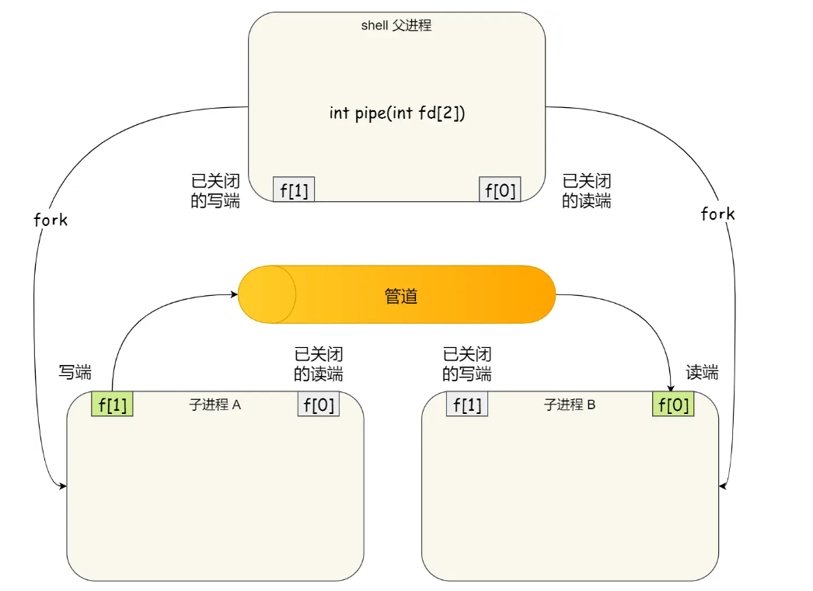


### 2.3 线程池

#### 2.3.1 前置知识

`m_threads = new pthread_t[m_thread_number];`

这行代码的作用是在堆内存上动态分配了一个 `pthread_t` 数组，数组的大小由 `m_thread_number` 决定，然后将数组的首地址（指向第一个元素的指针）赋值给线程池类的成员变量 `m_threads`。这个数组将用于存储线程的描述符，以便后续可以创建和管理多个工作线程。在使用完这个数组后，应该在适当的时候使用 `delete[] m_threads;` 来释放这块内存区域，以避免内存泄漏。


`pthread_create(m_threads + i, NULL, worker, this)` 

* `m_threads + i` 表示数组中第 `i` 个元素的地址，即线程描述符的地址。这个地址将用于存储新线程的描述符。
* `NULL`：这是线程的属性，表示线程的默认属性。在这里，我们使用默认属性
* `worker`：这是新线程将执行的函数的指针。`worker` 函数是线程的入口函数，新线程将从这个函数开始执行。

> 该函数，要求为静态函数。如果处理线程函数为类成员函数时，需要将其设置为**静态成员函数**。
>
> `pthread_create` 函数要求线程函数为静态成员函数的原因是因为非静态成员函数通常需要一个特定对象的实例来调用，**而线程函数的执行是在没有实例化对象的情况下进行的**。静态成员函数没有隐含的实例对象，因此可以直接通过函数指针调用，不需要实例。

* `this`：这是传递给 `worker` 函数的参数。在这里，我们将线程池对象的指针传递给新线程，以便新线程知道它属于哪个线程池对象，以及在需要时可以访问线程池的成员变量和方法。


`pthread_detach(m_threads[i])`

分离状态的线程在退出时会自动释放其资源，而不需要其他线程调用 `pthread_join` 来等待它的退出，这是因为设置线程为分离状态告诉操作系统，当前线程不关心该线程的退出状态或返回值，也不需要等待它的结束。


问题：

将线程通过线程池类来管理的好处？为什么线程的创建是在线程池类的构造函数里面？创建线程是通过线程池的大小for循环创建，并且在创建线程的过程中会去执行函数，如果在这个执行的过程中该函数发生了阻塞，那会发生什么？


#### 2.3.2 整体思路

项目中的Reactor处理模式和Proactor处理模式都是单Reactor多线程模型，两者的区别是：

* Reactor处理模式：读、处理、写都交给线程池中的线程来做

* Proactor处理模式：读、处理、写只有处理部分交给线程池中的线程来做，读和写还是主线程来做

对于Reactor处理模式：主线程为异步线程，负责监听文件描述符，接收socket新连接，若当前监听的socket发生了读写事件，然后将任务插入到请求队列。工作线程从请求队列中取出任务，完成读数据+处理数据+写数据。

对于Proactor处理模式：主线程为异步线程，负责监听文件描述符，接收socket新连接，若当前监听的socket发生了读写事件，先由主线程读数据，然后将任务插入到请求队列。工作线程从请求队列中取出任务，完成处理数据。之后再交由主线程写数据。


#### 2.3.3 代码分析

这里的`T`就是**链接对象**，请求队列中的任务其实就是一个一个的链接对象

```c++
template <typename T>
class threadpool
{
/*
省略...
*/
private:
    int m_thread_number;        //线程池中的线程数
    int m_max_requests;         //请求队列中允许的最大请求数
    pthread_t *m_threads;       //描述线程池的数组，其大小为m_thread_number
    std::list<T *> m_workqueue; //请求队列
    locker m_queuelocker;       //保护请求队列的互斥锁
    sem m_queuestat;            //是否有任务需要处理
    connection_pool *m_connPool;  //数据库

    /*
    0，Proactor模型
    1，Reactor模型
    */
    int m_actor_model;          //模型切换
};
```

成员变量分析：

`sem m_queuestat`

需要设置一个信号量`m_queuestat`来协调主线程和线程池中的工作线程之间工作顺序，由于一开始的请求队列中的任务（链接对象）为0，因此信号量`m_queuestat`需要初始化为0。


`connection_pool *m_connPool`

用户请求的资源其实是一个个在服务器中的**文件**，当用户是post请求并且请求的内容为注册和登录，服务器还需要与**数据库联动**，在数据库中插入校验成功之后的用户信息，并返回相应的登录界面。由于在处理任务的过程中可能需要访问到数据库，因此在线程池类中需要绑定一个数据库连接池类


```c++
template <typename T>
class threadpool
{
public:
    threadpool(int actor_model, connection_pool *connPool, int thread_number = 8, int max_request = 10000);
    ~threadpool();
    bool append(T *request, int state);
    bool append_p(T *request);

private:
    /*工作线程运行的函数，它不断从工作队列中取出任务并执行之*/
    /*
    void * 表示该函数返回一个指向未指定类型的指针的值。
    这种类型通常用于通用函数，它可以返回不同类型的指针，具体的类型由函数的实现确定。
    */
    static void *worker(void *arg);
    void run();
/*
省略...
*/
};
```

成员函数分析：

`threadpool()`

```c++
template <typename T>
threadpool<T>::threadpool( int actor_model, connection_pool *connPool,
int thread_number, int max_requests) : 
m_actor_model(actor_model),m_thread_number(thread_number), 
m_max_requests(max_requests), m_threads(NULL),m_connPool(connPool)
{
    if (thread_number <= 0 || max_requests <= 0)
        throw std::exception();
    m_threads = new pthread_t[m_thread_number];
    if (!m_threads)
        throw std::exception();
    for (int i = 0; i < thread_number; ++i)
    {
        if (pthread_create(m_threads + i, NULL, worker, this) != 0)
        {
            delete[] m_threads;
            throw std::exception();
        }
        if (pthread_detach(m_threads[i]))
        {
            delete[] m_threads;
            throw std::exception();
        }
    }
}
```

`m_threads = new pthread_t[m_thread_number]`在构造函数中创建线程池，`pthread_create`函数中将**类的对象**作为**参数**传递给**静态函数**(`worker`)，在静态函数中引用这个对象，并调用其私有成员函数(`run`)


`worker()`静态函数

```c++
void *threadpool<T>::worker(void *arg)
{
    threadpool *pool = (threadpool *)arg;
    pool->run();
    return pool;
}
```

类对象传递时用this指针，传递给静态函数后，将其转换为线程池类，并调用私有成员函数run


`run()`函数，该函数才是真正完成线程处理的相关要求，这里的`request`其实就是**链接对象**

```c++
void threadpool<T>::run()
{
    while (true)
    {
        /*
        省略从请求队列中取出一个任务，并将其删除
        */
        if (1 == m_actor_model)
        {
            // 处理读
            if (0 == request->m_state)
            {
                if (request->read_once())
                {
                    request->improv = 1;
                    connectionRAII mysqlcon(&request->mysql, m_connPool);
                    request->process();
                }
                else
                {
                    request->improv = 1;
                    request->timer_flag = 1;
                }
            }
            // 处理写
            else
            {
                if (request->write())
                {
                    request->improv = 1;
                }
                else
                {
                    request->improv = 1;
                    request->timer_flag = 1;
                }
            }
        }
        else
        {
            connectionRAII mysqlcon(&request->mysql, m_connPool);
            request->process();
        }
    }
}
```

当`1 = m_actor_model`代表==Reactor处理模式==，读数据在线程池中的工作线程进行，通过链接对象（request）中的两个成员变量（标志位）`int timer_flag`、`int improv`来判断读取数据是否成功，主线程根据这两个标志位来做进一步的处理

`connectionRAII mysqlcon(&request->mysql, m_connPool)`代表当读取数据成功时需要获取数据库连接池中的一个数据库连接对象来进行可能的数据库操作

`request->process()`代表进行真正的读取数据后的处理操作


当`1 != m_actor_model`代表==Proactor处理模式==，读取数据的操作**已经**在主线程中完成，在线程池中的工作线程中只需要进行数据处理的相关工作，对应上面的第41、42行


#### 2.3.4 工作流程串联分析

线程池的主要构成：

1. 线程池管理器：用于创建并管理线程
2. 工作线程：线程池中的线程
3. 任务队列：用于存放没有处理的任务。提供一种缓冲机制。
4. 用于添加任务的接口

part0:

线程池在主程序中（WebServer类中的`WebServer::thread_pool()`函数）创建

```c++
//在主程序中创建线程池
server.thread_pool();

void WebServer::thread_pool()
{
    //线程池
    m_pool = new threadpool<http_conn>(m_actormodel, m_connPool, m_thread_num);
}
```


part1:

项目中的线程池管理类为：

```c++
class threadpool
{
private:
    int m_thread_number;        //线程池中的线程数
    int m_max_requests;         //请求队列中允许的最大请求数
    pthread_t *m_threads;       //描述线程池的数组，其大小为m_thread_number
    std::list<T *> m_workqueue; //请求队列
    locker m_queuelocker;       //保护请求队列的互斥锁
    sem m_queuestat;            //是否有任务需要处理
    connection_pool *m_connPool;  //数据库
    /*
    0，Proactor模型
    1，Reactor模型
    */
    int m_actor_model;          //模型切换
    //省略...
}
```

该管理类会在主线程中创建，通过WebServer类的对象创建

```c++
void WebServer::thread_pool()
{
    //线程池
    m_pool = new threadpool<http_conn>(m_actormodel, m_connPool, m_thread_num);
}
```

线程池管理类会在其构造函数中创建线程

```c++
threadpool<T>::threadpool( int actor_model, connection_pool *connPool, int thread_number, int max_requests) : m_actor_model(actor_model),m_thread_number(thread_number), m_max_requests(max_requests), m_threads(NULL),m_connPool(connPool)
{
    /*
    创建线程数组：然后，它会创建一个 pthread_t 类型的数组 m_threads，用于存储线程的描述符。
    */
    m_threads = new pthread_t[m_thread_number];
    if (!m_threads)
        throw std::exception();
    for (int i = 0; i < thread_number; ++i)
    {
        if (pthread_create(m_threads + i, NULL, worker, this) != 0)
        {
            // 删除整个线程描述符数组 m_threads 的目的是确保释放已经分配的内存资源
            delete[] m_threads;
            throw std::exception();
        }
        if (pthread_detach(m_threads[i]))
        {
            delete[] m_threads;
            throw std::exception();
        }
    }
}
```


part2:

工作线程就是线程池管理类中的私有成员变量，是一个数组

```c++
class threadpool
{
private:
	//省略...
    pthread_t *m_threads;       //描述线程池的数组，其大小为m_thread_number
    //省略...
}
```


part3:

任务队列是用来存放任务，这里的任务线程池里的线程可以处理，**任务可以是对象也可以是某个函数**，项目中的任务是对象。任务队列由于是共享的，操作之前需要加锁

```c++
bool threadpool<T>::append(T *request, int state)
{
    m_queuelocker.lock();
    if (m_workqueue.size() >= m_max_requests)
    {
        m_queuelocker.unlock();
        return false;
    }
    request->m_state = state;
    m_workqueue.push_back(request);
    m_queuelocker.unlock();
    m_queuestat.post();
    return true;
}
```


part4:

当任务队列中有任务的时候，如何去处理这些任务，这个时候就需要添加任务处理的接口。**如果任务是对象，就需要根据取出的任务对象调用其处理任务的接口来进行任务处理**

线程在取任务时同样也要加锁，**当任务队列中没有任务时就需要停下来等待有任务到来信号的唤醒**

```c++
template <typename T>
void *threadpool<T>::worker(void *arg)
{
    // 将参数强转为线程池类，调用成员方法
    /*
    类对象传递时用this指针，传递给静态函数后，将其转换为线程池类，并调用私有成员函数run。
    */
    threadpool *pool = (threadpool *)arg;
    pool->run();
    return pool;
}

template <typename T>
void threadpool<T>::run()
{
    while (true)
    {
        // 信号量等待
        m_queuestat.wait();
        // 被唤醒后先加互斥锁 
        m_queuelocker.lock();
        if (m_workqueue.empty())
        {
            m_queuelocker.unlock();
            continue;
        }
        /*
        从请求队列中取出第一个任务并将任务从请求队列删除
        */
        T *request = m_workqueue.front();
        m_workqueue.pop_front();
        m_queuelocker.unlock();
        if (!request)
            continue;
        /*
        根据取出的任务request，调用其处理任务的接口进行任务处理
        省略...
        */
    }
}
```

> 本项目的处理模式与单Reactor多线程模式是有不同的，单Reactor多线程模式是把对一个请求中的读和写和业务处理分离，读和写在主线程中，业务处理在线程池中
>
> 但是本项目中的读和写以及业务处理**都是在**线程池中

读和写以及业务处理**都是在**线程池中在项目代码中的体现，`request->read_once()`函数用于真正读取数据，根据读取数据的结果来确定任务是否需要调用处理函数接口`request->process()`，已经设置任务对象（连接对象）的`improv`和`timer_flag`值，主程序中的`void WebServer::dealwithread(int sockfd)`函数会根据这两个值来判断线程池是否进行了读取数据的操作，如果在读取数据的过程中就发送错误就会关闭这个连接对象。

```c++
void threadpool<T>::run()
{
    while (true)
    {
        //省略...
        /*
        并发模型选择
        选择反应堆模型，默认Proactor
        0，Proactor模型
        1，Reactor模型
        */
        if (1 == m_actor_model)
        {
            // 处理读
            if (0 == request->m_state)
            {
                if (request->read_once())
                {
                    request->improv = 1;
                    connectionRAII mysqlcon(&request->mysql, m_connPool);
                    request->process();
                }
                else
                {
                    request->improv = 1;
                    request->timer_flag = 1;
                }
            }
            // 处理写
            else
            {
                if (request->write())
                {
                    request->improv = 1;
                }
                else
                {
                    request->improv = 1;
                    request->timer_flag = 1;
                }
            }
        }
        else
        {
            connectionRAII mysqlcon(&request->mysql, m_connPool);
            // process(模板类中的方法,这里是http类)进行处理
            request->process();
        }
    }
}
```

==重点！！！==

项目中的Reactor处理模式和Proactor处理模式都是单Reactor多线程模型，两者的区别是：

* Reactor处理模式：读、处理、写都交给线程池中的线程来做

* Proactor处理模式：读、处理、写只有处理部分交给线程池中的线程来做，读和写还是主线程来做

在代码中的体现：

* Reactor处理模式中在`void WebServer::dealwithread(int sockfd)`函数是先将任务（连接对象）加入任务队列，读是交给了线程池中的线程来处理，将读处理结果返回给了连接对象中的`improv`和`timer_flag`成员变量，因此主程序就能根据读取到的结果做进一步处理，比如当线程读取数据失败时，会设置`request->timer_flag = 1`，主程序根据该值是否等于1做是否关闭该连接对象的处理

```c++
if (1 == users[sockfd].timer_flag)
{
deal_timer(timer, sockfd);
users[sockfd].timer_flag = 0;
}
```

* Proactor处理模式中先在`void WebServer::dealwithread(int sockfd)`函数中做读取数据的操作然后再将任务（连接对象）加入任务队列，因此线程池中的线程只需要做任务处理的部分就好

```c++
void WebServer::dealwithread(int sockfd)
{
    //创建定时器临时变量，将该连接对应的定时器取出来
    util_timer *timer = users_timer[sockfd].timer;

    //reactor
    if (1 == m_actormodel)
    {
        /*
        若有数据传输，则将定时器往后延迟3个单位
        对其在链表上的位置进行调整
        */
        if (timer)
        {
            adjust_timer(timer);
        }

        //若监测到读事件，将该事件放入请求队列
        m_pool->append(users + sockfd, 0);

        while (true)
        {
            if (1 == users[sockfd].improv)
            {
                if (1 == users[sockfd].timer_flag)
                {
                    deal_timer(timer, sockfd);
                    users[sockfd].timer_flag = 0;
                }
                users[sockfd].improv = 0;
                break;
            }
        }
    }
    else
    {
        //proactor
        if (users[sockfd].read_once())
        {
            LOG_INFO("deal with the client(%s)", inet_ntoa(users[sockfd].get_address()->sin_addr));

            //若监测到读事件，将该事件放入请求队列
            m_pool->append_p(users + sockfd);

            /*
            若有数据传输，则将定时器往后延迟3个单位
            对其在链表上的位置进行调整
            */
            if (timer)
            {
                adjust_timer(timer);
            }
        }
        else
        {
            //服务器端关闭连接，移除对应的定时器
            deal_timer(timer, sockfd);
        }
    }
}
```


## 3 http

### 3.1 对与epoll相关系统调用的介绍

`int epoll_ctl(int epfd, int op, int fd, struct epoll_event *event)`函数

`epoll_ctl` 函数是 Linux 中用于控制 epoll 实例的函数，它允许你**添加、修改或删除**与 epoll 监视**文件描述符集合**相关的事件。下面是 `epoll_ctl` 函数的参数详细介绍：

1. `epfd`（epoll 文件描述符）：

   - 这是一个整数参数，用于指定 epoll 实例的文件描述符，它标识了你要操作的 epoll 对象。
   - 在调用 `epoll_create` 函数创建 epoll 实例后，会返回一个文件描述符，这个文件描述符必须传递给 `epoll_ctl` 函数，以指定要操作的 epoll 实例。

2. `op`（操作类型）：

   - 这是一个整数参数，用于指定要执行的操作类型。它可以是以下几个值之一：
     - `EPOLL_CTL_ADD`：添加一个文件描述符到 epoll 实例中。
     - `EPOLL_CTL_MOD`：修改一个已经在 epoll 实例中的文件描述符的事件关注情况。
     - `EPOLL_CTL_DEL`：从 epoll 实例中删除一个文件描述符。

3. `fd`（文件描述符）：

   - 这是一个整数参数，表示要添加、修改或删除的文件描述符。通常，你希望对某个文件描述符进行事件监听操作，就将该文件描述符传递给 `epoll_ctl`。

4. `event`（事件结构体指针）：

   - 这是一个指向 `struct epoll_event` 结构体的指针，用于指定要添加、修改或删除的事件信息。

   - `struct epoll_event`结构体通常包括两个字段：

     - `events`：一个位掩码，用于指定要监听的事件类型，例如 `EPOLLIN`（可读事件）或 `EPOLLOUT`（可写事件）等。

     > 位掩码（Bitmask）是一种二进制数，用于表示一组开关或标志的集合。每个位表示一种不同的事件类型，可以使用按位或操作来指定多个事件类型，例如 `EPOLLIN | EPOLLOUT` 表示同时监听可读和可写事件。

     - `data`：一个用户定义的数据，通常是一个联合体，可以携带额外的信息，以便在事件触发时使用。

     > `data` 字段：是一个联合体，它可以携带额外的信息，以便在事件触发时使用。
     >
     > 这个联合体包括两个字段：
     >
     > * `ptr`：一个 `void*` 指针，你可以将任意类型的指针赋值给它，以传递与事件相关的自定义数据。
     >
     > - `fd`：一个整数，通常用于传递文件描述符。

`struct epoll_event` 允许你在事件发生时**传递额外的信息**，以便根据需要执行相应的操作。例如，你可以将一个指向自定义数据结构的指针存储在 `data.ptr` 中，当事件触发时，可以通过该指针访问事件相关的数据。


相关函数在项目代码中的体现：

`WebServer`类中的监听函数`server.eventListen();`

```c++
//epoll创建内核事件表
epoll_event events[MAX_EVENT_NUMBER];
m_epollfd = epoll_create(5);
assert(m_epollfd != -1);
```

>`epoll_event events[MAX_EVENT_NUMBER]`与`int epoll_ctl(int epfd, int op, int fd, struct epoll_event *event)`函数第四个参数是同一个结构体

`server.eventListen();`函数中的`void Utils::addfd(int epollfd, int fd, bool one_shot, int TRIGMode)`函数

```c++
//将内核事件表注册读事件，ET模式，选择开启EPOLLONESHOT
//简单来说这里的epollfd文件描述符就是内核事件表
void addfd(int epollfd, int fd, bool one_shot, int TRIGMode)
{
    epoll_event event;
    event.data.fd = fd;
    /*
    EPOLLIN：表示对应的文件描述符可以读
    EPOLLET：将EPOLL设为边缘触发(Edge Triggered)模式
    EPOLLHUP：表示对应的文件描述符被挂断
    EPOLLONESHOT：只监听一次事件，当监听完这次事件之后，如果还需要继续监听这个socket的话，
    需要再次把这个socket加入到EPOLL队列里
    */
    if (1 == TRIGMode)
        event.events = EPOLLIN | EPOLLET | EPOLLRDHUP;
    else
        event.events = EPOLLIN | EPOLLRDHUP;
    //针对连接socket，开启EPOLLONESHOT，因为我们希望每个socket在任意时刻都只被一个线程处理
    if (one_shot)
        event.events |= EPOLLONESHOT;
    epoll_ctl(epollfd, EPOLL_CTL_ADD, fd, &event);
    setnonblocking(fd);
}
```

> 对EPOLLET的详细介绍：
>
> 在边缘触发模式下，套接字上的可读事件（例如 `EPOLLIN`）只在发生状态变化时**触发一次**，而不是在每次套接字变得可读时都触发。具体来说，只有在套接字从不可读状态变为可读状态时才会触发可读事件。这意味着如果套接字的接收缓冲区中有数据可读，但之前 `epoll` 已经报告过它可读，再次调用 `epoll_wait` 时将不会再次报告该事件，除非套接字的状态再次变为不可读，然后再次变为可读。
>
> 边缘触发模式通常需要更复杂的事件处理逻辑，但可以提供更高的性能，因为它避免了在每次套接字变得可读时触发事件的开销。在边缘触发模式下，您通常需要确保尽可能多地读取数据，以避免遗漏任何可用数据。


`int epoll_wait(int epfd, struct epoll_event *events, int maxevents, int timeout)`函数

1. `epfd`（epoll 文件描述符）：
   - 这是一个整数参数，用于指定要等待事件的 epoll 实例的文件描述符。
   - 在调用 `epoll_create` 函数创建 epoll 实例后，会返回一个文件描述符，你需要将其传递给 `epoll_wait` 以指定要等待事件的 epoll 实例。
2. `events`（事件数组指针）：
   - 这是一个指向 `struct epoll_event` 结构体数组的指针，用于==存储从 epoll 实例中获取的事件信息==。
   - 你需要提供一个足够大的数组来存储事件信息。通常，`maxevents` 参数决定了数组的大小。
3. `maxevents`（最大事件数量）：
   - 这是一个整数参数，指定了 `events` 数组的最大容量，即最多可以存储多少个事件信息。
   - 你需要确保 `events` 数组足够大，以容纳你期望的事件数量，避免数组溢出。
4. `timeout`（超时时间）：
   - 这是一个整数参数，表示等待事件的超时时间，以毫秒为单位。它可以有以下几种取值：
     - 正整数：表示等待指定毫秒数后返回，即阻塞等待事件发生。
     - 0：表示立即返回，即非阻塞模式，如果没有事件发生，函数将立即返回。
     - -1：表示永远等待，即一直等待直到事件发生。


相关函数在项目代码中的体现：

`WebServer`类中的运行函数`void WebServer::eventLoop()`

```c++
void WebServer::eventLoop()
{
    //超时标志
    bool timeout = false;
    //超时标志
    bool stop_server = false;

    while (!stop_server)
    {
        //等待所监控文件描述符上有事件的产生
        int number = epoll_wait(m_epollfd, events, MAX_EVENT_NUMBER, -1);

        //对所有就绪事件进行处理
        for (int i = 0; i < number; i++)
        {
            int sockfd = events[i].data.fd;

            //事件1：处理新到的客户连接
            if (sockfd == m_listenfd)
            {
                dealclinetdata();
				//省略...
            }
            //事件2：处理异常事件
            else if (events[i].events & (EPOLLRDHUP | EPOLLHUP | EPOLLERR))
            {
				//省略...
            }
            //事件3：处理定时器信号
            else if ((sockfd == m_pipefd[0]) && (events[i].events & EPOLLIN))
            {
                dealwithsignal(timeout, stop_server);
				//省略...
            }
            //事件4：处理客户连接上接收到的数据
            else if (events[i].events & EPOLLIN)
            {
                dealwithread(sockfd);
            }
            //事件5：处理客户连接上需要发送的数据
            else if (events[i].events & EPOLLOUT)
            {
                dealwithwrite(sockfd);
            }
        }
    }
    //省略...
}
```


### 3.2 http的请求报文与响应报文

请求报文分为：`get`和`post`

请求报文由四部分组成：

1. 请求行
2. 请求头部
3. 空行
4. 请求数据

`post`请求会有请求数据


响应报文由四部分组成：

1. 状态行
2. 消息报头
3. 空行
4. 相应正文


### 3.3 通过状态机解析http请求报文

什么是主从状态机进行报文解析？为什么从状态机将每一行的末尾\r\n符号改为\0\0，就可以以便于主状态机直接取出对应字符串进行处理？

> 1. 字符串终止符：在C/C++等编程语言中，字符串是以null终止的，即以'\0'字符结尾。通过将"\r\n"替换为"\0\0"，你实际上将字符串终止符'\0'添加到了每一行的末尾。这使得你可以使用标准的字符串处理函数来处理这些行，因为这些函数会一直处理到遇到'\0'为止。
> 2. 方便字符串操作：将每行的末尾改为'\0\0'后，你可以直接使用字符串处理函数，如`strlen()`来获取字符串的长度，使用`strcpy()`来复制字符串，以及使用`strcmp()`来比较字符串等。这使得处理文本数据变得更加方便和直观。
> 3. 提高性能：在状态机中直接处理字符串，而不需要额外的循环来搜索"\r\n"符号，可以提高性能，因为这样可以减少不必要的迭代。状态机可以更快速地找到并处理每一行。

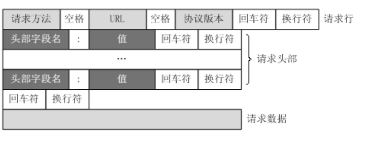

`parse_request_line(char *text)`在处理请求行时，以空格为分割单位对各个部分进行解析

从状态机会一行一行的读取请求数据，并将每一行末尾\r\n符号改为\0\0，主状态机根据从状态机读取到的数据和其所在的消息处理状态来判断是处理请求行还是请求头还是请求数据


### 3.4 http处理流程

#### 3.4.1 前置知识

`recv` 函数是用于接收数据的系统调用，通常在网络编程中用来从套接字接收数据。下面是对 `recv` 函数的输入和输出参数的详细介绍：

```c++
size_t recv(int sockfd, void *buf, size_t len, int flags);
```

**输入参数：**

1. `sockfd`（套接字文件描述符）：
   - 这是一个整数参数，用于指定要接收数据的套接字的文件描述符。
   - 你需要在调用 `recv` 函数时提供一个有效的套接字文件描述符。
2. `buf`（接收缓冲区指针）：
   - 这是一个指向接收数据的缓冲区的指针。
   - `recv` 函数将接收到的数据存储在这个缓冲区中。
3. `len`（接收缓冲区长度）：
   - 这是一个表示接收缓冲区的长度的无符号整数。
   - 它指定了接收数据的最大字节数，以确保接收**不会溢出缓冲区**。
4. `flags`（标志位）：
   - 这是一个整数参数，用于指定接收操作的标志。通常可以将其设置为0，表示没有特殊标志。
   - 可能的标志包括 `MSG_WAITALL`（等待接收完整的消息）等，可以根据需要设置。

**输出参数：**

`recv` 函数的输出是一个 `size_t` 类型的整数，表示接收到的字节数或错误情况。具体解释如下：

- 如果成功接收数据，`recv` 返回接收到的字节数，即已经存储在 `buf` 中的字节数。
- 如果连接**已经关闭**（对方执行了关闭操作），`recv` 返回0，表示对端已经关闭连接。
- 如果发生错误，`recv` 返回-1，并设置 `errno` 来指示错误的原因。常见的错误包括：
  - `EAGAIN` 或 `EWOULDBLOCK`：在**非阻塞套接字**上调用 `recv` 时，表示当前没有可用的数据，需要稍后再次尝试。
  - `EINTR`：接收操作被信号中断。
  - 其他错误，如网络错误或无效的套接字等。


WebServer类中处理内核事件表中注册的定时器信号的`bool flag = dealwithsignal(timeout, stop_server)`函数

```c++
bool WebServer::dealwithsignal(bool &timeout, bool &stop_server)
{
    int ret = 0;
    int sig;
    char signals[1024];
    ret = recv(m_pipefd[0], signals, sizeof(signals), 0);
    if (ret == -1)
    {
        return false;
    }
    else if (ret == 0)
    {
        return false;
    }
    else
    {
        //处理信号值对应的逻辑
        for (int i = 0; i < ret; ++i)
        {
            //这里面明明是字符
            switch (signals[i])
            {
                    //这里是整型
                case SIGALRM:
                    {
                        timeout = true;
                        break;
                    }
                case SIGTERM:
                    {
                        stop_server = true;
                        break;
                    }
            }
        }
    }
    return true;
}
```


读取数据时的**边缘触发(ET)**和**水平触发(LT)**在代码里面的体现

```c++
//循环读取客户数据，直到无数据可读或对方关闭连接
//非阻塞ET工作模式下，需要一次性将数据读完
bool http_conn::read_once()
{
    if (m_read_idx >= READ_BUFFER_SIZE)
    {
        return false;
    }
    int bytes_read = 0;

    //LT读取数据
    if (0 == m_TRIGMode)
    {
        //从套接字接收数据，存储在m_read_buf缓冲区
        bytes_read = recv(m_sockfd, m_read_buf + m_read_idx, READ_BUFFER_SIZE - m_read_idx, 0);
        m_read_idx += bytes_read;

        if (bytes_read <= 0)
        {
            return false;
        }

        return true;
    }
    //ET读数据
    else
    {
        while (true)
        {
            //从套接字接收数据，存储在m_read_buf缓冲区
            bytes_read = recv(m_sockfd, m_read_buf + m_read_idx, READ_BUFFER_SIZE - m_read_idx, 0);
            // 如果返回值为-1，表示接收数据出错，此时可以使用 errno 来获取错误码
            if (bytes_read == -1)
            {
                //非阻塞ET模式下，需要一次性将数据读完
                /*
                如果套接字是非阻塞的，且没有数据可用，
                recv 可能会返回-1，并设置 errno 为 EAGAIN 或 EWOULDBLOCK，表示暂时没有数据可用。
                */
                if (errno == EAGAIN || errno == EWOULDBLOCK)
                    break;
                return false;
            }
            // 如果返回值为0，表示对端已关闭连接（EOF）
            else if (bytes_read == 0)
            {
                return false;
            }
            m_read_idx += bytes_read;
        }
        return true;
    }
}
```

>存在的问题：
>
>当套接字有可读事件时，边缘触发会循环从操作系统内核中维护的用于存储套接字接收数据的缓冲区接收数据，然后将接收到的数据放入自己的接收缓冲区，那么**如果接收缓冲区比内核缓冲区小造成读不完数据**会发送什么呢
>
>如果内核缓冲区本来就比接收缓冲区大，那就算循环多次调用recv 函数，那接收缓冲区不就会溢出了吗，这样的话如何确保接收到所有的数据呢？
>
>边缘触发与水平触发的区别：简单来说边缘触发可以减少epoll_wait系统调用的次数


#### 3.4.2 问答解惑

1. 在监听客户端连接的过程中如何用线程池实现并发？
1. I/O多路复用配合线程池使用，这里的线程池和前面提到的线程池有什么区别？

根据我目前的理解，这两个线程池是一个东西，监听socket和连接socket都会注册到epoll事件表中，当有事件发生时，会先判断是不是监听socket的事件发生，如果是，会让**监听对象**处理，连接对象处理的过程会创建一个**连接socket对象**然后将其注册到epoll事件表中，当监听到连接事件时，比如读事件，会将客户端的数据读取进入这个连接socket，并将其封装成一个请求对象，加入请求队列中让线程池中的线程来竞争处理

> 这里的**连接`socket`**对象定义在`WebServer`类中的成员变量，`http_conn *users`

3. 上面是服务端接收客户端请求的过程，那么服务端是如何处理客户端请求的逻辑是什么呢？

服务端的主线程是**异步处理**的过程，建立连接和处理各个请求的过程是异步执行的，只不过是把处理请求的过程**拆分成**读取客户端的请求报文+处理客户端请求报文中的请求+发送给客户端相应报文，读写过程还是由主线程完成，只不过是将所有处理客户端请求的过程以同步的方法给线程池中的线程竞争来处理

4. 处理请求的具体过程又是什么呢？

解析请求，使用**主从状态机**的模式进行解析，并根据解析的结果进行相应的处理


对于post请求需要查询数据库，针对每一次用户的post请求都需要新建一个数据库连接的问题，采用线程池的思路，预先生成一系列数据库连接，供用户使用

对于post请求需要校验，校验需要一段校验程序的逻辑，而CGI就是这样的校验程序，这些程序通常用来执行一些信息搜索、存储等任务，这个CGI程序的运行通过多进程来实现，根据其返回结果判断校验结果，CGI程序（子进程）通过管道与父进程（主进程）进行通信，子进程将校验结果写到pipe的写端，父进程在读端读取。


#### 3.4.2 连接对象创建过程

浏览器端发出http连接请求，服务器端主线程**提前**创建http**连接对象**

> `WebServer`类的构造函数提前创建最大数量的`http`**连接对象**
>
> `users = new http_conn[MAX_FD];`

连接对象由**监听socket**创建，监听socket在主线程`void WebServer::eventListen()`函数中创建

>监听socket创建代码
>
>```c++
>void WebServer::eventListen()
>{
>    //网络编程基础步骤
>    m_listenfd = socket(PF_INET, SOCK_STREAM, 0);
>    
>    /*
>    省略...
>    */
>
>    //epoll创建内核事件表
>    epoll_event events[MAX_EVENT_NUMBER];
>    m_epollfd = epoll_create(5);
>    assert(m_epollfd != -1);
>
>    //将listenfd放在epoll树上
>    utils.addfd(m_epollfd, m_listenfd, false, m_LISTENTrigmode);
>    //将上述epollfd赋值给http类对象的m_epollfd属性
>    http_conn::m_epollfd = m_epollfd;
>	
>    /*
>    省略...
>    */  
>}
>```
>
>当监听socket监听到内核事件表中的连接事件到来时，通过`dealclinetdata()`函数创建连接对象
>
>```c++
>bool WebServer::dealclinetdata()
>{
>    //初始化客户端连接地址
>    struct sockaddr_in client_address;
>    socklen_t client_addrlength = sizeof(client_address);
>    // LT模式
>    if (0 == m_LISTENTrigmode)
>    {
>        //服务端为该连接分配的文件描述符
>        int connfd = accept(m_listenfd, (struct sockaddr *)&client_address, &client_addrlength);
>        timer(connfd, client_address);
>    }
>    /*
>    省略...
>    */  
>}
>```
>
>连接对象具体的创建代码在`timer(connfd, client_address)`函数中
>
>```c++
>void WebServer::timer(int connfd, struct sockaddr_in client_address)
>{
>    users[connfd].init(connfd, client_address, m_root, m_CONNTrigmode, m_close_log, m_user, m_passWord, m_databaseName);    
>	/*
>    省略...
>    */ 
>}
>```
>
>这里面的`init()`函数就是真正的初始话代码，创建好的连接会加入内核事件表中
>
>```c++
>void http_conn::init(int sockfd, const sockaddr_in &addr, char *root, int TRIGMode,
>                     int close_log, string user, string passwd, string sqlname)
>{
>    m_sockfd = sockfd;
>    m_address = addr;
>	// 将创建好的连接会加入内核事件表中
>    addfd(m_epollfd, sockfd, true, m_TRIGMode);
>    m_user_count++;
>	/*
>    省略...
>    */
>}
>```

当在内核事件表中检测到读事件，将该**连接对象**放入请求队列

> WebServer类中的`void WebServer::dealwithread(int sockfd)`函数
>
> ```c++
> void WebServer::dealwithread(int sockfd)
> {
>     //创建定时器临时变量，将该连接对应的定时器取出来
>     util_timer *timer = users_timer[sockfd].timer;
> 
>     //reactor
>     if (1 == m_actormodel)
>     {
>         //省略...
>         m_pool->append(users + sockfd, 0);
>         //省略...
>     }
>     else
>     {
>         //proactor
>         if (users[sockfd].read_once())
>         {
>             //省略...
>             m_pool->append_p(users + sockfd);
>         }
>         else
>         {
> 			//省略...
>         }
>     }
> }
> ```


#### 3.4.3 http处理的整体思路

处理过程的整体代码：

```c++
void http_conn::process()
{
    HTTP_CODE read_ret = process_read();
    if (read_ret == NO_REQUEST)
    {
        modfd(m_epollfd, m_sockfd, EPOLLIN, m_TRIGMode);
        return;
    }
    bool write_ret = process_write(read_ret);
    if (!write_ret)
    {
        close_conn();
    }
    modfd(m_epollfd, m_sockfd, EPOLLOUT, m_TRIGMode);
}  
```


服务端首先是通过**线程池+请求队列**的方式来处理连接对象中的业务处理部分，服务端处理请求的逻辑是：

1. 对请求报文进行解析，对应`process_read()`函数
2. 对于解析完成的请求预处理，这里的预处理函数为`do_request()`，在`process_read()`函数中，该函数会将需要请求的目标文件映射到该连接对象内存地址`m_file_address`处，对应的语句如下：

3. 然后`process_write()`函数会将连接目标文件在连接对象中的内存地址赋值到内核相应位置的内存地址

> 写操作的具体过程：
>
> * 首先将响应写到这个连接对象的写缓存`m_write_buf`中
> * 对于请求的文件，我们已经直接将其映射到`m_file_address`里面，然后将该连接对象socket修改为`EPOLLOUT`（可写）事件，当内核事件表监听到该事件后，使用`writev`来将响应信息和请求文件**聚集写**到**TCP Socket**本身定义的发送缓冲区中，交由内核发送给请求资源的用户

4. `process_write()`函数会将写缓冲（状态行，相应头）的内存地址和请求文件（数据）所在的内存地址是两个不连续的内存区域，最后通过使用 `writev` 系统调用需要将它们一起写入到**socket的发送缓冲区**中。

> 如何将它们一起写入到**socket的发送缓冲区**中？
>
> `iovec` 结构体（I/O 向量结构体）用于在进行 I/O 操作时描述数据的散列（scatter）和聚集（gather）操作。它通常在系统调用如 `readv()` 和 `writev()` 中使用，允许将数据从多个不连续的缓冲区传递给文件描述符或从文件描述符读取到多个不连续的缓冲区。`iovec` 结构体在 C 语言中定义如下：
>
> ```c++
> struct iovec {
>     void *iov_base; // 指向数据缓冲区的指针
>     size_t iov_len; // 缓冲区的长度
> };
> ```
>
> `iovec` 结构体包含两个主要成员：
>
> 1. `iov_base`：这是一个指向数据缓冲区的指针，它指向要读取或写入的数据的起始地址。通常，它可以是一个字符数组（`char[]`）或任何其他数据类型的指针。
> 2. `iov_len`：这是描述数据缓冲区长度的无符号整数（`size_t`）。它表示了 `iov_base` 指向的缓冲区的大小（字节数）。
>
> 使用 `iovec` 结构体，您可以在一次系统调用中处理多个缓冲区，而不必将它们合并成单个连续的缓冲区。这对于在高效地进行文件或套接字 I/O 时非常有用，因为它可以减少数据的复制操作。


#### 3.4.4 http报文响应

前置知识：

```c++
//获取文件属性，存储在statbuf中
int stat(const char *pathname, struct stat *statbuf);

struct stat 
{
   mode_t    st_mode;        /* 文件类型和权限 */
   off_t     st_size;        /* 文件大小，字节数*/
};
```

stat函数用于取得指定文件的文件属性，并将文件属性存储在结构体stat里

**输入参数**：

1. `const char *pathname`：这是一个字符串，表示要查询元数据信息的文件路径。你需要提供文件的完整路径，包括文件名。
2. `struct stat *statbuf`：这是一个指向 `struct stat` 结构的指针，用于存储文件的元数据信息。你需要在调用 `stat` 函数之前创建一个 `struct stat` 类型的变量，并将其地址传递给 `m_file_stat` 参数。

**输出参数**：

`stat` 函数将文件的元数据信息填充到 `struct stat *statbuf` 指向的结构中。

**对应在项目中的代码：**

在`http_conn`类的`http_conn::HTTP_CODE http_conn::do_request()`函数中

其中的`char m_real_file[FILENAME_LEN]`和`struct stat m_file_stat`为每一个连接对象中的成员变量

```c++
/*
    通过stat获取请求资源文件信息，成功则将信息更新到m_file_stat结构体
    失败返回NO_RESOURCE状态，表示资源不存在
*/
if (stat(m_real_file, &m_file_stat) < 0)
    return NO_RESOURCE;

//判断文件的权限，是否可读，不可读则返回FORBIDDEN_REQUEST状态
if (!(m_file_stat.st_mode & S_IROTH))
    return FORBIDDEN_REQUEST;

//判断文件类型，如果是目录，则返回BAD_REQUEST，表示请求报文有误
if (S_ISDIR(m_file_stat.st_mode))
    return BAD_REQUEST;
```


`void *mmap(void *addr, size_t length, int prot, int flags, int fd, off_t offset);`

**输入参数**：

1. `addr`：指定映射的起始地址，通常设置为 `NULL`，让操作系统自动选择合适的地址。如果指定为 `NULL`，则操作系统会选择一个合适的地址。
2. `length`：指定映射区域的长度，以字节为单位。通常设置为文件的大小。
3. `prot`：指定内存保护标志，用于控制对映射区域的访问权限，可以是以下常量的组合：
   - `PROT_READ`：允许读取映射区域的内容。
   - `PROT_WRITE`：允许写入映射区域的内容。
   - `PROT_EXEC`：允许执行映射区域的内容。
   - `PROT_NONE`：禁止访问映射区域的内容。
4. `flags`：用于指定映射的类型和属性，可以是以下常量的组合：
   - `MAP_SHARED`：共享映射，多个进程可以共享该映射。
   - `MAP_PRIVATE`：私有映射，对映射的修改不会影响到其他进程（**写入时拷贝**）。
   - `MAP_ANONYMOUS`：创建匿名映射，不关联文件，可以用于创建共享内存区域。
   - `MAP_FIXED`：强制映射到指定的地址（需要指定`addr`参数）。
5. `fd`：要映射的文件描述符。如果不需要映射文件，可以传入-1，或者使用`MAP_ANONYMOUS`标志来创建匿名映射。
6. `offset`：指定文件映射的起始位置，通常设置为0，表示从文件的开头开始映射。

**输出参数**：

向映射到进程地址空间的内存区域的起始地址，这个指针可以用于访问映射的内存区域。这个函数通常用于内存映射文件或其他资源，以便在程序中进行读取和写入操作。

**对应在项目中的代码：**

在`http_conn`类的`http_conn::HTTP_CODE http_conn::do_request()`函数中

其中的返回参数`char *m_file_address;`为每一个连接对象中的成员变量

```c++
//以只读方式获取文件描述符，通过mmap将该文件映射到内存中
int fd = open(m_real_file, O_RDONLY);
m_file_address = (char *)mmap(0, m_file_stat.st_size, PROT_READ, MAP_PRIVATE, fd, 0);
//避免文件描述符的浪费和占用
close(fd);
//表示请求文件存在，且可以访问
return FILE_REQUEST;
```


`int munmap(void *addr, size_t length)`

`munmap` 函数用于取消内存映射，将之前通过 `mmap` 函数映射到进程地址空间的内存区域释放掉。这个函数的输入和输出如下所示：

**输入参数**：

1. `void *addr`：这是一个 `void *` 类型的指针，它指向要取消映射的内存区域的起始地址。这个地址通常是通过之前调用 `mmap` 函数返回的映射区域的起始地址。
2. `size_t length`：这是要取消映射的内存区域的大小，以字节为单位。通常情况下，你可以使用之前调用 `mmap` 函数时指定的大小。

**对应在项目中的代码：**

在`http_conn`类的`void http_conn::unmap()`函数中

```c++
void http_conn::unmap()
{
    if (m_file_address)
    {
        munmap(m_file_address, m_file_stat.st_size);
        m_file_address = 0;
    }
}
```


`ssize_t writev(int filedes, const struct iovec *iov, int iovcnt);`

writev函数用于在一次函数调用中写多个非连续缓冲区

**输入参数**：

1. filedes表示文件描述符

2. iov为前述io向量机制结构体iovec

3. iovcnt为结构体的个数

**输出参数**：

若成功则返回已写的字节数，若出错则返回-1。

**对应在项目中的代码：**

在`http_conn`类的`bool http_conn::write()`函数中

```c++
bool http_conn::write()
{
    int temp = 0;

    while (1)
    {
        //将响应报文的状态行、消息头、空行和响应正文发送给浏览器端
        temp = writev(m_sockfd, m_iv, m_iv_count);

        //正常发送，temp为发送的字节数
        if (temp < 0)
        {
            //判断缓冲区是否满了
            if (errno == EAGAIN)
            {
                //重新注册写事件
                modfd(m_epollfd, m_sockfd, EPOLLOUT, m_TRIGMode);
                return true;
            }
            unmap();
            return false;
        }

        //更新已发送字节
        bytes_have_send += temp;
        //偏移文件iovec的指针
        bytes_to_send -= temp;
        if (bytes_have_send >= m_iv[0].iov_len)
        {
            m_iv[0].iov_len = 0;
            m_iv[1].iov_base = m_file_address + (bytes_have_send - m_write_idx);
            m_iv[1].iov_len = bytes_to_send;
        }
        else
        {
            m_iv[0].iov_base = m_write_buf + bytes_have_send;
            m_iv[0].iov_len = m_iv[0].iov_len - bytes_have_send;
        }
        /*
        省略...
        */
    }
}
```

==重点！！！==

对于大文件的读取，需要多次调用`writev`函数，由于该函数不会对这两个成员做任何处理，循环调用writev时，需要重新处理iovec中的指针和长度

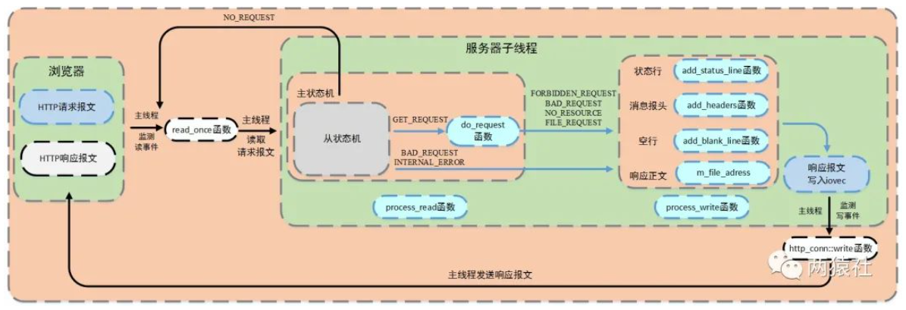

`do_request()`解析

整体逻辑：

用户请求的资源其实是一个个在服务器中的**文件**，这个函数的目标是将用户请求中的url转化为在服务器中的**资源路径**，并且如果用户是post请求并且请求的内容为注册和登录，这个服务器还需要与**数据库联动**，在用户注册和登录的过程中查找用户是否存在并不是在数据库中查找，而是在内存中查找，是因为在主程序中定义了`map<string, string> users;`变量，可以用来存储已经注册在数据库中的用户和密码，**只有在真正需要注册用户时才会访问数据库**，之后还需要查看资源路径的访问权限，在权限通过后获取该资源的文件描述符并通过mmap将该文件映射到内存中

> 那每次在服务器重启之后需要把用户信息加载到`map<string, string> users;`变量中吗？


http请求的结果定义在**HTTP_CODE**里，只有GET_REQUEST结果会调用do_request完成**请求资源映射**

> 这里什么是请求资源的映射？
>
> 该函数将**网站根目录**和`url`文件拼接，然后通过stat判断该文件属性。另外，为了提高访问速度，通过mmap进行映射，将普通文件映射到内存逻辑地址。

`char *doc_root;`为网站根目录，在`init()`函数中初始化

`char *m_url;`为类中的成员变量，是请求报文中解析出的请求资源，项目中解析后的m_url对应有**八种情况**

`/`

GET请求，跳转到judge.html，即欢迎访问页面


`/0`

POST请求，跳转到register.html，即注册页面


`/1`

POST请求，跳转到log.html，即登录页面


`/2CGISQL.cgi`

* POST请求，进行登录校验

- 验证成功跳转到welcome.html，即资源请求成功页面
- 验证失败跳转到logError.html，即登录失败页面


`/3CGISQL.cgi`

* POST请求，进行注册校验

- 注册成功跳转到log.html，即登录页面
- 注册失败跳转到registerError.html，即注册失败页面


`/5`

POST请求，跳转到picture.html，即图片请求页面


`/6`

POST请求，跳转到video.html，即视频请求页面


`/7`

POST请求，跳转到fans.html，即关注页面


`process_write()`函数

根据`do_request`的返回状态，服务器子线程调用`process_write`向`m_write_buf`中写入响应报文

服务器子线程调用`process_write`完成响应报文，随后注册`epollout`事件。服务器主线程监测写事件，并调用`http_conn::write`函数将响应报文发送给浏览器端。


`http_conn::write()`函数

在生成响应报文时初始化byte_to_send，包括头部信息和文件数据大小。通过writev函数循环发送响应报文数据，根据返回值更新byte_have_send和iovec结构体的指针和长度，并判断响应报文整体是否发送成功。

- 若writev单次发送成功，更新`byte_to_send`和`byte_have_send`的大小，若响应报文整体发送成功，则取消`mmap`映射，并判断是否是长连接.

  * 长连接**重置**http类实例，注册读事件，不关闭连接，

  * 短连接直接关闭连接

- 若writev单次发送不成功，判断是否是写缓冲区满了。

  * 若不是因为缓冲区满了而失败，取消`mmap`映射，关闭连接

  - 若`errno == EAGAIN`则满了

```c++
bool http_conn::write()
{
    int temp = 0;

    while (1)
    {
        //将响应报文的状态行、消息头、空行和响应正文发送给浏览器端
        temp = writev(m_sockfd, m_iv, m_iv_count);

        //正常发送，temp为发送的字节数
        if (temp < 0)
        {
            //判断缓冲区是否满了
            if (errno == EAGAIN)
            {
                //重新注册写事件
                modfd(m_epollfd, m_sockfd, EPOLLOUT, m_TRIGMode);
                return true;
            }
            unmap();
            return false;
        }

        //更新已发送字节
        bytes_have_send += temp;
        //偏移文件iovec的指针
        bytes_to_send -= temp;
        if (bytes_have_send >= m_iv[0].iov_len)
        {
            m_iv[0].iov_len = 0;
            m_iv[1].iov_base = m_file_address + (bytes_have_send - m_write_idx);
            m_iv[1].iov_len = bytes_to_send;
        }
        else
        {
            m_iv[0].iov_base = m_write_buf + bytes_have_send;
            m_iv[0].iov_len = m_iv[0].iov_len - bytes_have_send;
        }

        //判断条件，数据已全部发送完
        if (bytes_to_send <= 0)
        {
            unmap();
            //在epoll树上重置EPOLLONESHOT事件
            modfd(m_epollfd, m_sockfd, EPOLLIN, m_TRIGMode);

            //浏览器的请求为长连接
            if (m_linger)
            {
                //重新初始化HTTP对象
                init();
                return true;
            }
            else
            {
                return false;
            }
        }
    }
}
```


## 4 定时器处理非活动连接

### 4.1 整体思路

通过一段固定的时间触发一个**定时事件**（定时事件其实就是一段代码，由该段代码去执行一个任务），从**内核事件表**删除长时间不交换数据的事件，关闭相应的文件描述符来释放连接资源。

通过将**定时事件**与**连接资源封**装成一个结构体就是**定时器**，而将多个定时器以某一种形式组合起来就是**定时器容器**。

项目使用`SIGALRM` 信号来实现定时器功能，**服务器主循环**为每一个连接创建一个定时器，并对每个连接进行定时。另外，利用**升序时间**链表容器将所有定时器串联起来，若主循环接收到定时通知，则在链表中依次执行定时任务


### 4.2 前置知识

以下是 `SIGALRM` 信号的一些常见用途：

1. 定时操作：可以使用 `alarm` 函数来设置一个定时器，当定时器到期时，内核将向进程发送 `SIGALRM` 信号。应用程序可以捕获这个信号并执行相应的操作，例如执行某个任务或重新加载配置。
2. 超时操作：在某些情况下，程序可能需要在特定的时间间隔内等待某个事件的发生。如果事件在规定的时间内未发生，可以使用 `SIGALRM` 信号来实现超时操作，以确保程序不会无限等待。
3. 定时器：一些应用程序需要定期执行某些操作，例如数据备份、日志轮转等。`SIGALRM` 信号可以用于触发这些定期操作。
4. 周期性任务：`SIGALRM` 信号还可以用于周期性地执行某个任务，例如周期性地检查系统状态或执行清理操作。

要使用 `SIGALRM` 信号，通常需要执行以下步骤：

1. 使用 `signal` 函数或 `sigaction` 函数来设置信号处理函数，以便捕获 `SIGALRM` 信号。
2. 使用 `alarm` 函数或 `setitimer` 函数设置定时器，以指定在多少秒后触发 `SIGALRM` 信号。
3. 当定时器到期时，内核会发送 `SIGALRM` 信号给进程，进程会执行与信号相关的操作。

总之，`SIGALRM` 信号是一种用于实现定时和超时功能的信号，它允许应用程序在特定时间间隔或定时器到期时执行自定义操作。

`sigaction` 结构体是在Unix/Linux系统中用于配置信号处理的结构体。它通常用于设置信号处理函数、控制信号的行为以及指定特定的处理选项。`sigaction` 结构体的定义通常如下：

```c++
struct sigaction {
    void (*sa_handler)(int);          // 用于处理信号的函数指针
    void (*sa_sigaction)(int, siginfo_t *, void *); // 替代 sa_handler 的高级信号处理函数
    sigset_t sa_mask;                 // 在信号处理函数执行期间阻止的信号集合
    int sa_flags;                     // 用于指定处理选项的标志
    void (*sa_restorer)(void);        // 不再使用，已被废弃
};
```

下面是对 `sigaction` 结构体各字段的说明：

1. `sa_handler`: 一个函数指针，指向信号处理函数。当接收到指定信号时，系统会调用此函数来处理信号。通常用于简单的信号处理，例如 `SIGINT`（Ctrl+C）信号的处理。
2. `sa_sigaction`: 与 `sa_handler` 类似，但它指向一个**更高级**的信号处理函数。该函数接收三个参数，包括信号编号、`siginfo_t` 结构体和一个指向 `ucontext_t` 的指针。这个字段在需要更多关于信号事件的信息时使用。
3. `sa_mask`: 一个**信号集合**，用于在信号处理函数执行期间**阻止**其他信号的传递。这可以防止在处理一个信号时被另一个信号中断。通常，这个字段会设置为一组信号，以确保在信号处理函数执行时只有某些特定信号被阻塞。
4. `sa_flags`: 用于指定处理选项的标志，可以包括：
   - `SA_RESETHAND`：在信号处理函数执行后，将信号处理函数重置为默认操作。
   - `SA_NODEFER`：不阻塞当前信号。
   - `SA_SIGINFO`：使用 `sa_sigaction` 字段指定的高级信号处理函数。
5. `sa_restorer`: 一个不再使用的字段，已被废弃。

使用 `sigaction` 结构体可以更精确地控制信号的处理方式，包括捕获信号、阻止信号、安装信号处理函数等。这在编写信号处理程序时非常有用，以确保系统能够以可预测的方式响应不同的信号。

例子

```c++
#include <stdio.h>
#include <stdlib.h>
#include <signal.h>
#include <unistd.h>

// 信号处理函数
void sigint_handler(int signum) {
    printf("Caught SIGINT (Ctrl+C). Exiting...\n");
    exit(0);
}

int main() {
    // 创建一个 sigaction 结构体来配置信号处理
    struct sigaction sa;

    // 设置 sa_handler 字段为自定义的信号处理函数
    sa.sa_handler = sigint_handler;

    // 清空 sa_mask，表示在信号处理函数执行期间不阻塞其他信号
    sigemptyset(&sa.sa_mask);

    // 设置 sa_flags 为0，表示没有特殊处理选项
    sa.sa_flags = 0;

    // 使用 sigaction 函数来捕获 SIGINT 信号并指定处理方式
    if (sigaction(SIGINT, &sa, NULL) == -1) {
        perror("sigaction");
        return 1;
    }

    printf("Press Ctrl+C to trigger SIGINT...\n");

    // 进入一个无限循环，等待信号的触发
    while (1) {
        // 在此可以执行其他任务
        sleep(1);
    }

    return 0;
}
```

以下是对 `sigaction` 函数的参数和作用的详细介绍：

```c++
int sigaction(int signum, const struct sigaction *act, struct sigaction *oldact);
```

- `signum`：要配置的信号的**编号**。在这里，我们使用 `SIGINT` 来表示 Ctrl+C 信号，但你可以用其他信号编号来处理不同的信号。
- `act`：一个指向 `struct sigaction` 结构体的指针，用于设置信号的处理方式。通常，你可以在这个结构体中指定信号处理函数、信号屏蔽集等信息。
- `oldact`：一个指向 `struct sigaction` 结构体的指针，用于获取之前与该信号关联的处理方式。如果不需要这个信息，可以将其设置为 `NULL`。

函数的返回值是一个整数，如果执行成功，它将返回0；如果执行失败，它将返回-1，并且设置 `errno` 来指示错误的类型。


`socketpair` 函数用于在同一台计算机上创建一对相互连接的套接字（socket）。这对套接字可以用于在同一进程内进行进程间通信（Inter-Process Communication，IPC）。通常，一个套接字用于读取数据，而另一个套接字用于写入数据。

以下是 `socketpair` 函数的详细介绍：

```c++
int socketpair(int domain, int type, int protocol, int sv[2]);
```

- `domain`：指定套接字的通信域（协议族）。常见的选项包括 `AF_UNIX`（Unix域套接字，用于本地进程间通信）和 `AF_INET`（IPv4 套接字）等。通常在本地进程间通信时，使用 `AF_UNIX` 作为通信域。
- `type`：指定套接字的类型，通常可以是 `SOCK_STREAM`（流套接字，提供面向连接的、可靠的通信）或 `SOCK_DGRAM`（数据报套接字，提供无连接、不可靠的通信）等。
- `protocol`：指定协议，通常可以设置为0，表示根据 `domain` 和 `type` 的组合选择默认协议。
- `sv`：一个长度为2的整数数组，用于存储创建的一对套接字的文件描述符。`sv[0]` 表示**读取数据**的套接字，`sv[1]` 表示**写入数据**的套接字。

`socketpair` 函数的主要用途是在同一进程内的两个不同线程之间或在不同进程之间进行本地进程间通信。通过创建一对套接字，可以实现数据的双向传输，一个套接字用于发送数据，另一个套接字用于接收数据，这对于实现进程间通信非常有用。注意，这些套接字仅适用于本地通信，不能用于跨网络通信。

> 这样创建的相互连接的套接字，用于进行相互之间通信的两个对象是谁？


send函数

```c++
#include <sys/types.h>
#include <sys/socket.h>

4ssize_t send(int sockfd, const void *buf, size_t len, int flags);
```

1. `send` 函数是用于将数据从一个套接字发送到另一个套接字的函数，其中 `sockfd` 是套接字文件描述符，`buf` 是指向要**发送数据**的缓冲区的指针，`len` 是要发送的数据的长度，`flags` 是用于指定发送选项的标志。
2. 当套接字**发送缓冲区**变满时，意味着发送缓冲区已经装满了等待发送的数据，这时继续发送数据会阻塞当前进程或线程，直到发送缓冲区中有足够的空间来容纳要发送的数据。这种情况通常发生在**发送数据速度快于接收端接收数据**的情况下，或者接收端没有及时处理接收到的数据。
3. 如果套接字设置为**非阻塞模式**（通过设置 `O_NONBLOCK` 标志或使用 `fcntl` 函数等方式），那么当发送缓冲区变满时，`send` 函数不会阻塞，而是**立即返回**。在非阻塞模式下，如果发送缓冲区已满，`send` 函数通常会返回一个错误代码，可能是 `EAGAIN` 或 `EWOULDBLOCK`。
4. `EAGAIN` 和 `EWOULDBLOCK` 都表示**非阻塞操作被阻止的错误**。这些错误告诉你当前不能立即发送数据，因为发送缓冲区已满。但是，你可以使用循环和适当的延迟来等待发送缓冲区变得可用，然后再次尝试发送数据。
5. 可以使用 `select` 函数（或者更现代的 `poll`、`epoll` 等函数）来监视套接字的**可写性**（写就绪），以确定何时可以再次尝试发送数据。`select` 函数可以检查多个套接字的状态，以便你可以有效地等待多个套接字变得可写。


Linux下的信号采用的**异步处理机制**，信号处理函数和当前进程是两条不同的执行路线。具体的，当进程收到信号时，操作系统会中断进程当前的正常流程，转而进入信号处理函数执行操作，完成后再返回中断的地方继续执行。

为避免信号竞态现象发生，**信号处理期间系统不会再次触发它**。所以，为确保该信号不被屏蔽太久，信号处理函数需要尽**可能快**地执行完毕。

一般的信号处理函数需要处理该信号对应的逻辑，当该逻辑比较复杂时，信号处理函数执行时间过长，会导致信号屏蔽太久。

这里的解决方案是，**信号处理函数仅仅发送信号通知程序主循环**，将信号对应的**处理逻辑放在程序主循环中**，由主循环执行信号对应的逻辑代码。

例子

```c++
#include <stdio.h>
#include <stdlib.h>
#include <signal.h>
#include <unistd.h>

// 全局变量，用于表示是否收到信号
volatile sig_atomic_t got_signal = 0;

// 信号处理函数，仅发送信号通知程序主循环
void signal_handler(int signum) {
    got_signal = 1;
}

int main() {
    // 设置信号处理函数
    struct sigaction sa;
    sa.sa_handler = signal_handler;
    sigaction(SIGUSR1, &sa, NULL);

    // 主循环
    while (1) {
        if (got_signal) {
            printf("Received SIGUSR1 signal. Handling it...\n");
            // 在这里执行信号对应的逻辑代码
            // 例如，处理完信号后重置 got_signal 标志
            got_signal = 0;
        }

        // 在主循环中执行其他任务
        // 这里可以添加程序的主要逻辑

        sleep(1);  // 假装在执行一些任务
    }

    return 0;
}
```

在这个示例中，我们设置了一个信号处理函数 `signal_handler`，用于捕获 `SIGUSR1` 信号。这个函数非常简单，它只设置了 `got_signal` 标志，告诉程序主循环收到了信号。

程序主循环中会不断检查 `got_signal` 标志，如果收到了信号通知，就执行相应的信号处理逻辑。这样，信号处理函数的工作仅限于发送信号通知，而实际的处理逻辑在主循环中执行，确保了信号处理函数尽可能快速地完成，避免了长时间的信号屏蔽。

这种方式有助于确保信号处理函数的快速响应，同时将信号处理与主程序逻辑分离，使代码更加清晰和可维护。


统一事件源，是指将信号事件与其他事件一样被处理。 具体的，信号处理函数使用**管道**将信号传递给主循环，信号处理函数往管道的写端写入信号值，主循环则从管道的读端读出信号值，使用I/O复用系统调用来监听管道读端的可读事件，这样信号事件与其他文件描述符都可以通过epoll来监测，从而实现统一处理。 

>为什么信号处理函数需要使用管道将信号传递给主循环？
>
>信号处理函数是主循环folk处理的进程吗？

例子：

```c++
#include <stdio.h>
#include <stdlib.h>
#include <signal.h>
#include <unistd.h>
#include <sys/epoll.h>

// 全局变量，用于表示是否收到信号
volatile sig_atomic_t got_signal = 0;

// 管道文件描述符
int signal_pipe[2];

// 信号处理函数，将信号写入管道
void signal_handler(int signum) {
    // 将信号值写入管道
    write(signal_pipe[1], &signum, sizeof(signum));
}

int main() {
    // 创建管道
    if (pipe(signal_pipe) == -1) {
        perror("pipe");
        exit(EXIT_FAILURE);
    }

    // 设置信号处理函数
    struct sigaction sa;
    sa.sa_handler = signal_handler;
    sigaction(SIGUSR1, &sa, NULL);

    // 创建 epoll 实例
    int epoll_fd = epoll_create1(0);
    if (epoll_fd == -1) {
        perror("epoll_create1");
        exit(EXIT_FAILURE);
    }

    // 添加管道读端到 epoll 中
    struct epoll_event event;
    event.events = EPOLLIN;
    event.data.fd = signal_pipe[0];
    if (epoll_ctl(epoll_fd, EPOLL_CTL_ADD, signal_pipe[0], &event) == -1) {
        perror("epoll_ctl");
        exit(EXIT_FAILURE);
    }

    // 主循环
    while (1) {
        struct epoll_event events[1];
        int num_events = epoll_wait(epoll_fd, events, 1, -1);
        if (num_events == -1) {
            perror("epoll_wait");
            exit(EXIT_FAILURE);
        }

        for (int i = 0; i < num_events; i++) {
            int fd = events[i].data.fd;
            if (fd == signal_pipe[0]) {
                // 从管道中读取信号值
                int signum;
                read(signal_pipe[0], &signum, sizeof(signum));
                printf("Received signal %d\n", signum);
                // 在这里可以执行信号处理逻辑
                // 例如，处理完信号后重置标志
                got_signal = 0;
            }
            // 在这里可以处理其他事件
        }
    }

    // 关闭管道和 epoll 文件描述符
    close(signal_pipe[0]);
    close(signal_pipe[1]);
    close(epoll_fd);

    return 0;
}
```


### 4.3 计算机编程模型中的事件驱动机制

"事件驱动机制" 是一种计算机编程模型，它基于事件的发生来触发相应的处理程序，而不是持续地轮询或等待。这种机制通常用于编写异步和非阻塞的程序，以提高效率和响应性。在事件驱动编程中，程序等待事件的发生，一旦事件发生，就会触发相应的回调函数或处理程序来处理该事件。

与上面提到的信号处理的事件不同，事件驱动机制通常与用户交互和异步操作相关。在事件驱动编程中，事件可以是用户输入、网络数据到达、定时器到期等，而不仅仅是信号。在网络编程中，例如使用 epoll、select、或异步网络库时，程序通常使用事件驱动机制来监听和处理套接字上的数据到达事件。

以下是一个简单的 C++ 示例，演示了事件驱动机制的基本概念。在这个示例中，我们将创建一个简单的事件处理引擎，模拟处理用户输入事件的情况。

```c++
#include <iostream>
#include <functional>
#include <vector>

// 事件类型
enum class EventType {
    MouseClick,
    KeyboardInput
};

// 事件结构体
struct Event {
    EventType type;
    std::string data;
};

// 事件处理函数类型
using EventHandler = std::function<void(const Event&)>;

// 事件处理引擎
class EventEngine {
public:
    // 注册事件处理函数
    void registerEventHandler(EventType type, EventHandler handler) {
        eventHandlers[type].push_back(handler);
    }

    // 模拟事件触发
    void triggerEvent(const Event& event) {
        auto handlers = eventHandlers[event.type];
        for (const auto& handler : handlers) {
            handler(event);
        }
    }

private:
    /*
    同一个事件类型对应多个不同的处理函数
    例如，如果有多个不同的模块或组件希望对鼠标点击事件做出响应，可以为同一 EventType::MouseClick 注册多个不同的事件处理函数，并且当鼠标点击事件发生时，所有这些处理函数都会被依次调用。
    */
    std::unordered_map<EventType, std::vector<EventHandler>> eventHandlers;
};

int main() {
    // 创建事件处理引擎
    EventEngine engine;

    // 注册事件处理函数
    engine.registerEventHandler(EventType::MouseClick, [](const Event& event) {
        std::cout << "Mouse Click Event: " << event.data << std::endl;
    });

    engine.registerEventHandler(EventType::KeyboardInput, [](const Event& event) {
        std::cout << "Keyboard Input Event: " << event.data << std::endl;
    });

    // 模拟触发事件
    Event clickEvent{EventType::MouseClick, "Left Button"};
    Event keyboardEvent{EventType::KeyboardInput, "Enter Key"};

    engine.triggerEvent(clickEvent);
    engine.triggerEvent(keyboardEvent);

    return 0;
}
```

在这个示例中，我们创建了一个 `EventEngine` 类，它允许注册不同类型事件的处理函数。我们定义了两种事件类型：`MouseClick` 和 `KeyboardInput`，每种事件类型有自己的处理函数。

通过 `registerEventHandler` 方法，我们可以将事件类型和对应的处理函数进行关联。然后，通过 `triggerEvent` 方法，我们模拟触发不同类型的事件，并执行与每种事件相关的处理函数。

这个示例展示了一个简单的事件驱动机制，其中不同类型的事件触发相应的处理函数，这种机制允许程序响应不同的事件类型而不必等待或轮询。事件驱动机制在 GUI 应用程序、网络编程和异步编程中经常被使用。

>`using EventHandler = std::function<void(const Event&)>;` 是 C++ 中的一种类型别名声明，用于定义一个新的类型 `EventHandler`。这个类型别名声明将一个复杂的函数类型简化为一个更容易使用的名称。
>
>让我逐步解释这个声明的各部分：
>
>- `using EventHandler`：这部分表示我们正在声明一个类型别名，将某种类型命名为 `EventHandler`。
>- `=`：这是类型别名声明的赋值符号，表示将某个类型赋值给新的类型别名。
>- `std::function<void(const Event&)>`：这是实际的类型，它描述了 `EventHandler` 类型应该是什么。在这里，`std::function` 是一个 C++ 标准库中的模板类，用于表示可以调用的函数对象。`std::function` 可以包含各种可调用对象，包括函数指针、成员函数指针、函数对象（即重载了 `operator()` 的类的实例）等。`std::function` 还允许我们指定函数的参数列表和返回类型。
>  - `void` 表示函数的返回类型，这里是一个没有返回值的函数。
>  - `(const Event&)` 表示函数的参数列表，这里是接受一个 `const Event&` 类型的参数。这表示 `EventHandler` 类型的函数接受一个 `const Event&` 类型的参数作为输入。
>
>所以，`EventHandler` 类型别名声明告诉我们，它是一个可以接受一个 `const Event&` 类型参数的函数类型，且没有返回值。使用这个类型别名后，我们可以声明和使用 `EventHandler` 类型的变量或参数，而不必重复写出完整的函数类型描述。这在事件处理函数的注册和调用中非常方便，因为我们可以将不同类型的事件处理函数都用相同的 `EventHandler` 类型来表示。


### 4.4 代码分析

`util_timer`类代表定时器

```c++
class util_timer
{
public:
    util_timer() : prev(NULL), next(NULL) {}

public:
    //超时时间
    time_t expire;
    //回调函数（定时任务处理函数）
    void (* cb_func)(client_data *);
    //连接资源
    client_data *user_data;
    //前向定时器
    util_timer *prev;
    //后继定时器
    util_timer *next;
};
```

成员变量：

定时器类将连接资源（`client_data *user_data`）和定时事件（`void (* cb_func)(client_data *)`）作为其成员函数

`time_t expire`表示一个连接的超时事件，当这个连接现在的事件超过这个超时事件时，这个连接需要被释放


成员函数：

`void (* cb_func)(client_data *)`

```c++
void cb_func(client_data *user_data)
{
    //删除非活动连接在socket上的注册事件
    epoll_ctl(Utils::u_epollfd, EPOLL_CTL_DEL, user_data->sockfd, 0);
    assert(user_data);
    //关闭文件描述符
    close(user_data->sockfd);
    //减少连接数
    http_conn::m_user_count--;
}
```

当判定一个连接需要删除时就会执行这个超时事件（回调函数），这个函数会执行具体的释放连接的操作

 

`client_data`结构体代表连接资源

```c++
struct client_data
{
    //客户端socket地址
    sockaddr_in address;
    //服务器接收端socket文件描述符
    int sockfd;
    util_timer *timer;
};
```

里面有成员变量`util_timer *timer`，因此连接资源和定时器是相互绑定的


`Utils`类

```c++
class Utils
{
public:
    Utils() {}
    ~Utils() {}

    void init(int timeslot);

    //对文件描述符设置非阻塞
    int setnonblocking(int fd);

    //向内核事件表注册读事件，ET模式，选择开启EPOLLONESHOT
    void addfd(int epollfd, int fd, bool one_shot, int TRIGMode);

    //信号处理函数
    static void sig_handler(int sig);

    //设置信号函数
    void addsig(int sig, void(handler)(int), bool restart = true);

    //定时处理任务，重新定时以不断触发SIGALRM信号
    void timer_handler();

    void show_error(int connfd, const char *info);

public:
    static int *u_pipefd;
    sort_timer_lst m_timer_lst;
    static int u_epollfd;
    int m_TIMESLOT;
};
```

成员变量：

`static int *u_pipefd`保存由`socketpair` 函数创建的一对相互连接的套接字（socket），`u_pipefd[0]`表示读取数据的套接字，`u_pipefd[1]`表示写入数据的套接字，这对套接字用于**同一进程**之间的通信

`static int u_epollfd`保存内核事件表的文件描述符

这两个变量在主线程`eventListen()`函数中初始化

```c++
void WebServer::eventListen()
{
	/*
	省略...
	*/
    m_epollfd = epoll_create(5);
    ret = socketpair(PF_UNIX, SOCK_STREAM, 0, m_pipefd);
    /*
	省略...
	*/
    
    Utils::u_pipefd = m_pipefd;
    Utils::u_epollfd = m_epollfd;
}
```


成员函数：

`void addfd(int epollfd, int fd, bool one_shot, int TRIGMode)`用于向内核事件表注册相关事件

在主线程`eventListen()`函数中会将`socketpair` 函数创建的读取数据的套接字加入内核事件表中

```c++
void WebServer::eventListen()
{
	/*
	省略...
	*/
    utils.addfd(m_epollfd, m_pipefd[0], false, 0);
    /*
	省略...
	*/
}
```


`static void sig_handler(int sig)`为具体的信号处理函数

```c++
void Utils::sig_handler(int sig)
{
    //为保证函数的可重入性，保留原来的errno
    //可重入性表示中断后再次进入该函数，环境变量与之前相同，不会丢失数据
    int save_errno = errno;
    int msg = sig;
    //将信号值从管道写端写入，传输字符类型，而非整型
    send(u_pipefd[1], (char *)&msg, 1, 0);
    errno = save_errno;
}
```

该函数中会向`socketpair` 函数创建的写入数据的套接字中写入需要传递的信号类型`int msg = sig`，从而主线程可以根据读取数据的套接字中收到的信号类型来执行相关的处理该信号类型的回调函数


`void addsig(int sig, void(handler)(int), bool restart = true)`为用来具体的设置信号处理函数

```c++
void Utils::addsig(int sig, void(handler)(int), bool restart)
{
    //创建sigaction结构体变量
    struct sigaction sa;
    memset(&sa, '\0', sizeof(sa));
    //信号处理函数中仅仅发送信号值，不做对应逻辑处理
    sa.sa_handler = handler;
    if (restart)
        // 使被信号打断的系统调用自动重新发起
        sa.sa_flags |= SA_RESTART;
    //将所有信号添加到信号集中
    sigfillset(&sa.sa_mask);
    assert(sigaction(sig, &sa, NULL) != -1);
}
```

设置信号处理函数需要先配置好`struct sigaction sa`结构体，然后通过`sigaction(sig, &sa, NULL)`函数来实现真正的信号处理函数的设置

在主线程`eventListen()`函数中为`SIGALRM`和`SIGTERM`这两个需要处理的信号来设置具体的信号处理函数。

`alarm`函数会定期触发`SIGALRM`信号，这个信号交由`sig_handler`来处理，每当监测到有这个信号的时候，都会将这个信号写到`pipefd[1]`里面，传递给主线程

```c++
void WebServer::eventListen()
{
	/*
	省略...
	*/
    utils.addsig(SIGALRM, utils.sig_handler, false);
    utils.addsig(SIGTERM, utils.sig_handler, false);
    
    alarm(TIMESLOT);
    /*
	省略...
	*/
}
```


当主线程监听到读取数据套接字（`m_pipefd[0]`）上有事件发送时就会执行相关的处理程序，在读端`pipefd[0]`读到这个信号的的时候，就会将`timeout`变量置为`true`并跳出循环，让`timer_handler()`函数取出来定时器容器上的到期定时器，该定时器容器是通过升序链表来实现的，从头到尾对检查**定时器绑定的连接资源**是否超时，若超时则调用定时器的回调函数`cb_func()`，关闭这个连接资源，并删除其对应的定时器`del_timer`。

```c++
bool WebServer::dealwithsignal(bool &timeout, bool &stop_server)
{
    int ret = 0;
    int sig;
    char signals[1024];
    ret = recv(m_pipefd[0], signals, sizeof(signals), 0);
    if (ret == -1)
    {
        return false;
    }
    else if (ret == 0)
    {
        return false;
    }
    else
    {
        //处理信号值对应的逻辑
        for (int i = 0; i < ret; ++i)
        {
            //这里面明明是字符
            switch (signals[i])
            {
            //这里是整型
            case SIGALRM:
            {
                timeout = true;
                break;
            }
            case SIGTERM:
            {
                stop_server = true;
                break;
            }
            }
        }
    }
    return true;
}
```


### 4.5 模糊概念解答

==管道连接的两个对象分别是什么？==

这里的管道是主线程通过`socketpair(PF_UNIX, SOCK_STREAM, 0, m_pipefd);`创建出来的，管道的读端和写段其实都是在这个主线程中


==信号是如何产生的？==

通过`alarm` 函数来产生SIGALRM信号，`alarm` 函数是一个系统调用，用于设置一个定时器，在指定的时间间隔后触发 `SIGALRM` 信号。这个机制的工作方式可以分为用户态和内核态两个阶段。

* 用户态：调用 `alarm` 函数来请求内核在一定的时间后触发 `SIGALRM` 信号。应用程序可以选择捕获 `SIGALRM` 信号，为其指定一个信号处理函数。
* 内核态：内核接收到 `alarm` 函数的请求后，会在内部维护一个定时器，用来跟踪定时器的剩余时间。当定时器的剩余时间达到0秒时，内核会生成 `SIGALRM` 信号，并将其发送给相应的进程。


==信号处理函数为什么要拆出一部分放入主线程中？==

信号处理函数就是在信号处理过程的开销，信号处理过程涉及到用户态和内核态之间的多次切换，因此应尽量保持信号处理函数的简洁和高效


==如何拆分？==

信号处理函数仅仅负责发送信号通知主线程，这里的信号其实就是一个数字，将这个数字通过之前创建出来的管道的写端写入管道中，并将管道的读端注册到内核事件表中，当写端写入信号时可以触发读端的可读事件，读端根据读取到的信号值进行相应的拆分到主线程中的信号处理函数的部分


==回调函数和信号处理函数有什么区别和联系？==

信号处理函数实质上是来传递需要去检查是否有空闲连接的信号，而回调函数则是根据信号处理函数传递过来的需要去进行检查空闲连接的信号来进行**真正的**删除空闲连接的操作，而所有的连接又和其对应的定时器封装好了之后维护在一个根据超时事件从小到大排序的双向链表中

每次当有信号处理函数传递过来的需要去检查是否有空闲连接的信号时，会根据双向链表中的超时时间和当前时间进行对比来判断是否需要指向回调函数


==如何周期性的通过alarm函数来产生SIGALRM信号？==


==如何更新双向链表中的超时时间？==


## 5 数据库连接池

### 5.1 整体思路

数据库连接池和用线程池处理连接对象的思路一致

若系统需要频繁访问数据库，则需要频繁创建和断开数据库连接，而创建数据库连接是一个很耗时的操作，也容易对数据库造成安全隐患

因此在程序初始化的时候，集中创建多个数据库连接，并把他们集中管理，供程序使用，可以保证较快的数据库读写速度，更加安全可靠


### 5.2 代码分析

在代码中的具体体现：

每一个连接对象（`class http_conn`类的对象）都有一个私有成员`MYSQL *mysql`，并被初始化为`NULL`，表示该连接对象目前还没有连接到数据库

当该连接对象需要连接数据库时，调用`connectionRAII mysqlcon(&request->mysql, m_connPool)`

> 将数据库连接的获取与释放通过RAII机制封装，避免手动释放。
>
> ```c++
> /*
> RAII（Resource Acquisition Is Initialization）
> 资源获取即初始化
> 确保资源的正确管理，避免了手动管理资源的复杂性，提高了代码的可靠性和可维护性
> */
> class connectionRAII{
> 
> public:
> 	//双指针对MYSQL *con修改
> 	connectionRAII(MYSQL **con, connection_pool *connPool);
> 	~connectionRAII();
> 	
> private:
> 	MYSQL *conRAII;
> 	connection_pool *poolRAII;
> };
> ```

`MYSQL **con` 之所以需要两个星号（`**`），是因为将一个 `MYSQL*` 类型的指针传递给函数，而函数可以通过修改 `con` 指针本身来**改变调用者持有的指针的值**，因此连接对象中的私有成员`MYSQL *mysql`就被改变为从数据库连接池中取出来的数据库连接，从而连接对象就可以通过私有成员`MYSQL *mysql`来操作数据库


数据库连接池类

连接池的功能主要有：初始化，获取连接、释放连接，销毁连接池。**在获取连接和释放连接时需要加相应的同步或互斥信号量来避免对共享资源的冲突访问**

```c++
class connection_pool
{
public:
	MYSQL *GetConnection();				 //获取数据库连接
	bool ReleaseConnection(MYSQL *conn); //释放连接
	int GetFreeConn();					 //获取连接
	void DestroyPool();					 //销毁所有连接

	//单例模式
	static connection_pool *GetInstance();

	void init(string url, string User, string PassWord, string DataBaseName, int Port, int MaxConn, int close_log); 

private:
	connection_pool();
	~connection_pool();

	int m_MaxConn;  //最大连接数
	int m_CurConn;  //当前已使用的连接数
	int m_FreeConn; //当前空闲的连接数
	locker lock;
	list<MYSQL *> connList; //连接池
	sem reserve;

public:
	string m_url;			 //主机地址
	string m_Port;		 //数据库端口号
	string m_User;		 //登陆数据库用户名
	string m_PassWord;	 //登陆数据库密码
	string m_DatabaseName; //使用数据库名
	int m_close_log;	//日志开关
};
```


### 5.3 请求数据库连接过程梳理

数据库连接池在主程序中（WebServer类`void WebServer::sql_pool()`函数）创建

```c++
//数据库在主程序中创建
server.sql_pool();

void WebServer::sql_pool()
{
    //初始化数据库连接池
    m_connPool = connection_pool::GetInstance();
    m_connPool->init("localhost", m_user, m_passWord, m_databaseName, 3306, m_sql_num, m_close_log);

    //初始化数据库读取表
    users->initmysql_result(m_connPool);
}
```


整体逻辑：

用户请求的资源其实是一个个在服务器中的**文件**，这个函数的目标是将**用户请求中的url**转化为在服务器中的**资源路径**，并且如果当用户是post请求并且请求的内容为注册和登录，服务器还需要与**数据库联动**，在用户注册和登录的过程中查找用户是否存在并不是在数据库中查找，而是在内存中查找，是因为在主程序中定义了`map<string, string> users;`变量，可以用来存储已经注册在数据库中的用户和密码，**只有在真正需要注册用户时才会访问数据库**，之后还需要查看资源路径的访问权限，在权限通过后获取该资源的文件描述符并通过mmap将该文件映射到内存中

在`http_conn`连接类中有一个该类所有连接对象共享的全局变量`map<string, string> users`，`void http_conn::initmysql_result(connection_pool *connPool)`函数用于提前将数据库中的用户信息加载入这个全局变量中


在注册页面的请求操作数据库的实例，注册之前需要先检测用户是否存在，检测用户是否存在是在`map<string, string> users`中，这样免去了在数据库中检测用户是否存在耗时操作

```c++
http_conn::HTTP_CODE http_conn::do_request()
{
    // 省略...

    //处理cgi
    if (cgi == 1 && (*(p + 1) == '2' || *(p + 1) == '3'))
    {
		//省略t用户名和密码过程...
        if (*(p + 1) == '3')
        {
            //如果是注册，先检测数据库中是否有重名的
            //没有重名的，进行增加数据
            char *sql_insert = (char *)malloc(sizeof(char) * 200);
            strcpy(sql_insert, "INSERT INTO user(username, passwd) VALUES(");
            strcat(sql_insert, "'");
            strcat(sql_insert, name);
            strcat(sql_insert, "', '");
            strcat(sql_insert, password);
            strcat(sql_insert, "')");

            // 判断用户是否存在不是在数据库中，而是在内存中
            if (users.find(name) == users.end())
            {
                // 对数据库进行操作需要加锁
                m_lock.lock();
                int res = mysql_query(mysql, sql_insert);
                users.insert(pair<string, string>(name, password));
                m_lock.unlock();

                // 通过res判断注册是否成功
                if (!res)
                    strcpy(m_url, "/log.html");
                else
                    strcpy(m_url, "/registerError.html");
            }
            // 用户已经存在就之间判断失败
            else
                strcpy(m_url, "/registerError.html");
        }
    }
}
```


## 6 日志

### 6.1 设计模式-单例模式

[参考链接1](https://juejin.cn/post/6844903928497176584)

[参考链接2](https://blog.csdn.net/unonoi/article/details/121138176)

什么是单例模式？

单例模式是指在整个系统生命周期内，保证**一个类只能产生一个实例**，确保该类的唯一性。


为什么需要单例模式？

chatgpt回答：

1. **全局访问点**：单例模式提供了一个**全局访问点**，使得应用程序中的各个部分能够方便地访问**同一个对象实例**。这对于管理和共享资源非常有用，例如配置信息、**日志记录器、数据库连接**等。
2. **资源共享**：某些资源，如**数据库连接、线程池**、缓存管理器等，需要被多个部分共享。通过使用单例模式，可以确保只有一个实例被创建和共享，从而减少资源的浪费和冲突。
3. **节省内存和提高性能**：在某些情况下，创建多个相同类型的对象实例可能会消耗大量的内存和系统资源。使用单例模式，可以节省内存并提高性能，因为只有一个实例存在。
4. **保持一致性**：单例模式可以确保整个应用程序中只有一个对象实例，从而保持数据的一致性。当多个部分需要共享相同的状态或配置时，单例模式可以确保它们都操作同一个对象。
5. **延迟初始化**：有时候，创建对象实例的成本较高，或者需要在需要时才创建。单例模式可以实现延迟初始化，即只有在第一次访问时才创建对象，从而节省资源。
6. **线程安全**：单例模式可以用于确保多线程环境下只有一个对象实例，从而避免并发问题。
7. **控制实例数量**：在某些情况下，需要限制类的实例数量，例如线程池中的工作线程数量。单例模式可以用于控制实例的数量。

两个原因：

1. 节省资源：一个类只有一个实例，不存在多份实例，节省资源。
2. 方便控制：在一些操作公共资源的场景时，避免了多个对象引起的复杂操作。

但是在实现单例模式时，需要考虑到**线程安全**的问题。这是因为当多个线程来创建类的实例时，可能会出现重复创建多个实例的情况，从而违背单例模式下一个类只能产生一个实例的原则


什么是线程安全？

在拥有共享数据的多条线程并行执行的程序中，线程安全的代码会通过**同步机制**保证各个线程都可以正常且正确的执行，不会出现数据污染等意外情况。


如何保障线程安全？

1. 给共享的资源加把锁，保证每个资源变量每时每刻至多被一个线程占用。
2. 让线程也拥有资源，不用去共享进程中的资源。如：使用threadlocal可以为每个线程维护一个私有的本地变量。


#### 6.1.1 单例模式分类

单例模式可以分为**懒汉式** 和**饿汉式** ，两者之间的区别在于创建实例的时间不同。

- 懒汉式

系统运行中，实例并不存在，只有当需要使用该实例时，才会去创建并使用实例。这种方式**要考虑线程安全**。

- 饿汉式

系统一运行，就初始化创建实例，当需要时，直接调用即可。这种方式**本身就线程安全**，没有多线程的线程安全问题。


#### 6.1.2 单例类的特点

- 构造函数和析构函数为**私有类型**，目的是禁止外部构造和析构。
- 拷贝构造函数和赋值构造函数是私有类型，目的是禁止外部拷贝和赋值，确保实例的唯一性。
- 类中有一个获取实例的**静态方法**，可以全局访问。


#### 6.1.3 单例模式的实现

* 普通懒汉式单例（线程不安全）
* 加锁的懒汉式单例（线程安全）
* 内部静态变量的懒汉式单例（线程安全）


#### 6.1.4 通过代码对应单例模式的实现

用加锁的懒汉式单例和内部静态变量的懒汉式单例两者方法实现懒汉单例：

实例初始化中对应双检锁技术，为什么需要双检测？

如果只检测一次，在每次调用获取实例的方法时，都需要加锁，这将严重影响程序性能。双层检测可以有效避免这种情况，仅在第一次创建单例的时候加锁，其他时候都不再符合`m_SingleInstance == nullptr`的情况，直接返回已创建好的实例。

```c++
///  加锁的懒汉式实现  //
class SingleInstance
{

public:
    // 获取单实例对象
    static SingleInstance *GetInstance();

    //释放单实例，进程退出时调用
    static void deleteInstance();
	
    // 打印实例地址
    void Print();

private:
    // 将其构造和析构成为私有的, 禁止外部构造和析构
    SingleInstance();
    ~SingleInstance();

    // 将其拷贝构造和赋值构造成为私有函数, 禁止外部拷贝和赋值
    SingleInstance(const SingleInstance &signal);
    const SingleInstance &operator=(const SingleInstance &signal);

private:
    // 唯一单实例对象指针
    static SingleInstance *m_SingleInstance;
    static std::mutex m_Mutex;
};

//初始化静态成员变量
SingleInstance *SingleInstance::m_SingleInstance = nullptr;
std::mutex SingleInstance::m_Mutex;

// 注意：不能返回指针的引用，否则存在外部被修改的风险！
SingleInstance * SingleInstance::GetInstance()
{

    //  这里使用了两个 if 判断语句的技术称为双检锁；好处是，只有判断指针为空的时候才加锁，
    //  避免每次调用 GetInstance的方法都加锁，锁的开销毕竟还是有点大的。
    if (m_SingleInstance == nullptr) 
    {
        std::unique_lock<std::mutex> lock(m_Mutex); // 加锁
        if (m_SingleInstance == nullptr)
        {
            volatile auto temp = new (std::nothrow) SingleInstance();
            m_SingleInstance = temp;
        }
    }

    return m_SingleInstance;
}

void SingleInstance::deleteInstance()
{
    std::unique_lock<std::mutex> lock(m_Mutex); // 加锁
    if (m_SingleInstance)
    {
        delete m_SingleInstance;
        m_SingleInstance = nullptr;
    }
}

void SingleInstance::Print()
{
	std::cout << "我的实例内存地址是:" << this << std::endl;
}

SingleInstance::SingleInstance()
{
    std::cout << "构造函数" << std::endl;
}

SingleInstance::~SingleInstance()
{
    std::cout << "析构函数" << std::endl;
}
```


在C++中，使用静态变量来实现Singleton模式的`GetInstance`方法通常是线程安全的，因为C++标准规定了静态局部变量的初始化只会发生一次，从而避免了多个线程同时初始化的问题。这种方式被称为"局部静态变量"

根本原因是C++11之后要求**编译器保证内部静态变量的线程安全性**

```c++
///  内部静态变量的懒汉实现  //

class Single
{

public:
    // 获取单实例对象
    static Single& GetInstance();
	
	// 打印实例地址
    void Print();

private:
    // 禁止外部构造
    Single();

    // 禁止外部析构
    ~Single();

    // 禁止外部拷贝构造
    Single(const Single &single) = delete;

    // 禁止外部赋值操作
    const Single &operator=(const Single &single) = delete;
};
Single& Single::GetInstance()
{
    /**
     * 局部静态特性的方式实现单实例。
     * 静态局部变量只在当前函数内有效，其他函数无法访问。
     * 静态局部变量只在第一次被调用的时候初始化，也存储在静态存储区，生命周期从第一次被初始化起至程序结束止。
     */
    static Single single;
    return single;
}

void Single::Print()
{
    std::cout << "我的实例内存地址是:" << this << std::endl;
}

Single::Single()
{
    std::cout << "构造函数" << std::endl;
}

Single::~Single()
{
    std::cout << "析构函数" << std::endl;
}
```


一种方法实现饿汉单例：

饿汉模式不需要用锁，就可以实现线程安全。原因在于，在程序运行时就定义了对象，并对其初始化。之后，不管哪个线程调用成员函数getinstance()，都只不过是返回一个**对象的指针**而已。所以是线程安全的，不需要在获取实例的成员函数中加锁。


### 6.2 条件变量

```c++
int pthread_cond_wait(pthread_cond_t *cond, pthread_mutex_t *mutex);
```

这个函数有两个参数：

1. `cond`：这是一个指向条件变量（`pthread_cond_t` 类型）的指针。条件变量用于在线程之间传递信号，通常与互斥锁（`pthread_mutex_t`）一起使用，以协调线程的执行顺序。
2. `mutex`：这是一个指向互斥锁（`pthread_mutex_t` 类型）的指针。互斥锁用于保护共享资源，以确保在任何给定时间只有一个线程可以访问这些资源。

函数的作用是：

- 当一个线程调用 `pthread_cond_wait` 时，它会释放之前已经获得的 `mutex` 互斥锁，并且进入阻塞状态，等待条件变量 `cond` 的信号。
- 当另一个线程调用 `pthread_cond_signal` 或 `pthread_cond_broadcast` 来通知条件已经满足时，阻塞的线程会重新获得 `mutex` 互斥锁，并继续执行。
- 这个函数返回时，它会重新获得 `mutex` 互斥锁，因此它可以继续执行后续的代码。


例子：

```c++
#include <stdio.h>
#include <stdlib.h>
#include <pthread.h>

pthread_mutex_t mutex = PTHREAD_MUTEX_INITIALIZER; // 初始化互斥锁
pthread_cond_t condition = PTHREAD_COND_INITIALIZER; // 初始化条件变量
int shared_data = 0; // 共享数据

// 线程函数1，增加 shared_data 的值
void *thread1(void *arg) {
    while (1) {
        pthread_mutex_lock(&mutex); // 获取互斥锁
        shared_data++;
        printf("Thread 1: Incremented shared_data to %d\n", shared_data);
        if (shared_data >= 5) {
            // 当 shared_data 达到5时，发送信号通知线程2
            pthread_cond_signal(&condition);
        }
        pthread_mutex_unlock(&mutex); // 释放互斥锁
        sleep(1); // 等待一秒钟
    }
    return NULL;
}

// 线程函数2，等待 shared_data 达到5
void *thread2(void *arg) {
    pthread_mutex_lock(&mutex); // 获取互斥锁
    while (shared_data < 5) {
        // 当 shared_data 小于5时，等待条件变量
        pthread_cond_wait(&condition, &mutex);
    }
    printf("Thread 2: shared_data is now %d, so I can continue.\n", shared_data);
    pthread_mutex_unlock(&mutex); // 释放互斥锁
    return NULL;
}

int main() {
    pthread_t t1, t2;
    
    // 创建两个线程
    pthread_create(&t1, NULL, thread1, NULL);
    pthread_create(&t2, NULL, thread2, NULL);

    // 等待两个线程结束
    pthread_join(t1, NULL);
    pthread_join(t2, NULL);

    return 0;
}
```

==重点！！！==

在进入条件变量之前为什么要加锁，出来条件变量之后为什么需要解锁？

`pthread_cond_wait(&condition, &mutex)`的本质其实就是消费者去消费资源，资源是共享变量，所以在消费资源之前需要加锁。

当消费者达不到消费资源的条件时就会阻塞，由于消费者先加了锁，因此在阻塞之前，该函数内部会先解锁再阻塞，这就是为什么进入条件变量之前需要加锁

当消费资源到来时会唤醒阻塞的消费者，该函数内部在唤醒消费者之后会给消费者加锁，这样消费者就可以去消费资源，最后当然要对应解锁，这就是出来条件变量之后为什么需要解锁


为什么`pthread_cond_wait(&condition, &mutex)`外面加的是`while`循环而不是`if`判断？

```c++
enqueue_msg(struct msg* mp) {
    pthread_mutex_lock(&qlock);
    mp->m_next = workq;
    workq = mp;
    pthread_mutex_unlock(&qlock);
    /** 此时另外一个线程在signal之前，执行了process_msg，刚好把mp元素拿走*/
    pthread_cond_signal(&qready);
    /** 此时执行signal, 在pthread_cond_wait等待的线程被唤醒，
    但是mp元素已经被另外一个线程拿走，所以，workq还是NULL ,因此需要继续等待*/
}
```

由于其他消费者**见缝插针**般消费资源，导致资源又没有了，这时候生产者唤醒了另外一个消费者，当用`while`循环时，由于这个消费者发现资源没有了又会继续陷入阻塞


### 6.3 日志类的具体设计

流程图

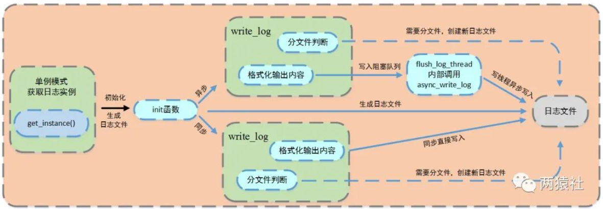


`class Log`类

* 有如下成员变量：

```c++
private:
    char dir_name[128]; //路径名
    char log_name[128]; //log文件名
    int m_split_lines;  //日志最大行数
    int m_log_buf_size; //日志缓冲区大小
    long long m_count;  //日志行数记录
    int m_today;        //因为按天分类,记录当前时间是哪一天
    FILE *m_fp;         //打开log的文件指针
    char *m_buf;        //要输出的内容
    block_queue<string> *m_log_queue; //阻塞队列
    bool m_is_async;                  //是否同步标志位
    locker m_mutex;     //同步类
    int m_close_log; //关闭日志
```

其中`block_queue<string> *m_log_queue` 定义了阻塞队列

> `class block_queue`类
>
> ```c++
> template <class T>
>     class block_queue
>     {
>         /*
>     	省略...
>     	*/
>         private:
>         //条件变量与互斥变量
>         locker m_mutex;
>         cond m_cond;
> 
>         T *m_array;
>         //用循环数组表示阻塞队列，下面是记录阻塞队列的一些相关信息
>         int m_size;
>         int m_max_size;
>         int m_front;
>         int m_back;
>     }
> ```
>
> 阻塞队列类中封装了生产者-消费者模型，其中push成员是生产者，pop成员是消费者。
>
> 阻塞队列中，使用了**循环数组**实现了队列，作为两者共享缓冲区，当然了，队列也可以使用STL中的queue。
>
> 当队列为空时，从队列中获取元素的线程将会被挂起；当队列是满时，往队列里添加元素的线程将会挂起。


* 有如下成员函数

```c++
public:
//C++11以后,使用局部变量懒汉不用加锁
static Log *get_instance()
{
    static Log instance;
    return &instance;
}

//异步写日志公有方法，调用私有方法async_write_log
static void *flush_log_thread(void *args)
{
    Log::get_instance()->async_write_log();
}
//可选择的参数有日志文件、日志缓冲区大小、最大行数以及最长日志条队列
bool init(const char *file_name, int close_log, int log_buf_size = 8192, int split_lines = 5000000, int max_queue_size = 0);

//将输出内容按照标准格式整理
void write_log(int level, const char *format, ...);

//强制刷新缓冲区
void flush(void);
```


`bool init()`函数有如下功能：

* 判断同步异步写入方式

当最长日志队列的值大于1时，则表示异步写入日志

异步写入方式：将信息写入阻塞队列，创建一个写线程，由写线程从阻塞队列中取出信息并真正将信息写入日志文件

同步写入方式：直接将信息写入日志文件

```c++
bool Log::init(const char *file_name, int close_log, int log_buf_size, int split_lines, int max_queue_size)
{
    //如果设置了max_queue_size,则设置为异步
    if (max_queue_size >= 1)
    {
        //设置写入方式flag
        m_is_async = true;
        //创建并设置阻塞队列长度
        m_log_queue = new block_queue<string>(max_queue_size);
        pthread_t tid;
        //flush_log_thread为回调函数,这里表示创建线程异步写日志
        pthread_create(&tid, NULL, flush_log_thread, NULL);
    }
    /*
    省略...
    */
}
```

* 生成日志文件

```c++
bool Log::init(const char *file_name, int close_log, int log_buf_size, int split_lines, int max_queue_size)
{
    /*
    省略...
    */
    //以 "a" 模式打开，表示以追加方式打开文件
    m_fp = fopen(log_full_name, "a");
    if (m_fp == NULL)
    {
        return false;
    }

    return true;
}
```

其中`log_full_name`为日志文件名


`void write_log()`函数功能如下：

* 判断是否需要重新创建日志文件，如果需要重新创建文件需要关闭原来的日志文件描述符，并打开新的日志文件描述符

> 由于日志文件是按天分类的，当时间不是今天，则创建今天的日志；
>
> 由于日志文件有最大的行数，当当天的日志写满时需要在之前的日志名基础上加后缀

```c++
void Log::write_log(int level, const char *format, ...)
{
    /*
    省略...
    */

    /*
    日志不是今天或写入的日志行数是最大行的倍数
    */
    if (m_today != my_tm.tm_mday || m_count % m_split_lines == 0) //everyday log
    {
        
        char new_log[256] = {0};
        //关闭原来的日志文件描述符
        fflush(m_fp);
        fclose(m_fp);
        char tail[16] = {0};
       
        //格式化日志名中的时间部分
        snprintf(tail, 16, "%d_%02d_%02d_", my_tm.tm_year + 1900, my_tm.tm_mon + 1, my_tm.tm_mday);
       
        //如果是时间不是今天,则创建今天的日志，更新m_today和m_count
        if (m_today != my_tm.tm_mday)
        {
            snprintf(new_log, 255, "%s%s%s", dir_name, tail, log_name);
            m_today = my_tm.tm_mday;
            m_count = 0;
        }
        else
        {
            //超过了最大行，在之前的日志名基础上加后缀, m_count/m_split_lines
            snprintf(new_log, 255, "%s%s%s.%lld", dir_name, tail, log_name, m_count / m_split_lines);
        }
        //打开新的日志文件描述符
        m_fp = fopen(new_log, "a");
    }
    
    /*
    省略...
    */
}
```

* 格式化输出信息到日志文件

```c++
void Log::write_log(int level, const char *format, ...)
{
    /*
    省略...
    */
    if (m_is_async && !m_log_queue->full())
    {
        m_log_queue->push(log_str);
    }
    else
    {
        m_mutex.lock();
        fputs(log_str.c_str(), m_fp);
        m_mutex.unlock();
    }
    /*
    省略...
    */
}
```

其中的`string log_str`为已经格式化处理好的信息，如果是异步写入方式就将其放入阻塞队列，如果是同步写入方式就直接将其写入日志文件


真正的日志输出函数

```c++
#define LOG_INFO(format, ...) if(0 == m_close_log) {Log::get_instance()->write_log(1, format, ##__VA_ARGS__); Log::get_instance()->flush();}
```

这个宏的作用是将信息级别的日志消息记录到日志文件中，但只有在满足条件 `0 == m_close_log` 时才会执行日志记录操作。

宏的各个部分解释如下：

- `LOG_INFO(format, ...)`：这是宏的名称，用于调用日志记录操作。它接受一个格式字符串 `format` 和可变数量的参数（`...`），这些参数将被传递给 `format` 中的格式占位符以生成日志消息。
- `if(0 == m_close_log)`：这是一个条件语句，它检查条件 `0 == m_close_log` 是否为真。`m_close_log` 变量用于控制日志记录是否启用或禁用。如果 `m_close_log` 的值为 0（即条件为真），则表示允许记录日志。
- `{}`：大括号中包含了在条件为真时执行的代码块。这里的代码块包括两个函数调用：
  - `Log::get_instance()->write_log(1, format, ##__VA_ARGS__);`：这是用于记录日志的函数调用。它调用某种 `Log` 类的 `write_log` 方法，传递了信息级别（1 表示信息级别），以及格式字符串和可变数量的参数，以生成和记录日志消息。
  - `Log::get_instance()->flush();`：这是用于刷新日志缓冲区的函数调用，以确保日志消息被写入到日志文件中。


在主程序中调用日志类的入口

```c++
//日志
server.log_write();

void WebServer::log_write()
{
    if (0 == m_close_log)
    {
        //初始化日志
        if (1 == m_log_write)
            Log::get_instance()->init("./ServerLog", m_close_log, 2000, 800000, 800);
        else
            Log::get_instance()->init("./ServerLog", m_close_log, 2000, 800000, 0);
    }
}
```


## 7 一些开放性问题

包括项目介绍，线程池相关，并发模型相关，HTTP报文解析相关，定时器相关，日志相关，压测相关，综合能力等。

### 7.1 项目相关

- 为什么要做这样一个项目？
- 介绍下你的项目

### 7.2 线程池相关

- 手写线程池
- 线程的同步机制有哪些？
- 线程池中的工作线程是一直等待吗？
- 你的线程池工作线程处理完一个任务后的状态是什么？
- 如果同时1000个客户端进行访问请求，线程数不多，怎么能及时响应处理每一个呢？
- 如果一个客户请求需要占用线程很久的时间，会不会影响接下来的客户请求呢，有什么好的策略呢?

### 7.3 并发模型相关

- 简单说一下服务器使用的并发模型？
- reactor、proactor、主从reactor模型的区别？
- 你用了epoll，说一下为什么用epoll，还有其他复用方式吗？区别是什么？

### 7.4 HTTP报文解析相关

- 用了状态机啊，为什么要用状态机？
- 状态机的转移图画一下
- https协议为什么安全？
- https的ssl连接过程
- GET和POST的区别

### 7.5 数据库登录注册相关

- 登录说一下？
- 你这个保存状态了吗？如果要保存，你会怎么做？（cookie和session）
- 登录中的用户名和密码你是load到本地，然后使用map匹配的，如果有10亿数据，即使load到本地后hash，也是很耗时的，你要怎么优化？
- 用的mysql啊，redis了解吗？用过吗？

### 7.6 **定时器相关**

- 为什么要用定时器？
- 说一下定时器的工作原理
- 双向链表啊，删除和添加的时间复杂度说一下？还可以优化吗？
- 最小堆优化？说一下时间复杂度和工作原理

### 7.7 日志相关

- 说下你的日志系统的运行机制？
- 为什么要异步？和同步的区别是什么？
- 现在你要监控一台服务器的状态，输出监控日志，请问如何将该日志分发到不同的机器上？（消息队列）

### 7.8 压测相关

- 服务器并发量测试过吗？怎么测试的？
- webbench是什么？介绍一下原理
- 测试的时候有没有遇到问题？

### 7.9 综合能力

- 你的项目解决了哪些其他同类项目没有解决的问题？
- 说一下前端发送请求后，服务器处理的过程，中间涉及哪些协议？

