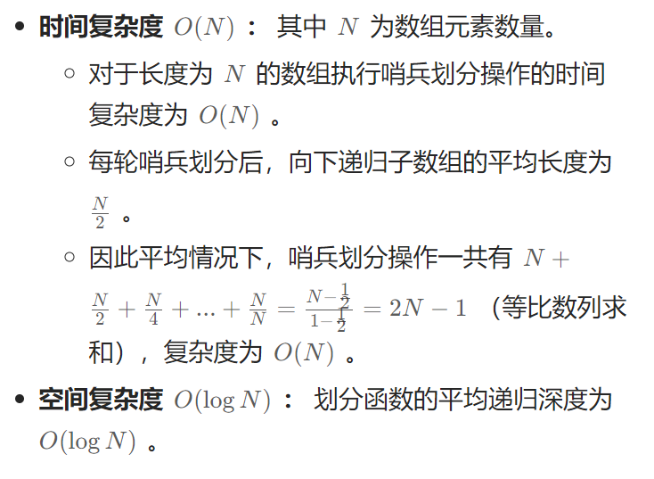
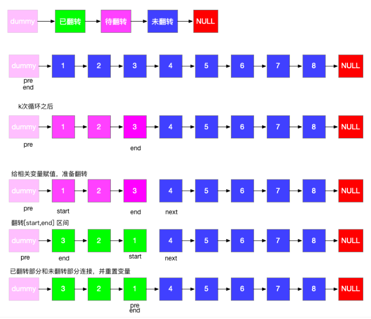

## 0 刷题心得

我们刷题中**算法的本质就是「穷举」**，**穷举有两个关键难点：无遗漏、无冗余**。无遗漏对应着如何穷举；无冗余对应着如何聪明的穷举。

不同类型的题目，难点是不同的，有的题目难在「如何穷举」，有的题目难在「如何聪明地穷举」。


## 研二上学期段刷题计划

1. 二叉树（统领篇）的所有可以刷的题目
2. 第一章：手把手刷图算法里面的所有内容以及题目


## 7 重建二叉树

### 解题思路

根据前序遍历中的首元素（根节点）来划分中序遍历，形成==[左子树|根节点|右子树]==的结构，然后再递归的对左右子树进行相同的操作。

### 方法：递推法

1. 递推参数：根节点在**前序遍历**中的索引pre_root、子树在**中序遍历**中的左边界in_left、子树在**中序遍历**中的右边界in_right
2. 函数返回值：**当前**子树所代表的根节点
3. 终止条件:：`in_left>in_right`，返回NULL

### 具体细节

* 根据左子树长度和上一层递归中的根节点索引（root）确定下一层递归中**右子树根节点索引**在前序遍历中的位置

rootnew=root+(i-left)+1，上一层根节点索引+左子树长度+1


## 12 矩阵中的路径

### 解题思路

通过深度优先搜索来遍历矩阵中所有字符串的可能性

### 方法：递推法

1. 递推参数：当前遍历的元素在矩阵中的索引：i（行）、j（列），在目标字符串中的索引k
2. 函数返回值：如果目标字符串在矩阵中匹配完成则返回true
3. 终止条件（相当于剪枝操作）：索引越界、a当前遍历元素和目标字符不相同、b当前遍历元素在之前已经访问过
4. 递归搜索过程：从当前索引位置向上、下、左、右四个方向遍历，用**或**连接四个方向上的返回值代表只要找到任一可行路径就可以返回
5. 回溯过程：由于需要把a和b判断合并处理，在每次递归搜索之前需要将访问过的元素修改为一个空字符，因此在递归搜索结束时需要将该访问过的元素还原为之前的字符

### 具体细节

* 递归参数中一些固定不变的量可以转化为类中的私有成员变量


## 17 打印从1到最大的n位数

### 解题思路

当n很大时基本的数据类型（int）会溢出，因此使用字符串来存储这些数。

通过回溯法从数的高位遍历到数的低位，每一位数字都有0-9十种情况，在递归终止条件中通过确定截取位置startIndex来删除每一个字符串前面多余的'0'

### 方法：回溯法

1. 递推参数：当前的位数和最大位数，最高位为0，最低位为n-1
2. 终止条件：当当前位数等于最大位数时终止，为了确保对字符串数字中的'0'进行删除，需要设置两个**私有成员变量**

```c++
int nineCount;// 统计字符串数字中'9'出现的个数，用于判断startIndex什么时候需要左移
int startIndex;// 对当前字符串的截取位置，初始化为字符串数字的最低位n-1
```

3. 递归搜索过程：用**for循环**循环处理'0'到'9'是个字符，进入下一层递归完成之后需要对相应的变量做回溯处理

### 具体细节

在递归终止条件中如何判断startIndex什么时候需要左移

```c++
startIndex==n-nineCount;// 判断字符串数字中所有位是否为'9'，当所有位为'9'时startIndex需要左移
```


## 19 正则表达式匹配

### 解题思路

利用动态规划求解该题

### 方法：动态规划

1. dp数组的确定：需要的进行匹配的字符串为s和p，p包含正则表达式

```c++
dp[i][j] // s[0...i-1]与p[0...j-1]匹配是值为true，否则为false
```

2. 确定状态转移公式：p中包含两个特殊字符`.`、`*`，将`.`看成一个万能字符从而归结为普通字符，在确定`dp[i][j]`时对p要增加的字符是`p[j-1]`，所以根据`p[j-1]`是否为特殊字符可以确定不同的状态转移方程

   1. p[j-1]!='*'，需要对两个s[i-1]和p[j-1]进行比较，当p[j-1]为万能字符时一定有s[i-1]==p[j-1]

   ```
   dp[i][j]=dp[i-1][j-1]
   ```

   2. p[j-1]=='*'，由于该特殊字符一定是其前面的字符p[j-2]，需要对p[j-2]与s[i-1]进行比较

   ```c++
   dp[i][j]=dp[i-1][j]
   dp[i][j]=dp[i][j-2] // 或者将 字符*之间删去
   ```

3. 确定初始状态

```
dp[0][0]代表s、p为空字符串一定可以匹配
当s为空时，p不为空时，当p可自身删去时也需初始化
```


## 20 表示数字的字符串

### 解题思路：

字符串是否满足某一规则可以通过有限自助机求解，通过顺序的读取字符串的每一个字符，并根据**当前状态**和**读入的字符**，按照某一个规则，从当前状态转移到**下一个状态**，当读取完所有的字符达到的状态为**可接受状态**时，判定该字符串满足规则。当是其他状态或在==读取过程中无法转移时==（在当前状态下根据读取的字符找不到任何一个可以转移到下一个状态的字符），判定该字符串不满足规则。

### 方法：有限自助机

1. 确定出所有可能的状态，状态对于字符串来说是所有可能读取到的字符串的类别，比如小数点
   1. 左侧有整数的小数点
   2. 左侧无整数的小数点
2. 在确定的所有状态中找出==初始状态==和==接受状态==
3. 定义状态转移规则，对于每一个定义好的状态，当接收到一个合理的字符时要确定一个合法的转移。==对于state[i]中的键值对(key,value)的含义：若输入key，则可从状态i转移到状态value==

```c++
vector<unordered_map<char,int>> state;
/*
定义转移状态，state[0]中的所有键值对就代表0状态下接收一个合理字符时的所有可能转移
char对应在s中归纳后的字符，比如所有的数字'0'-'9'用'd'代替，int代表状态
*/
```

4. 状态转移循环
   1. 记录当前字符的类型为t
   2. 初始状态定义为p=0;
   3. 终止条件：在当前状态中找不到可以转移的状态（在state[i]中找不到记录字符t的类型的键）时返回匹配失败
   4. 状态转移：将状态p转移到`state[p][t]`;

5. 在跳出循环后，若状态落在接收状态中就匹配成功，否则匹配失败


## 23 链表中环的入口节点

### 解题思路

设置两个指针，其中快指针每次移动两步，慢指针每次移动一步。当快指针移到空指针的位置时说明无环，当两个指针相遇时说明有环（当有环时，由于快指针每次比慢指针多走一步所有两个指针一定可以相遇）

### 方法：双指针法

1. 初始化：快慢指针开始时都置为头结点
2. 循环条件：

```c++
while(fast->next!=NULL&&fast!=NULL)// 只有满足这个条件快指针才可以移动两步
```

3. 快慢指针相遇点所满足的条件。环外结点数a，环内结点数b，快指针走的步数f，慢指针走的步数s，可得如下两个等式

```c++
f=2s
f=s+nb// 快指针追上慢指针需要在慢指针的基础上在走n个环的节点数
```

​	所有有`s=nb`，根据这个等式当慢指针再走a个节点时可以到达环的入口节点

4. ==怎么判断相遇后s在走a个节点？==由于有等式`a=a+nb`，只需将另外一个指针放置在头结点，同步向后移动该指针和慢指针，两个节点的相遇位置就是环的入口节点


## 24 反转链表

### 解题思路

设置两个指针pre和cur，两个指针同时向后移动，每次将cur的next指针重新置为pre

### 方法1：双指针法

1. 初始化：pre置为NULL，cur置为head
2. 循环条件：

```c++
while(cur!=NULL)
```

3. ==在修改cur的next指针之前需要保存cur原来的next指针==

```c++
tmp=cur->next;
cur->next=pre;
cur=tmp;
pre=cur;
```

### 方法2：递归法

1. 递归参数：当前指针cur，前置指针pre
2. 递归返回值：反转后链表的头结点
3. 递归终止条件：`cur==NULL`

```c++
if(cur==NULL) return pre;
```

4. 修改指针后函数内的==返回值为下一层递归==

```c++
return dfs(tmp,cur);
```


整体代码

```c++
ListNode* dfs(ListNode* cur, ListNode* pre) {
    if(!cur) return pre;
    ListNode* tmp = cur->next;
    cur->next = pre;
    return dfs(tmp, cur);
}
```

> 相当于是二叉树中的先序遍历，根据传入参数的值修改前后指针的指向，在递归中更新传入参数的值


为什么递归终止条件返回的是`pre`？

这是因为当`cur`为`NULL`时，此时的`pre`指向的就是翻转后链表的头节点


为什么最后的返回值是`dfs(tmp, cur)`？

因为递归函数的定义就是返回翻转后链表的头节点


### 具体细节

递归法其实就是参照双指针的思路写的


## 26 树的子结构

### 解题思路

在判断B树是否是A树的子结构过程中，由于**子结构的根节点**可能是**A的任意一个节点**，需要==先序变量==A树，在遍历的过程中需要判断以A的某一个节点为子树的树是否包括B。（A必须以该节点为根节点进行匹配）

### 方法：递归法

==判断以A的某一个节点为子树的树是否包括B。（A必须以该节点为根节点进行匹配）==`recur(TreeNode* A,TreeNode* B)`

1. 递归参数：需要进行匹配的两个树的根节点

2. 递归终止条件：

```c++
B==NULL; return true;// B子树已检查完毕
A==NULL; return false;// 为在A树中找到匹配节点
A->val!=B->val; return false;
```

3. 递归返回值：判断A和B对应子树的结构是否相等

```c++
return recur(A->left,B->left)&&recur(A->right,B->right)
```

==在判断B树是否是A树的子结构过程==`isSubStructure(TreeNode* A,TreeNode* B)`

1. 递归终止条件：A或B任意一个为空时代表匹配不成功
2. 递归返回值：相当于先序遍历过程中处理左右子节点的过程

```c++
return recur(A,B)||isSubStructure(A->left,B)||isSubStructure(A->right,B);
/*
1、B的起点为A的根节点
2、B的起点在A的左子树中
3、B的起点在A的右子树中
*/ 
```

### 具体细节

我的代码想把以上两个递归过程整合到一个函数中而通不过某个测试案例


## 27 二叉树的镜像

### 解题思路

递归的交换树的左右节点，根据递归函数的不同定义可以写出不同的递归算法

### 方法：递归法

==返回值为void的递归函数== `void dfs(TreeNode* node)`

1. 递归终止条件：`if(node==NULL) return;`当节点为空时代表镜像过程已经处理完成

2. 当前递归处理过程:

```c++
// 需要对当前节点(node)交换其左右孩子节点
TreeNode* tmp=node->left;
node->left=node->right;
node->right=tmp;
```

3. 下层递归处理过程：

```c++
// 递归的处理其左右子树
dfs(node->left);
dfs(node->right);
```

==返回值为`TreeNode*`的递归函数== `TreeNode* dfs(TreeNode* node)`

1. 递归终止条件：`if(node==NULL) return NULL;`当节点为空时代表镜像过程已经处理完成

2. 递归处理过程：

```c++
// 该递归函数的定义是返回已经进行镜像处理之后树的根节点；
TreeNode* tmp=node->left;
node->left=dfs(node->right);// 当前节点的左指针应该指向已经进行镜像处理完成之后的右子树
node->right=dfs(tmp);// 当前节点的右指针应该指向已经进行镜像处理完成之后的左子树
```

3. 递归函数返回值：`return node;`


## 29 顺时针打印数组

### 解题思路

定义四个表示边界的变量`l,r,t,b`分别表示左、右、上、下四个边界，以顺时针的方向以四条==外边==的顺序打印矩阵。每遍历一条边时，在矩阵的两个维度上，需以==某个变量固定住一个维度==，然后另外一个维度由其==他两个变量以遍历的方式确定==，在遍历完一条边之后需要对相应的边界变量的==值做修改==然后判断是否达到终止条件。

### 方法：模拟

1. 初始化所有边界变量（所打印的矩阵为A）

```c++
l=0;t=0
b=A.size()-1;
r=A[0].size()-1
```

2. 一次遍历四条边

```c++
while(true) {
    for(int j=l;j<=r;j++) result.push_back(A[t][j]);//以上边界t固定住第一个维度，以遍历的方式从左边界l到右边界r固定住第二个维度
	if(++t>b) break;// 上边界需要修改然后判断是否达到终止条件
	for(int i=t;i<=b;i++) result.push_back(A[i][r]);
    if(--r<l) break;
}
```


## 31 栈的压入、弹出序列

### 解题思路

通过**辅助栈**和**某一个序列的索引**来模拟相关过程。当索引为压入序列时，需要遍历弹出序列。当==辅助栈为空或者辅助栈的栈顶元素不等于当前的弹出序列的元素==时，需要根据压入序列的索引将压入序列的元素压入栈直到压入的元素等于当前弹出序列的元素时停止（压入的压入序列元素需要做压入序列越界判断）。然后弹出栈顶元素之后继续变量弹出序列，当最后辅助栈的元素为空时模拟成功。

### 方法：模拟

```c++
bool validateStackSequences(vector<int>& pushed, vector<int>& popped) {
	stack<int> A;
	int index=0;//在push数组下的索引
	for(int i=0;i<popped.size();i++) {
		while(A.empty()||A.top()!=popped[i]) {
			if(index>=pushed.size()) return false;
			A.push(pushed[index]);
			index++;
		}
		A.pop();//需要将成功匹配上的元素弹出栈
	}
	return A.empty()?true:false;
}
```


## 33 二叉搜索树的后序遍历序列

### 解题思路：

以数组的形式给定一个后序遍历序列，需要判断该遍历序列是否可以构成二叉搜索树。该序列的==最右端节点==是二叉搜索树的==根节点==，根据==根节点将当前序列划分成左右两个子树的后序遍历序列==，并判断当前根节点和左右两个子树是否满足二叉搜索树的定义。

### 方法：递归法

1. 递归参数：后序遍历序列的左索引start，右索引end，给定的后序遍历序列`vector<int> postorder`

2. 递归结束条件：`start>=end`，此时的节点数量<=1，不需要在进行划分，直接返回true
3. 递归处理：根据根节点将当前序列划分成左右两个子树的后序遍历序列

```c++
int p=start;// 用于以遍历的方式判断当前根节点和左右两个子树是否满足二叉搜索树的定义
while(postorder[p]<postorder[end]) p++;
int m=p;// 寻找第一个大于根节点的节点，索引记为m，在寻找的过程中就已经判断了左子树相对于当前根节点满足二叉搜索树的定义
while(postorder[p]>postorder[end]) p++;// 判断右子树相对于当前根节点满足二叉搜索树的定义，如果不满足，有p<end;
```

4. 递归返回：

```c++
return p==end&&dfs(start,m-1,postorder)&&dfs(m,end-1,postorder);
// 分别用于判断当前树是否满足二叉树搜索树的定义和当前树的左子树已经当前树的右子树是否满足二叉搜索树的定义
```

### 具体细节：

只通过==一个辅助索引p==就划分了两棵子树，并且判断两个子树相对于当前的根节点是否满足二叉搜索树的定义


## 34 二叉树中和为某一值的路径

### 解题思路

定义一下三个**私有成员变量**

```c++
vector<vector<int>> result;// 和为某一值的所有路径存入结果集
vector<int> path;// 当前遍历二叉树下的路径
int sum;// 当前遍历二叉树下路径的和
```

通过递归的方式搜索整个二叉树，遍历到叶子节点时判断当前路径的和是否为目标值

### 方法：递归法

1. 递归结束条件：`if(node==NULL) return`
2. 对当前节点的处理：

```c++
path.push_back(node->val);
sum+=node->val;
if(sum==target&&node->left==NULL&&node->right==NULL) result.push_back(path);
//在路径中加入当前节点后需要判断当前和是否等于目标值已经当前节点是否为叶子节点，如果是，需要将当前路径加入结果集
```

3. 向下递归处理：

```c++
backTracking(node->left,target);
backTracking(node->right,target);
```

4. 回溯过程：

```c++
path.pop_back();
sum-=node->val;
return;
```

### 具体细节

如果是需要找到**所有**满足条件的路径时，在2中的`if`里面不需要`return`

如果是只有找到**一条**满足条件的路径时，在2中的`if`里面需要`return`


## 36 二叉搜索树和双向链表

### 解题思路

由于双向链表需要递增排序，所有应该以==中序遍历==的方式遍历二叉搜索树，在遍历过程中需要维护一个当前遍历节点(cur)的==前驱节点==(pre)，然后修改当前节点和前驱节点==之间的指针==来实现二叉搜索树向双向链表的转化

### 方法：树的中序递归遍历

当pre为空时，此时的当前节点为双向链表的头结点，需要在私有成员变量中定义pre和head

```c++
Node *pre;
Node *head;
```

1. 递归终止条件：`if(cur==NULL) return;`
2. 递归左子树：`dfs(cur->left);`
3. 访问当前节点并做相应更新：

```c++
if(pre==NULL) head=cur;
else {
    // 根据双向链表的要求修改pre和cur之间的指针指向
	pre->right=cur;
	cur->left=pre;
}
pre=cur;// 在离开当前节点之前更新pre，保证pre始终是cur的前驱节点
```

4. 递归右子树：`dfs(cur->right);`

### 具体细节

==中序遍历结束时pre指向的是链表的尾结点==，由于双向链表是一个循环链表，因此需要连接头结点和尾结点


## 37 序列化二叉树

### 解题思路

利用层次遍历将二叉树序列化与反序列化，在序列化过程中需要将空节点也加入到==string数组==中并表示为"null"，然后将string数组转化为string字符串返回。在反序列的过程中需要定义一个==索引指示当前需要添加的左右子树的根节点在string数组中的下标==。在添加节点的过程中每次index需要右移，并且需要把==当下==index所指字符串不为"null"的节点加入层次遍历的队列当中。不管是在序列化还是在反序列化的过程中都需要维护一个以树中的节点的队列。

### 方法：层次遍历

1. 定义私有成员变量string数组

```c++
vector<string> s// 在序列化的过程中将s拼接为字符串然后返回，在反序列化的过程中可以之间使用s而不需要在对序列化后的字符串进行分割处理
```

2. 反序列化过程中对出队节点的操作

```c++
TreeNode* cur=q.front();// q为层次遍历维护的队列
q.pop();
if(s[index]!="null") {
    cur->left=new TreeNode(stoi(s[index]));
    q,push(cur->left)
}
index++;// 不管在index下s的值是否为"null"，index都需要右移
```

### 具体细节

```c++
to_string(13);// 将数组13转化为字符串"13"
stoi("13");// 将字符串"13"转化为数字13
```


## 38 字符串的排列

### 解题思路

对于一个长度为n的字符串的所有排列，采用深度优先搜索，先固定第一位，再固定第二位，一直固定到第n位。有两个难点：在固定同一位时，同一位可以有多种情况，当出现相同情况（同一位出现相同字符）需要剪枝处理来==避免重复排列的出现==。在处理完上一层继而处理当层时，==需要排除上一层已经处理过的字符==。

* 对于第一个难点：可以在固定同一位的字符时，定义一个`unordered_set<char>`，当遇到相同元素时跳过该种情况的所有后序搜索。
* 对于第二个难点：在每次向下一层搜索之前，==将当前的元素交换到已经固定的位上==，这样在继续向下层处理时可以排除上一层已经处理过的字符。

### 方法：回溯法

定义如下私有成员变量：

```c++
vector<string> result;// 保存所有的排列
string path;// 保存当前搜索下的某一个正在处理的排列
```

基于深度优先搜索的回溯法：

`backTracking(string s,int startIndex)`

1. 递归参数：startIndex代表当前处理的位数（字符串s中的索引）
2. 递归终止条件：

```c++
if(startIndex==s.size()) {
    result.push_back(path);
    return;
}
```

3. 对当前层的递归处理：

```c++
unordered_set<char> se;
// for循环是对同一层所有情况的处理
for(int i=startIndex;i<s.size();i++) {
    if(se.find(s[i])!=se.end()) continue;// 当遇到相同元素时跳过该种情况的所有后序搜索
    
    path.push_back(s[i]);
    se.insert(s[i]);
    
    swap(s[i],s[startIndex]);// 在每次向下一层搜索之前，将当前的元素交换到已经固定的位上,这样在继续向下层处理时可以排除上一层已经处理过的字符。
    backTracking(s,startIndex+1);

```

4. 回溯处理：

```c++
swap(s[i],s[startIndex]);
path.pop_back();
```


## 45 把数组排成最小的数

### 解题思路

先把数组转化为字符串存储在`vector<string> strs` 中，把strs进行==排序==，排序的规则是对于其中的任意两个字符串x和y，若有`x+y<y+x`代表x==小于==y

### 方法1：快速排序

私有成员变量`vector<string> strs`

思想：选取一个==基准元素==（一般为待排序序列的第一个元素），定义指向==待排序序列首尾元素的两个索引==`int start,end;`，这两个索引需要==不断向中间移动==直到相遇，在移动的过程中需要保证end索引右边的元素都==大于==基准元素，start索引左边的元素都==小于==基准元素，两个索引==相遇的位置==放基准元素，此时的基准元素是排好序后的==最终位置==，然后==递归==的对基准元素左边和右边的序列进行相同的操作

`void quickSort(vector<string>& strs,int start,int end)`

1. 递归终止条件：`if(start>=end) return`，当所处理的元素小于等于1时不需要再进行排序
2. 本层递归处理：

```c++
string tmp=strs[start];// 选取基准元素
int i=start,j=end;
while(i<j) {
    while(i<j&&strs[j]+tmp>=tmp+strs[j]) j--;// 在i<j的条件下确保j索引右边的元素都大于等于基准元素
    strs[i]=strs[j];// 将找到的小于基准元素的元素放到i的位置
    while(i<j&&strs[i]+tmp<=tmp+strs[i]) i++;// 在i<j的条件下确保i索引左边的元素都小于等于基准元素
    strs[i]=strs[j];// 将找到的大于基准元素的元素放到j的位置
}
strs[i]=tmp;// 两个索引相遇的位置放基准元素
```

3. 向下处理递归：

```c++
quickSort(strs,start,i-1);// 对基准元素左边的序列进行处理
quickSort(strs,i+1,end);// 对基准元素右边的序列进行处理
```

> `strs[i]=strs[j];strs[i]=strs[j];`代码中第5、7行这样的操作不会发送元素覆盖吗？
>
> 因为第一次发送覆盖的位置是基准元素的位置，后面每一次的覆盖位置都是上一次需要去覆盖元素的位置。快速排序有两种方法，一种是交换元素，一种是这里的覆盖元素
>
> ==快速排序相当于二叉树的先序遍历==

> 当待排序数组相对有序时，这时候简单的选择数组的第一个元素为基准元素，快速排序算法的事件复杂度会退化到$O(n^2)$，此时可以随机的选取待排序数组中的一个元素作为基准元素，并与第一个元素交换位置后进行快速排序
>
> ```c++
> int randomIndex = start + rand() % (end - start + 1);
> swap(nums[randomIndex], nums[start]);
> ```

> 用$O(n)$的时间复杂度实现在一个数组中求其第k大的元素
>
> 可以由快速排序衍生为**快速选择**，基准元素的位置是固定的，根据基准元素的索引判断其是否是我们需要的元素，然后不断的对**一边**进一步进行基准元素的求解（当基准元素不是我们要求的元素时，我们要求的元素只可能在基准元素的一遍）

> 快速选择的时间复杂度为什么是$O(n)$，[引用链接](https://leetcode.cn/problems/kth-largest-element-in-an-array/solutions/2361969/215-shu-zu-zhong-de-di-k-ge-zui-da-yuan-d786p/)，链接中的快速选择是用的交换元素的方法
>
> 

### 方法2：内置排序函数

需要自定义内置排序函数的比较规则，该内置函数需要是==静态/全局函数==，在类内定义==比较函数==需要加static关键字，在类外不需要加。

```c++
static bool compare(string a,string b) {
    return a+b<b+a;// 在比较元素时如果满足这个条件就把a放前面，b放
}
// 在某一处理函数内直接调用sort排序方法
sort(strs.begin(),strs.end(),compare);
```


## 48 最长不含重复字符的子字符串

### 解题思路

`dp[j]`代表以字符是`s[j]`结尾的“最长不重复子字符串”的长度，在状态转移方程中需要寻找与字符`s[j]`左边距离最近的相同字符`s[i]`，当`s[i]`落在`dp[j-1]`所代表的**当前**最长不重复子字符串内时需要更新`dp[j]`为`dp[j]=j-i`，否则`dp[j]=dp[j-1]+1`，代表**新的**最长不重复子字符串为当前最长不重复子字符串+1

### 方法：动态规划

如何寻找`s[i]`？

通过哈希表寻找`s[i]`，定义`unordered_map<char,int> mp`，代表**字符char**在**字符串s**中==最后一次出现==的索引位置为int，在遍历字符串更新哈希表的过程中，需要先根据`s[j]`来寻找`s[i]`的索引位置，再更新哈希表。

```c++
unordered_map<char,int> mp;
vector<int> dp(s.size(),0);
int result=0;
for(int j=0;j<s.size();j++) {
    int i=mp.find(s[j])==mp.end()?-1:mp[s[j]];// 先根据s[j]来寻找s[i]的索引位置
    mp[s[j]]=j;
    if(dp[j-1]<j-i) dp[j]=dp[j-1]+1;// 代表新的最长不重复子字符串为当前最长不重复子字符串+1
    else dp[j]=j-i;// 当s[i]落在dp[j-1]所代表的当前最长不重复子字符串内时需要更新dp[j]为dp[j]=j-i
    result=max(result,dp[j]);
}
```


## 51 数组中的逆序对

### 解题思路

对一个序列进行==归并排序==是需要在==已经排好序==的两个序列进行==归并操作==，在归并操作的过程中需要定义指向两个序列（a、b）**开始位置**的`i,j`指针，每一次选取两个指针所指向的元素中**较小**的一个放入**需要进行归并的序列**中，这个时候每当==选取b==序列的元素时，会产生`m-i+1`个逆序对，因为a是已经排好序的序列，因此==i及i以后的所有元素都会小于j所指元素==，其中m是a序列的结尾指针。因此收集在归并排序进行合并的过程中的每一个逆序对，可得到该原始序列的所有逆序对。

### 方法：归并排序

定义如下私有成员变量：

```c++
vector<int> tmp;// 辅助序列。每次归并的过程中将待归并的两个序列放入其中
int result;// 收集所有归并过程中产生的逆序对
```

通过递归进行归并排序`void mergeSort(int l,int r,vector<int>& nums)`

1. 递归参数：需要对元素序列`vector<int>& nums`从`l`到`r`进行归并排序
2. 递归终止条件：`if(l>=r) return; `当所处理的元素小于等于1时不需要再进行归并排序
3. 向下进行递归处理：

```c++
int m=(l+r)/2;// 对原始序列等分成两个序列进行划分
mergeSort(l,m,nums);
mergeSort(m+1,r,nums);
```

4. 进行归并操作：由于进行归并操作的两个序列是已经排好序的两个序列，所以进行归并操作之前需要先向下进行递归处理对两个序列进行排序

```c++
for(int k=l;k<=r;k++) tmp[k]=nums[k];// 每次归并的过程中将待归并的两个序列放入其中
int i=l,j=m+1,k=l;// 分别指向两个序列（a、b）开始位置的i,j指针和指向需要归并排序序列（a+b）开始位置的k指针，其中a、b序列已经存储在辅助数组tmp中
for(i,j,k;i<=m&&j<=r;k++) {// 每一次选取两个指针所指向的元素中较小的一个放入需要进行归并的序列中
    if(tmp[i]<=tmp[j]) nums[k]=tmp[i++];
    else {
        num[k]=tmp[j++];
        result+=m-i+1;// 每当选取b序列的元素时，会产生m-i+1个逆序对
    }
}
// 如果两个序列中有剩余的部分直接加入nums即可
while(i<=m) nums[k++]=tmp[i++];
while(j<=r) nums[k++]=tmp[j++];
```

### 具体细节

当for循环中有两个判断条件时，中间用&&连接


## 55 平衡二叉树

### 解题思路

当二叉树中任意节点的左右子树的深度相差不超过1，那么它就是一颗平衡二叉树。在求一颗二叉树==深度==的过程中==判断==其是否为平衡二叉树。“判断”需要返回==bool类型==，“深度”需要返回==int类型==，这时返回值类型产生冲突，需要将布尔类型转化为int类型，因此用返回-1表示该二叉树不是平衡二叉树。当已经确定某个节点的左右子树不是平衡二叉树时，以该节点为根节点的树也不会是平衡二叉树，因此需要进行剪枝处理。

### 方法：树的后序遍历+剪枝

`int dfs(TreeNode* cur)`

1. 递归终止条件：`if(cur==NULL) return 0;` 当为空节点时，高度为0，且是平衡二叉树
2. 判断左右子树是否是平衡二叉树，如果不是平衡二叉树可以直接剪枝

```c++
int lh=dfs(cur->left);
if(lh==-1) return -1;// 当已经确定某个节点的左右子树不是平衡二叉树时，以该节点为根节点的树也不会是平衡二叉树，因此需要进行剪枝处理。
int rh=dfs(cur->right);
if(rh==-1) return -1;
```

3. 判断以当前节点为根节点的树是否是平衡二叉树

```c++
return abs(lh-rh)<=1?1+max(lh,rh):-1;
// 如果当前节点为根节点的树是平衡二叉树，则返回其高度，否则返回-1代表其不是平衡二叉树
```


## 68 二叉树的最近公共祖先

### 解题思路

从p、q节点出发**向上搜索交汇**的那个节点就是最近公共祖先，向上搜索体现的是**回溯**的过程，**后序遍历**就是在二叉树向下递归的过程中回溯从而达到向上搜索的目的。如何判断交汇，**根据向上搜索过程中的返回结果**，由于p、q一定位于最近公共祖先节点的**不同侧**，因此可以根据向上搜索返回的结果判断是否在这个节点交汇，如果这个节点接收到的左右子树的向上返回的节点**不同时**，代表p、q位于该节点的异侧，此时该节点就是最近公共祖先。

### 方法：后序遍历+回溯判断

`TreeNode* dfs(TreeNode* cur,TreeNode* p,TreeNode* q)`代表当cur节点是p、q的最近公共祖先时返回cur，否则向上返回搜索到的p、q结果

1. 递归终止条件：

```c++
if(cur==NULL) return NULL;// 空树不存在最近公共祖先
if(cur==p||cur==q) return cur;// 回溯，向上返回搜索到的p、q结果
```

2. 递归向下遍历：

```c++
TreeNode* left=dfs(cur->left,p,q);// 接收对于左子树向上返回搜索到的结果
TreeNode* right=dfs(cur->right,p,q);// 接收对于右子树向上返回搜索到的结果
```

3. 后序遍历中的本层处理（==根据向下递归中的返回结果进行最近公共祖先节点的判断==）：

```c++
if(left!=NULL&&right!=NULL) return cur;// p、q一定位于最近公共祖先节点的不同侧，此时cur就是最近公共祖先节点
else if(left==NULL&&right==NULL) return NULL;// 返回NULL代表此时的cur节点一定不是公共祖先节点
else if(left==NULL) return right;
else return left;
/*
1、当p、q都在cur的右子树中，right一定是经过回溯判断后已经为最近公共祖先的那个节点，此时返回的right就是最近公共祖先
2、当p、q其中一个在cur的右子树中，此时的right接收到的就是之前回溯过程中向上返回的p或者q，继续将p或者q通过right向上返回
*/
```

### 具体细节

后序遍历的返回值需要对向下递归过程中的返回结果进行处理


## -----------------剑指部分end


## 1080 根到叶路径上的不足节点

### 解题思路

**累积**从目标树根节点到某一节点上的各个节点的路径之和，以该节点为根节点作为**子树**，如果该子树的**所有**叶子节点都是不足节点，则该节点就是不足节点；如果**存在**该子树的某一个叶子节点不是不足节点，则该节点就不是不足节点。==由于需要通过以该节点为根节点的树的所有叶子节点来判断该节点是否是不足节点==，是一个**从下向上**的过程，因此需要用**后序遍历**。根据后序遍历判断的相关结果修改**当前节点**的相关指针，来达到删除根到叶路径上不足节点的目的。

### 方法：后序遍历

`bool dfs(TreeNode* cur,int sum,int limit)` 

判断以`cur`节点是否是不足节点（需要判断以`cur`为根节点的子树的所有叶子节点是否是不足节点），不是不足节点返回`true`，否则返回`false`。第二个参数**累积**的从目标树根节点到当前节点上的各个节点的路径之和。

1. 递归终止条件：

```c++
if(cur==NULL) return false;// 空节点就是不足节点
if(cur->left==NULL&&cur->right==NULL) return sum+cur->val>=limit;// 回溯，向上返回该叶节点是否是不足节点
```

2. 递归向下遍历并接收返回值：

```c++
bool left=dfs(cur->left,sum+cur->val,limit);// 接收左子节点是否是不足节点
bool right=dfs(cur->right,sum+cur->val,limit);// 接收右子节点是否是不足节点
```

3. 后序遍历中的本层处理（==根据向下遍历中的返回结果来修改当前节点的相关指针==）

```c++
if(left==false) cur->left==NULL;// 如果左子节点是不足节点，需要删除该节点
if(right==false) cur->right==NULL;
```

4. 递归返回值

```c++
return left||right;// 左右子节点只有有一个不是不足节点，当前节点就不是
```

### 总结

需要通过某一节点的两个子节点来判断该节点是否是不足节点，以**后序遍历**的方式判断两个子节点是否是不足节点，如果是不足节点的话**就直接修改当前节点的指针来指向NULL**

通过在递归函数中加入参数`int sum`，以先序遍历的方式来记录走到当前节点时路径上面已经累积的值，当当前节点是叶子节点时，可以通过该传入参数加上当前叶子节点的值直接判断这个叶子节点是否是不足节点，通过叶子节点以逐层向上的方式判断上层节点是否是不足节点

在主函数中如下调用递归函数

```c++
if(DFS(root, 0, limit)){
	return root;
}
else return NULL;
```


## 33 搜索旋转排序数组

### 解题思路

由于旋转数组二分之后的**两部分总会有其中一部分是已经排好序的**，所以==根据已经排好序的部分==**不断缩小搜索范围**，如果目标值落在已经排好序的部分，在该部分继续二分搜索；如果目标值没有落在已经排好序的部分，就在另外一部分二分搜索（此时的该部分就相当于缩小一半范围后的搜索选择排序数组）

### 方法：二分法

二分区间为左右闭区间

`int search(vector<int>& nums,int target)`

1. 定义区间范围：`int left=0,right=nums.size()-1;`

2. 循环搜索条件：`while(left<=right)` 由于是闭区间，`left=right`代表区间还有一个元素，也需要继续搜索
3. 根据二分中的有序部分不断更新区间范围

```c++
int mid=(left+right)/2;
if(nums[mid]==target) return mid;
if(nums[mid]>=nums[left]) {//[left,mid)是有序部分
    if(nums[left]<=target&&target<nums[mid]) right=mid-1;
    else left=mid+1;
}
else {//(mid,right]是有序部分
    if(nums[mid]<target&&target<=nums[right]) left=mid+1;
    else right=mid-1;
}
```


## 148 排序链表

### 解题思路

参考数组中的排序算法，发现快速排序这类的排序都需要用到==数组的随机访问特性==，及将某一位置的元素移动到数组中的任意其他位置。而归并排序是对已经排好序的两个数组进行归并，每次只需根据大小关系取其中一个数组的**开头元素**作为归并后数组的元素，因此这样的特性也可以很好的应用到两个有序链表的归并，参考数组的归并算法可以得到链表的归并算法。即通过快慢指针寻找链表的中间节点之后，对左右两个链表进行归并排序，排好序后再对左右两个链表进行归并。

### 方法：归并排序

`ListNode* sortList(ListNode* head)` 对头结点为head的链表进行归并排序

1. 递归终止条件：`if(!head||!head->next) return head;` 当链表为空或者只有一个节点时不需要在进行归并排序

2. 寻找当前链表的中间节点：

```c++
ListNode* slow=head;// 根据快慢指针寻找当前链表的中间节点
ListNode* fast=head;
while(fast->next&&fast->next->next) {
    slow=slow->next;
    fast=fast->next->next;
}
ListNode* mid=slow->next;
```

3. 对左右两个链表递归进行归并排序

```c++
slow->next=NULL;
ListNode* left=sortList(head);// 对左链表进行归并排序返回排好序后的头结点
ListNode* right=sortList(mid);
```

4. 对左右两个排好序的链表进行归并操作，并返回归并后链表的头结点

```c++
return merge(left,right);// merge为相应的链表归并函数，并返回归并后链表的头结点
```


## 1171 从链表中删去总和为零的连续节点

### 解题思路

遍历链表记录每一个节点的当前**前缀和**（从头节点到当前节点所有节点的和），如果有两个节点a、b具有**相同的前缀和**时，代表从头结点到a节点和从头结点到b节点的**效果相同**，此时可以**统一**a、b节点的下一个节点指针来代表删去链表中和为0的节点序列。

### 方法：前缀和

定义`unordered_map<int,ListNode*> mp` 来记录每一个节点的当前前缀和，当有相同的前缀和时，后面一个节点会覆盖前面一个节点，这样当==第二次遍历链表时==可以将两个具有**相同的前缀和**的节点a、b进行**统一**下一个节点指针的操作来达到删除目的

第二次遍历代码：

```c++
while(cur) {// 第二次遍历链表时
    curSum+=cur->val;//记录每一个遍历到节点的当前前缀和
    cur->next=mp[curSum]->next;// 将两个具有相同的前缀和的节点a、b进行统一下一个节点指针，及将a节点的指向下一个节点的指针指向b节点的指向的下一个节点
    cur=cur->next;
}
```


## 560 和为k的子数组

[题目链接](https://leetcode.cn/problems/subarray-sum-equals-k/description/)

### 解题思路

看到子数组的和首先想到计算目标数组的前缀和，容易想到的是通过两个for循环枚举所有的子数组然后通过已经计算好的前缀和计算子数组的和，这种方法的时间复杂度为$O(n^2)$

可以通过**只遍历一遍数组**的方式找到所有和为k的子数组，在遍历的过程中**记录已经遍历过的前缀和**，在判断当前前缀和是否存在和为k的子数组时，可以通过将当前前缀和与目标k的差值是否被记录过来判断，如果被记录过说明存在==当前前缀和-之前记录过的前缀和=k==，说明当前前缀和存在这样的和为k的子数组，由于之前记录过的**前缀和可能相同**，==相同的情况代表多种和为k的子数组的可能==，因此要用`unordered_map<int,int>`来统计所有的前缀和，此时这种方法的时间复杂度为$O(n)$

### 方法：前缀和+哈希表

```c++
class Solution {
public:
    int subarraySum(vector<int>& nums, int k) {
        vector<int> sum(nums.size()+1,0);
        int count = 0;
        for(int i=1;i<=nums.size();i++) sum[i] = sum[i-1]+nums[i-1];// 计算目标数组的前缀和
        unordered_map<int,int> mp;// 用于记录已经遍历过的前缀和
        for(int i=0;i<=nums.size();i++) {
            if(mp.count(sum[i]-k)) count+=mp[sum[i]-k];// 通过将当前前缀和与目标k的差值是否被记录过来判断
            mp[sum[i]]++;// 记录已经遍历过的前缀和
        }
        return count;
    }
};
```

### 同类型的题

1. 可被k整除的子数组（974）

将记录已经遍历过的前缀和修改为记录已经遍历过的**前缀和的整数k的余数**

由于负数的余数可以有**多种选择**，如`-17 mod 10`余数可以为-7也可以为3，为了**统一余数为正数**，可以做如下处理

`(前缀和 mod k + k) mod k`

```c++
只需将上述代码的for循环中的所有sum[i]-k修改为(sum[i]%k+k)%k
```

2. 使数组和能被p整除（1590）

**具体见题目中的第二个题解，需要用到同余定理并且对同余的判断需要移向**，判断中的数和记录中的数需要是转化为同类型的数，比如都为余数

* 判断中的数：`mp.count(数)`
* 记录中的数：`mp[数]`

```c++
// 将前缀和转化为余数前缀和，此时判断中的数就是余数
for(int i=1;i<=nums.size();i++) sum[i]=(sum[i-1]+nums[i-1])%p;

for(int i=0;i<=nums.size();i++) {
    if(mp.count((sum[i]-x%p+p)%p)) res=min(res,i-mp[(sum[i]-x%p+p)%p]);
    mp[sum[i]]=i;
}
```

3. 连续数组（525）

需要将题目进行转化将目标数组中的`0`替换成`-1`，此时问题从含有相同数量的 `0` 和 `1` 的最长连续子数组转化为找到和**为`0`的最长连续子数组**

用`unordered_map<int,int> mp;`统计所有的前缀和，其中第一个维度记录前缀和，第二个维度记录当前前缀和的长度，**此时的`k=0`**

```c++
for(int i=0;i<=nums.size();i++) {
	if(mp.count(sum[i])) res=max(res,i-mp[sum[i]]);// res始终更新最大的和为0的连续子数组
	if(!mp.count(sum[i])) mp[sum[i]]=i;// 当第一个维度遇到相同的前缀和时，第二个维度始终记录长度小的那个前缀和，来保证上一步求得的和为0的连续子数组是最优解
	//mp[sum[i]]=min(i,mp[sum[i]]);/ 不能这样判断，ymp的第二个维度会初始化为0
}
```


## 1262 可被三整除的最大和

### 解题思路

`dp[i][j]`表示从`nums[0...i-1]`中选数，当**所选数字之和**`s`满足`s%3==j`时`s`的**最大值**为`dp[i][j]`，最后返回的结果为`dp[n][0]`，每一个数（x）只有**选与不选**两种情况，当选这个数时对应的子序列为s1，当不选这个数时对应的子序列为s0

* 不择x：`s0`和`s1`相同，有`s1%3==s0%3`
* 选择x：`{s0,x}=s1`，有`(s0+x)%3==s1%3`

因此可以根据处理到x前一步的状态转移到处理x时的状态，然后根据选与不选来确定dp数组中的**第二个维度**

当处理到`nums[i]`时:

* 不择`nums[i]`：`dp[i+1][j]=dp[i][j]`
* 选择`nums[i]`：`dp[i+1][j]=dp[i][((j-nums[i]%3)+3)%3] + nums[i]`

选取它们中的较大值来进行状态转移

**为什么选择`nums[i]`时的第二个维度为`((j-nums[i]%3)+3)%3`**

```c++
/*
(s0+x)%3=s1%3
s0%3=s1%3-x%3
由于s1%3-x%3可能为负余数，需要转化为正余数((s1%3-x%3)+3)%3
*/
```

### 方法：动态规划

```c++
class Solution {
public:
    int maxSumDivThree(vector<int>& nums) {
        int n = nums.size();
        vector<vector<int>> dp(n+1,vector<int>(3,0));
        dp[0][0] = 0;
        dp[0][1] = INT_MIN;// 不存时初始化为最小值
        dp[0][2] = INT_MIN;
        for (int i = 0; i < n; i++)
            for (int j = 0; j < 3; j++)
                dp[i + 1][j] = max(dp[i][j], dp[i][((j-nums[i]%3)+3)%3] + nums[i]);
        return dp[n][0];
    }
};
```


## 80 删除有序数组中的重复项

### 解题思路

如果每找到重复元素就立即删除，需要**移动**删除元素之后的所有数组元素并且此时数组的**索引会发生变化**从而又需要从头遍历数组来删除重复元素，这种方法的时间复杂的为$O(n^2)$

可以通过遍历数组的方式，不从删除元素为视角而以**保留元素为视角**，把需要保留的元素依次**覆盖**原有的数组从而达到删除的目的，通过`fast`指针来**指向需要保留的元素**，通过`slow`指针来指向**已经维护的无重复数组**`nums[0...slow-1]`的**下一个位置**。由于这种方法只需要fast指针遍历一遍数组，因此时间复杂度为$O(n)$

### 方法：双指针

==如何判断数组中的一个元素是需要保留的元素呢？(假设重复项最多为2)==

通过判断`nums[fast]!=nums[slow-2]`
由于无重复数组nums[0...slow-1]最多允许重复项为2，因此只要fast指针所指向的元素和当前无重复数组中slow位置的**前面两个**元素**不同时**，fast所指的元素就是需要保留的元素，因此可以加入已经维护的无重复数组的下一个位置即slow指针所指的位置

```c++
int removeDuplicates(vector<int>& nums) {
	int slow=0,fast=0;
    while(fast<nums.size()) {
		if(fast<2||nums[fast]!=nums[slow-2]) {// 此时fast所指的元素就是需要保留的元素
        	nums[slow]=nums[fast];
            slow++;// 由于已经维护的无重复数组新加入了一个元素，因此slow指针需要后移
        }
        fast++;
    }
    return slow;// 返回删除后数组的长度
}
```

### 扩展：当每个元素的重复项为k时

只需将上述代码中**所有出现2的地方改为k**即可


## 76 最小覆盖子串

题目描述：

相当给你一个 `S` 和一个 `T`，请问你 `S` 中是否存在一个子串，包含 `T` 中所有字符并且长度最小

### 解题思路

在用滑动窗口求解此题的过程中关键是判断窗口**何时收缩、何时扩大以及子串何时更新**。根据**当前子串是否覆盖目标字符串**来进行窗口的缩放，窗口右移的过程是**找可行解**的过程即找到覆盖目标字符串的子串，窗口左移的过程是**优化可行解**的过程即对找到的已经覆盖目标字符串的子串缩小区间看能否找到**更小**的覆盖子串。

==如何判断当前子串是否覆盖目标字符串呢？==

* 记录窗口中出现的**目标字符串中的目标字符的数量**，当窗口中每一个目标字符的数量与**相应的**目标字符串中的字符数量相等时代表当前子串已经覆盖了目标字符串

```c++
unordered_map<char,int> windows;// 记录记录窗口中出现的目标字符串中的目标字符的数量
unordered_map<char,int> needs;// 记录目标字符串中每一个字符的数量
int valid=0;// 统计窗口中每一个目标字符的数量与相应的目标字符串中的字符数量的个数
```

### 方法：滑动窗口

```c++
string minWindow(string s, string t) {
	int left=0,right=0;

	unordered_map<char,int> windows;
	unordered_map<char,int> needs;
	int valid=0;
	int start,len=INT_MAX;// 以子串在原始字符串中的开始索引和长度来维护一个子串，而不需要实际去维护一个子串
	for(int i=0;i<t.size();i++) needs[t[i]]++;// 初始化记录目标字符串中每一个字符的数量

	while(right<s.size()) {
		char c=s[right];
		right++;
        
        // 增大窗口后需要对窗口内的数据进行更新，这里需要更新的时windows和valid
		if(needs.count(c)) {
			windows[c]++;
			if(windows[c]==needs[c]) valid++;
		}
        
        // 当找到可行解时需要判断窗口是否需要收缩
		while(left<right&&valid==needs.size()) {
			// 在这里更新最小覆盖子串
			if (right-left<len) {
				start=left;
                len=right-left;
            }
			
            char d=s[left];
            left++;
            
            //缩小窗口后需要对窗口内的数据进行更新，这里需要更新的时windows和valid
            if(windows.count(d)) {
				windows[d]--;
                if(windows[d]<needs[d]) valid--;
            }
   
        }
	}
	return len==INT_MAX?"":s.substr(start, len);
}
```

### 具体细节

* 以子串在原始字符串中的**开始索引**和**长度**来维护一个子串，而不需要实际去维护一个子串
* 针对具体的问题需要合理的**设计窗口内的数据结构**来用于判断窗口何时缩放
* 窗口是**左闭右开**的区间[left,right)，在每一次缩放窗口后都需要更新窗口内的数据结构

### 同类型的题

1. 字符串的排列（567)

相当给你一个 `S` 和一个 `T`，请问你 `S` 中是否存在一个子串，包含 `T` 中所有字符且不包含其他字符

**区别：**判断窗口收缩的条件需要改变，因为`S`中满足条件的子串和`T`字符串的长度**一定相同**，所以当子串的长度大于等于`T`字符串的长度时就可以**判断该子串是否满足条件**，==在不满足条件的情况下可以收缩区间，即每次向前滑动只会移出一个字符==

```c++
while(right-left>=s1.size())// 对应上面完整代码的21行
```

缩小窗口后需要对相关数据结构进行更新

```c++
// 这种更新方法是错误的
if(windows.count(d)) {
	windows[d]--;
	if(windows[d]<needs[d]) valid--;
}
            
// 这种更新方法是正确的
if(needs.count(d)) {
	if(windows[d]==needs[d]) valid--;
	window[d]--;
}
```

==为什么上面那种的更新方法是错误的？==

* 因为如果`windows`中的某一个字符本来就比`needs`中的对应的字符少，在减一后依然满足条件`if(windows[d]<needs[d]) valid--`此时valid就会被错误的减一，下面的例子可以印证这种情况`S=abaa,T=aa`

因此在缩小窗口后对相关数据结构进行更新时使用下面的方式更加稳妥，因为这种方式是和增大窗口后需要对窗口内的数据结构进行更新**相对称的**

2. 无重复字符串的最长子串（3）

这道题只需要保留窗口内三个数据结构中的`windows`，当 `window[c]` 值大于 1 时，说明窗口中存在重复字符，不符合条件，就该移动 `left` 缩小窗口了直到窗口中不存在重复字符

```c++
while(right<s.size()) {
	char c=s[right];
	right++;
	windows[c]++;
	while(left<right&&windows[c]>1) {
		char d=s[left];
		left++;
 		windows[d]--;
	}
	len=max(len,right-left);
}
```


## 1186 删除一次得到子数组最大和

### 解题思路

该问题有**两个状态**，第一个状态是**子数组**，第二个状态是**是否对该子数组删除一个元素**。因此dp数组需要定义成二维。

`dp[i][j]`的定义为对于一个以`nums[i-1]`为结尾的子数组是否删除其中的元素（i=0代表不删除当前子数组的元素，i=1表示删除当前子数组的元素）可以得到的最大子数组的和为`dp[i][j]`

当处理到`nums[i-1]`时，有两种**选择**，可以将`nums[i-1]`添加到上一次遍历后子数组的末尾来**扩大子数组**或者以`nums[i-1]`**重新开始一个新的子数组**，因为需要得到最大的子数组，所以选取较大值来进行状态转移。

对于不删除当前子数组的元素：

* 扩大子数组：`dp[i][0]=dp[i-1][0]+nums[i-1]`
* 重新开始子数组：`dp[i][0]=nums[i-1]`

选取其中的较大值进行状态转移`dp[i][0]=max(dp[i-1][0]+nums[i-1],nums[i-1])`

对于删除当前子数组的元素：

这里还需要==额外考虑==删除的元素是当前处理的元素`nums[i]`，还是上一次遍历中子数组的元素

* 当删除的是当前元素时，必须将当前元素添加到上一次遍历的子数组的末尾再删除当前元素，==而不能重新开始子数组后再删除当前的元素，这样就违了子数组中至少有一个元素的约定==，因为子数组最多只能删除一个元素，因此上一次遍历的子数组是没有删除元素的子数组：`dp[i][1]=dp[i-1][0]`

* 当删除的是上一次遍历的子数组中的元素时，此时当前元素是不能再删除的元素，因此只能将其添加到上一次遍历后删除元素的子数组的末尾：`dp[i][1]=dp[i-1][1]+nums[i]`

选取其中的较大值进行状态转移`dp[i][1]=max(dp[i-1][0],dp[i-1][1]+[nums[i-1])`

### 方法：动态规划

```c++
class Solution {
private:
    vector<int> arr;
    int n;
    vector<vector<int>> dp;
    int dfs(int i,int j) {// 加了记忆化搜索，保存已经计算过的值来避免重复计算
        if(i==0) return INT_MIN/2;// i=0，代表子数组为
        int& res=dp[i][j];
        if(res!=INT_MIN) return res;
        if(j==0) return res=max(arr[i-1],dfs(i-1,0)+arr[i-1]);
        return res=max(dfs(i-1,0),dfs(i-1,1)+arr[i-1]);
    }
public:
    int maximumSum(vector<int>& _arr) {
        arr=_arr;
        vector<vector<int>> tmp(arr.size()+1,vector<int>(2,INT_MIN));
        dp=tmp;
        // dp[0][1]=INT_MIN/2;
        // dp[0][0]=INT_MIN/2;
        // int res=INT_MIN;
        // for(int i=1;i<=arr.size();i++) {
        //     dp[i][0]=max(arr[i-1],dp[i-1][0]+arr[i-1]);
        //     dp[i][1]=max(dp[i-1][0],dp[i-1][1]+arr[i-1]);
        //     res=max(res,max(dp[i][0],dp[i][1]));
        // }
        int res=INT_MIN;
        for(int i=1;i<=arr.size();i++) res=max(res,max(dfs(i,0),dfs(i,1)));
        return res;
    }
};
```

### 具体细节

上面定义`int dfs(int i,int j)`是递归的写法，递归写法会存在**重叠子问题**，需要加一个**备忘录**，避免重复计算，是一种**自顶向下**的求解方法

而用动态规划其实就已经避免了重叠子问题的重复计算，是一种**自底向上**的求解方法

动态规划算法本质上就是穷举「状态」，然后在「选择」中选择最优解。


## 30 串联索引单词的子串

### 解题思路

由于子串的长度是个不变量，因此可以用滑动窗口解决该题，难点如下：

* 如何设计好的数据结构来表示子串是否包含所有给定的字符串数组
* 如何利用给定的数据结构初始化窗口
* 每次移动窗口如何计算移入窗口内的元素和移出窗口内的元素

### 方法：滑动窗口

```c++
class Solution {
public:
    vector<int> findSubstring(string s, vector<string>& words) {
        vector<int> res;
        int m = words.size();
        int n = words[0].size();
        int len = s.size();
        for(int startIndex = 0; startIndex < n && startIndex + m * n <= len; startIndex++) {
            /*
            用于表示当前窗口内的元素与给定字符串数组元素的差值，如:
            differ[word1] = 1 表示窗口内的元素word1比字符串数组中的元素word1多一个
            differ[word1] = -1 表示窗口内的元素word1比字符串数组中的元素word1少一个
            differ[word1] = 0 表示窗口内的元素word1比字符串数组中的元素word1相等，相等时就删除这个元素方便后面				判断子串是否包含所有给定的字符串数组
            */
            unordered_map<string, int> differ;
            // 初始化窗口,窗口大小要为m
            for(int i = 0; i < m; i++) {
                differ[s.substr(startIndex + i * n, n)]++;
            }
            for(auto& word : words) {
                if(--differ[word] == 0) differ.erase(word);
            }
            // 将初始化的窗口不断滑动,窗口大小维持不变,每次移入一个单词,移出一个单词
            for(int start = startIndex; start <= len - m * n; start += n) {
                if(start != startIndex) {
                    // 移入的单词为,移入单词的起始索引为start + (m - 1) * n
                    string in = s.substr(start + (m - 1) * n, n);
                    if(++differ[in] == 0) differ.erase(in);
                    // 移出的单词为,移出单词的起始索引为start - n
                    string out = s.substr(start - n, n);
                    if(--differ[out] == 0) differ.erase(out);
                }
                if(differ.empty()) res.push_back(start);
            }
        }
        return res;
    }
};
```


**用滑动窗口框架解决这道题**

算法框架：

```c++
/* 滑动窗口算法框架 */
void slidingWindow(string s) {
    // 用合适的数据结构记录窗口中的数据
    unordered_map<char, int> window;
    
    int left = 0, right = 0;
    while (right < s.size()) {
        // c 是将移入窗口的字符
        char c = s[right];
        window.add(c)
        // 增大窗口
        right++;
        // 进行窗口内数据的一系列更新
        ...

        /*** debug 输出的位置 ***/
        // 注意在最终的解法代码中不要 print
        // 因为 IO 操作很耗时，可能导致超时
        printf("window: [%d, %d)\n", left, right);
        /********************/
        
        // 判断左侧窗口是否要收缩
        while (left < right && window needs shrink) {
            // d 是将移出窗口的字符
            char d = s[left];
            window.remove(d)
            // 缩小窗口
            left++;
            // 进行窗口内数据的一系列更新
            ...
        }
    }
}
```

套用框架的代码：

```c++
class Solution {
public:
    vector<int> findSubstring(string s, vector<string>& words) {

        vector<int> res;
        int m = words.size();
        int n = words[0].size();
        int len = s.size();
        unordered_map<string, int> need;
        for(auto& word : words) need[word]++;
        for(int startIndex = 0; startIndex < n && startIndex + m * n <= len; startIndex++) {
            unordered_map<string, int> window;
            int left = startIndex, right = startIndex, valid = 0;
            while(right < len) {
                string in = s.substr(right, n);
                right += n;
                if(need.count(in)) {
                    window[in]++;
                    if(window[in] == need[in]) valid++;
                }
                while(right - left >= m * n) {
                    if(valid == need.size()) res.push_back(left);
                    string out = s.substr(left, n);
                    left += n;
                    if(need.count(out)) {
                        if(need[out] == window[out]) valid--;
                        window[out]--;
                    }
                }
            }
        }
        return res;
    }
};
```


## 124 二叉树中的最大路径和

### 解题思路：

题目中要求的路径为二叉树中的任意路径，只要是包含重复的节点就行。任意路径起始可以将其分解为：==根节点、从根节点出发往左子树走的路径、从根节点出发往右子树走的路径==。

由于是要求最大路径和，因此可以将问题**转化为**在遍历二叉树的过程中求从根节点出发往其子树走的最大路径。

因为存在如下递推公式：**从当前根节点出发的最大路径 = 其左或右子节点出发的最大路径的较大值 + 当前根节点的值**，当前根节点出发的最大路径是**依赖于**其左右子节点出发的最大路径，因此需要通过后序遍历求解。

### 方法：后序遍历

```c++
class Solution {
private:
    int res = INT_MIN;
    // 该函数返回的是以cur作为根节点出发的最大路径的值是多少
    int dfs(TreeNode* cur) {
        if(!cur) return 0;
        // 当其左或右子节点出发的最大路径的值已经小于0时可以不取
        int left = max(0, dfs(cur -> left));
        int right = max(0, dfs(cur -> right));
        // 经过问题的转换之后在遍历的过程中就可以求最大路径
        res = max(res, left + right + cur -> val);
        return max(left, right) + cur -> val;
    }
public:
    int maxPathSum(TreeNode* root) {
        dfs(root);
        return res; 
    }
};
```


## 1367 二叉树中的链表

```c++
class Solution {
private:
    // node必须和cur匹配是否成功
    bool dfs(ListNode* node, TreeNode* cur) {
        if(!node) return true;
        if(!cur) return false;
        if(cur -> val == node -> val) 
            return dfs(node -> next, cur -> left) || dfs(node -> next, cur -> right);
        else
            return false;
            // return dfs(node, cur -> left) || dfs(node, cur -> right); ---1
            // 你这个不能作为判断依据的原因是：在二叉树中查询成功后的结果可能是不连续的，比如查找链表值【1，2，3，4】，二叉树中有一个路径为【1，2，5，3，4】，你这个会返回true，原因在于 } else { return return dfs(node, cur -> left) || dfs(node, cur -> right); } 你这段代码中的head可能已经不是原链表的头了，可能是上层递归的head.next，所有你是在拿上层的head.next与 root.left（ root.right）做比较，而忽略了当前的head与root的值比较，应该是当前的head.val != node.val时返回false
    }
public:
    bool isSubPath(ListNode* head, TreeNode* root) {
        if(!root) return false;
        return dfs(head, root) || isSubPath(head, root -> left) || isSubPath(head, root -> right);
        /*
        	当采用1方式写dfs函数时，isSubPath直接通过下面的方式返回s
            return dfs(head, root);
        */
    }
};
```

> 在第11行不能以这种方法return的原因是：
>
> 当发现不匹配时这样返回会跳过树的这一层

### 二叉树总结

综上，遇到一道二叉树的题目时的通用思考过程是：

**1、是否可以通过遍历一遍二叉树得到答案**？如果可以，用一个 `traverse` 函数配合外部变量来实现。

**2、是否可以定义一个递归函数，通过子问题（子树）的答案推导出原问题的答案**？如果可以，写出这个递归函数的定义，并充分利用这个函数的返回值。

**3、无论使用哪一种思维模式，你都要明白二叉树的每一个节点需要做什么，需要在什么时候（前中后序）做**。

> 对于递归函数的解法需要区分前序遍历和后续遍历：
>
> 前序位置是刚刚进入节点的时刻，后序位置是即将离开节点的时刻，意味着前序位置的代码只能从**函数参数**中获取**父节点传递来的数据**，而后序位置的代码不仅可以获取参数数据，还可以获取到子树通过**函数返回值**传递回来的数据。


## 1026 节点与其祖先之间的最大差值

### 解题思路

先序遍历：

对于一条从根到某一节点的路径，实际需要求的是当前路径上的最大值和最小值，因此可以以**函数参数**的方式维护到当前节点路径上的两个最值，每走到一个新的节点时更新这两个最值，并在递归的过程中传递给其子树

后续遍历：

以子问题为视角，如果要计算以当前节点为祖先节点和其子节点之间的最大差值，只需分别求其左右子树的最大值和最小值，因此在递归的过程中可以通过**函数返回值**来接收左右子树的最值再做进一步的计算

两种方法都只需要遍历一次树

### 方法：先序 or 后续递归

先序遍历：

```c++
class Solution {
    int ans = 0;

    void dfs(TreeNode *node, int mn, int mx) {
        if (node == nullptr) return;
        // 虽然题目要求「不同节点」，但是相同节点的差值为 0，不会影响最大差值
        // 所以先更新 mn 和 mx，再计算差值也是可以的
        // 在这种情况下，一定满足 mn <= node.val <= mx
        mn = min(mn, node->val);
        mx = max(mx, node->val);
        ans = max(ans, max(node->val - mn, mx - node->val));
        dfs(node->left, mn, mx);
        dfs(node->right, mn, mx);
    }

public:
    int maxAncestorDiff(TreeNode *root) {
        dfs(root, root->val, root->val);
        return ans;
    }
};
```

后续遍历：

```c++
class Solution {
private:
    int res;
    vector<int> dfs(TreeNode* cur) {
        if(!cur) return {INT_MAX, INT_MIN};
        vector<int> l = dfs(cur -> left);
        vector<int> r = dfs(cur -> right);
        int minValue = min(l[0], r[0]);
        int maxValue = max(l[1], r[1]);
        if(minValue != INT_MAX) res = max(res, abs(cur -> val - minValue));
        if(maxValue != INT_MIN) res = max(res, abs(cur -> val - maxValue));
        return {min(cur -> val, minValue), max(cur -> val, maxValue)};
    }
public:
    int maxAncestorDiff(TreeNode* root) {
        res = 0;
        dfs(root);
        return res;
    }
};
```

### 总结

- 递就是先序遍历，遍历一个点更新在此点上情况，并维护全局的情况；
- 归就是后序遍历，根据左子树的情况和右子树的情况，得到本树的情况。
- 一个是把每个点的情况都计算一遍维护最值，一个是根据左子树整体情况和右子树整体情况得到当前树的整体情况。
- 递很像回溯算法，归很像动态规划算法。


## 1110 删点成林

### 解题思路：

我一开始的想法是通过**先序遍历**的过程来删除树中的节点，在遍历的过程中先判断该节点是否需要删除，如果该节点需要删除进而判断其孩子节点是否需要删除，将不需要删除的孩子节点加入结果集中，然后将需要删除的该节点的左右孩子指针置为空，再递归的遍历左右子树。

> 这样存在的问题为：
>
> “然后将需要删除的节点的左右孩子指针置为空，再递归的遍历左右子树。”这句话是**先将**该节点的左右孩子指针其置为空此时就**无法**正确的遍历到左右子树了，而是需要在遍历完左右子树的过程中再将需要删除节点的左右子树置为空

“而是需要在遍历完左右子树的过程中再将需要删除节点的左右子树置为空。”这句话又包含了后序遍历的思想，先处理完左右两个子树，通过左右两个子树的**返回值**来判断左右两个子节点是否被删除，当当前节点自己将被删除，但是子节点不需要被删除时，将子节点加入答案中

### 方法：后序遍历

```c++
class Solution {
private:
    unordered_set<int> to_delete_set;
    vector<TreeNode*> res;
    // 我一开始思考时的代码，存在上面所说的错误
    void dfs_(TreeNode* cur) {
        if(!cur) return;
        if(to_delete_set.count(cur -> val)) {
            if(cur -> left && to_delete_set.count(cur -> left -> val) == 0) res.push_back(cur -> left);
            if(cur -> right && to_delete_set.count(cur -> right -> val) == 0) res.push_back(cur -> right);
            // 删除这个节点
            cur -> left = NULL;
            cur -> right = NULL;
            // free(cur);
        }
        dfs(cur -> left);
        dfs(cur -> right);
    }
    
    // 先序遍历解题，第二个参数用于判断当前节点的父节点是否被删除，true为被删除、false为未被删除
    TreeNode* dfs(TreeNode* cur, bool is_fcur_delete) {
        if(!cur) return NULL;
        bool is_cur_delete = false;
        if(to_delete_set.count(cur -> val)) is_cur_delete = true;
        if(is_fcur_delete && !is_cur_delete) res.push_back(cur);
        cur -> left = dfs(cur -> left, is_cur_delete);
        cur -> right = dfs(cur -> right, is_cur_delete);
        return is_cur_delete? NULL : cur;
    }

    // 后续遍历解题
    TreeNode* DFS(TreeNode* cur) {
        if(!cur) return NULL;
        cur -> left = dfs(cur -> left);
        cur -> right = dfs(cur -> right);
        if(!to_delete_set.count(cur -> val)) return cur;
        if(cur -> left) res.push_back(cur -> left);
        if(cur -> right) res.push_back(cur -> right);
        return NULL;
    }
public:
    vector<TreeNode*> delNodes(TreeNode* root, vector<int>& to_delete) {
        for(auto& num : to_delete) to_delete_set.insert(num);
        if(DFS(root)) res.push_back(root);
        // dfs(root, true);
        // 检查根节点是否需要被删除
        // if (to_delete_set.count(root->val) == 0) res.push_back(root);
        // dfs_my(root);
        return res;
    }
};
```


## 1372 二叉树中的最长交错路径

### 解题思路：

在上面的方法基础上加两个参数，第一个为，0表示从该点的父节点出发走左指针走到该节点，0表示从该点的父节点出发走右指针走到该节点，第二个为该节点已经累计的交错路径长度，以先序遍历的方式在搜索过程中返回结果。

### 方法：先序遍历

```c++
class Solution {
private:
    int res = 0;
    // 以后序遍历在求每一个节点的最长交错路径的过程中返回结果,后序遍历存在问题
    int dfs(TreeNode* cur) {
        if(!cur) return 0;
        int l = 0;
        if(cur -> left) l = dfs(cur -> left -> right) + 1;
        int r = 0;
        if(cur -> right) r = dfs(cur -> right -> left) + 1;
        res = max(res, 1 + max(l, r));
        return 1 + max(l, r);
    }

    void dfs(TreeNode* cur, int dir, int length) {
        if(!cur) return;
        res = max(res, length);
        if(dir == 0) {
            dfs(cur -> right, 1, length + 1);
            dfs(cur -> left, 0 , 1);
        }
        else {
            dfs(cur -> left, 0, length + 1);
            dfs(cur -> right, 1 , 1);
        }
    }
public:
    int longestZigZag(TreeNode* root) {
        dfs(root, 0, 0);
        dfs(root, 1, 0);
        return res - 1;
    }
};
```


## 1373二叉搜索树的最大键值和

### 解题思路：

在求一棵二叉树和的过程中判断其是否为二叉搜索树，返回值为-1表示该树不是二叉树，否则返回搜索二叉树的和，并更新res;

### 方法：后序遍历

```c++
int dfs(TreeNode* cur) {
	if(!cur) return 0;
	int l = dfs(cur -> left);
	// if(l == -1) return -1; // 此时不能之间返回，答案可能在右子树当中
    int r = dfs(cur -> right);
	if(r == -1) return -1;
	bool ll = true;
	if(cur -> left) ll = cur -> val > cur -> left -> val;
	bool rr = true;
	if(cur -> right) rr = cur -> val < cur -> right -> val;
	if(ll && rr && l != -1) {
		res = max(res, l + r + cur -> val);
        return l + r + cur -> val;
	}
	else return -1;
}
```

该方法存在如下两个错误：

1. 二叉搜索树的判断存在错误，不是判断当前节点值和**其左右孩子的节点值**的大小关系，而是需要判断当前节点值和**其左子树最大节点值**以及**其右子树最小节点值**之间的大小关系

> 如果左子树的最大值 ≥ 当前节点值，或者右子树的最小值 ≤ 当前节点值，就不符合二叉搜索树的定义

2. 当左子树不是二叉搜索树时，当前子树也就不是二叉搜索树，此时不能之间返回，还需要递归右子树，因为最后的结果可能在右子树中

> 对应上述代码注释掉的第三行


如何修改上述代码？

1. 需要增加后序遍历的返回值，仅仅返回当前二叉树的节点值之和是不够的，还需要返回当前二叉树的最小节点值和最大节点值用来做二叉搜索树的判断
2. 需要合理的设定**空树**和**非二叉搜索树**返回的最小节点值和最大节点值

```c++
tuple<int, int, int> dfs(TreeNode *node) {
	if (node == nullptr)
	return {INT_MAX, INT_MIN, 0};// 空树也是一棵二叉搜索树，因此空树的前两个返回值一定不满足第八行“不是二叉搜索树”的判断

	auto [l_min, l_max, l_sum] = dfs(node->left); // 递归左子树
	auto [r_min, r_max, r_sum] = dfs(node->right); // 递归右子树
	int x = node->val;
	if (x <= l_max || x >= r_min) // 不是二叉搜索树
		return {INT_MIN, INT_MAX, -1};// 不是二叉搜索树的返回值一定满足第八行“不是二叉搜索树”的判断

	int s = l_sum + r_sum + x; // 这棵子树的所有节点值之和
	res = max(res, s);
    
	return {min(l_min, x), max(r_max, x), s};
}
```


## 437 二叉树中的路径总和

[题目链接](https://leetcode.cn/problems/path-sum-iii/description/?show=1)

> ctrl+k设置超链接

### 解题思路：

`int res = 0;`结果统计，在`private`中定义好

想通过传入参数的方式指导在先序遍历过程中的搜索是否从当前节点开始，由于节点值存在正负，因此该方法不可行

```c++
/*
    以先序遍历的方式寻找满足条件的路径，传入如下参数：
    int sum,遍历到该节点之前已经积累的路径和
    bool start_new,是否需要从当前节点重新开始积累路径和
*/
void dfs(TreeNode* cur, int sum, bool start_new, int targetSum) {
    if(!cur) return;
    sum += cur -> val;
    if(sum == targetSum) res++;
    if(sum > targetSum)
    // 因为节点值有正数和负数，此时无法确定bool start_new
}
```

>`ctrl+a`全选后再`shift+tab`快速格式化代码


通过先序遍历求以某一个节点开始的所有符合条件的路径，再一次将该方法应用到每一个节点上，还方法存在递归嵌套递归，因此时间复杂度高

```c++
void dfs(TreeNode*cur, long sum, int targetSum) {
    if(!cur) return;
    sum += cur -> val;
    if(sum == targetSum) res++;
    dfs(cur->left, sum, targetSum);
    dfs(cur->right, sum, targetSum);
}
void DFS(TreeNode* cur, int targetSum) {
    if(!cur) return;
    dfs(cur, 0, targetSum);
    DFS(cur->left, targetSum);
    DFS(cur->right, targetSum);
}
```


### 思路：前缀和+记忆化搜索

思路类似与求一个数组中和等于某一个数的所有子数组，只不过这里将其迁移到了树中

[子数组和题目链接](#560 和为k的子数组)

> ctrl+k设置超链接
>
> 文章内的锚链接（#+想要到跳转到的标题）

```c++
// 上面的代码是递归嵌套递归，通过前缀和+记忆化搜索，只需要递归的遍历一遍数就可以得到结果
unordered_map<long, int> m;
void dfs(TreeNode* cur, long sum, int targetSum) {
    if(!cur) return;
    sum += cur->val;
    if(sum == targetSum) res++;
    if(m.count(sum - targetSum)) res += m[sum - targetSum];
    m[sum]++;
    dfs(cur->left, sum, targetSum);
    dfs(cur->right, sum, targetSum);
    m[sum]--;
}
```


## 538 把二叉搜索树转化为累加树

### 解题思路：

一开始的想法是在后序遍历求以某一个节点为根节点的子树的和的过程中更新答案

当前节点的右子树和其父节点去除左子树后形成的树一定大于当前节点

> 上面的更新方法存在问题，当前节点是从其父节点的左指针或右指针过来时需要分类讨论，当前节点是从前父节点的右指针过来又需要对其是否存在祖父节点分类讨论，情况太复杂


需要充分利用二叉搜索树的中序遍历节点的过程中，节点值会形成一个有序序列这个重要性质

### 方法：中序遍历+二叉搜索树

```c++
void dfs(TreeNode* cur) {
    if(!cur) return;
    dfs(cur->right);
    sum += cur->val;// 其中sun是维护的全局遍历，代表遍历到当前节点的累计值
    cur->val = sum;
    dfs(cur->left);
}
```

根据题目要求应该先遍历右子树再访问节点再遍历左子树


## 207 课程表

### 解题思路：

通过深度优先搜索判断有向图中是否存在环，`vector<bool> visited`用来标记深度优先搜索过程中已经访问过的节点，之所以还要加`vector<bool> path`，代表当前遍历过程中的路径，是因为仅仅只用`visited`数组来判断是否存在环是有漏洞的，当图中存在多条路径进过相同的节点，但是每一条路径都不存在环，这时候只用`visited`数组是会判断出错，因为相同的节点会多次被经过，从而会被误判存在环


## 865 具有最深节点的最小子树

[题目链接](https://leetcode.cn/problems/smallest-subtree-with-all-the-deepest-nodes/description/)

### 解题思路：

后序遍历

设计了两个**返回值**：

第一个返回值为：当前树中具有最深节点的最小子树的根节点

第二个返回值为：当前树中的最大深度

当当前树的两个子树**最大深度相同**时，当前树中具有最深节点的最小子树的根节点就是当前树的根节点

否则前树中具有最深节点的最小子树的根节点是两个子树中具有**较大深度**的那个子树的具有最深节点的最小子树的根节点

### 方法：后序遍历

```c++
pair<TreeNode*, int> dfs(TreeNode* cur) {
    if(!cur) return pair<TreeNode*, int>{NULL, 0};
    auto l = dfs(cur->left);
    auto r = dfs(cur->right);
    if(l.second == r.second) {
        return pair<TreeNode*, int>{cur, 1 + max(l.second, r.second)};
    }
    else if(l.second > r.second) {
        return pair<TreeNode*, int>{l.first, 1 + max(l.second, r.second)};
    }
    else {
        return pair<TreeNode*, int>{r.first, 1 + max(l.second, r.second)};
    }
}

TreeNode* subtreeWithAllDeepest(TreeNode* root) {
    auto res = dfs(root);
    return res.first;
}
```

### 具体细节：

后序遍历需要合理设计递归函数的返回值，并根据函数的返回值更新状态


## 897 递增顺序二叉树

[题目链接](https://leetcode.cn/problems/increasing-order-search-tree/?show=1)

### 解题思路：

后序遍历，递归函数的返回值为根据题目要求重新排列后树的根节点

### 方法：后序遍历

`l`与`r`是分别对当前节点的左右子树根据题目要求排好序后的根节点

```c++
TreeNode* dfs(TreeNode* cur) {
    if(!cur) return NULL;
    TreeNode* l = dfs(cur->left);// 此时的l与r是分别对当前节点的左右子树根据题目要求排好序后的根节点
    TreeNode* r = dfs(cur->right);
    // 先更新当前树的左右节点
    cur->left = NULL;
    cur->right = r;
    // 再将排好序后的左子树中的最后一个节点的右指针连接到当前节点
    if(!l) return cur;
    TreeNode* last = l;
    while(last->right) {
        last = last->right;
    }
    last->right = cur;
    return l;
}
```

### 具体细节：

在更新当前树的左右节点时，应该放在**[更新好序后的左子树中的最后一个节点的右指针]**之前，因为当放到其之后更新时会出现提前返回的情况而导致更新不到当前节点的右子树


## 968 监控二叉树

[题目链接](https://leetcode.cn/problems/binary-tree-cameras/description/?show=1)

### 解题思路：

贪心确定后序遍历和空节点状态

节点状态的定义

递归函数返回值为当前节点状态和当前节点为子树安装的最小摄像头数量

> 贪心：**尽量让叶子节点的父节点安装摄像头，这样摄像头的数量才是最少的**
>
> 由贪心确定自底向上推到，根据当前节点两个孩子节点的状态确定当前节点的状态，进一步确定是否需要多安装一个摄像头

> 节点状态定义：
>
>   0：有覆盖
>
>   1：无覆盖
>
>   2：安装摄像头
>
> 根据节点状态定义结合贪心确定空节点的返回值：
>
> 空节点不能是无覆盖的状态，这样叶子节点就可以放摄像头了，空节点也不能是有摄像头的状态，这样叶子节点的父节点就没有必要放摄像头了，而是可以把摄像头放在叶子节点的爷爷节点上。所以空节点的状态只能是有覆盖，这样就可以在叶子节点的父节点放摄像头了
>

### 方法：贪心+后序遍历

```c++
pair<int, int> dfs1(TreeNode* cur,  bool is_root) {
    if(!cur) return{0, 0};
    auto l = dfs(cur->left, false);
    auto r = dfs(cur->right, false);
    int l_state = l.first;
    int r_state = r.first;
    // 当左右两个子节点存在无覆盖的状态时，需要在根节点安装摄像头
    if(l_state == 1 || r_state == 1) return {2, l.second + r.second + 1};
    // 当左右两个子节点存在安装了摄像头的状态时，此时的根节点就是覆盖状态，并且不需要安装摄像头
    if(l_state == 2 || r_state == 2) return {0, l.second + r.second};
    // 当根节点是无覆盖状态时，结果需要加1
    if(is_root) return{2, 1 + l.second + r.second};
    else return{1, l.second + r.second};
}

pair<int, int> dfs2(TreeNode* cur) {
    if(!cur) return{0, 0};
    auto l = dfs(cur->left);
    auto r = dfs(cur->right);
    int l_state = l.first;
    int r_state = r.first;
    if(l_state == 1 || r_state == 1) return {2, l.second + r.second + 1};
    if(l_state == 2 || r_state == 2) return {0, l.second + r.second};
    return{1, l.second + r.second};
}

int minCameraCover(TreeNode* root) {
    // auto res = dfs1(root, true);
    // return res.second;
    
    // 或者在这里根据根节点的状态来判断最后结果是否需要加1
    auto res = dfs2(root);
    return res.first == 1? res.second + 1 : res.second;
}
```


## 971 翻转二叉树以匹配先序遍历

[题目链接](https://leetcode.cn/problems/flip-binary-tree-to-match-preorder-traversal/description/?show=1)

### 解题思路：

将对某一个节点子树的翻转操作转化为对该节点左右子树遍历方式的”翻转“，这里的”翻转“指由原来的先遍历左子树再遍历右子树转化为先遍历右子树在遍历左子树

以先序遍历的方式判断当前节点是否匹配，通过判断已经匹配的当前节点的左孩子节点的值是否匹配来决定**是否以”翻转“的方式**进行后续的遍历

递归函数的返回值为：表示当前结点以及翻转子树前后能否满足voyage序列

### 方法：先序遍历

```c++
// 定义的全局变量
vector<int> res;
int index = 0;

bool dfs(TreeNode* cur, vector<int>& voyage) {
    if(!cur) return true;
    // 以先序遍历的方式判断当前节点是否匹配
    if(cur->val != voyage[index++]) return false;
	// 通过判断已经匹配的当前节点的左孩子节点的值是否匹配来决定是否以”翻转“的方式进行后续的遍历
    if(cur->left && cur->left->val != voyage[index]) {
        res.push_back(cur->val);
    	// 以”翻转“的方式进行后续
        return dfs(cur->right, voyage) && dfs(cur->left, voyage);
    }
    // 不以”翻转“的方式进行后续
    else return dfs(cur->left, voyage) && dfs(cur->right, voyage);
}

vector<int> flipMatchVoyage(TreeNode* root, vector<int>& voyage) {
    bool state = dfs(root, voyage);
    if(!state) {
        res.clear();
        res.resize(1, -1);
    }
    return res;
}
```

### 具体细节：

在用`resize`之前最好先`clear`一下，不然会出现未知错误


## 987 二叉树的垂序遍历

[题目链接](https://leetcode.cn/problems/vertical-order-traversal-of-a-binary-tree/description/?show=1)

### 解题思路：

中序遍历满足按列从左到右的分布，因此第一时间想到的是中序遍历。同列需要按行排序同时同列同行又有大小排序，因此在中序遍历的过程中需要一些哈希表的辅助

第一个哈希表为：将当前存在的列最后一个元素的行存入map，这样当遇到同列的元素时可以根据行来排序

第二个哈希表为：这里是需要取和当前节点在同一列的res中的元素，因此res需要按列来取，因此需要将列映射到结果数组res中的下标

### 方法：中序遍历

```c++
class Solution {
    private:
    // 中序遍历满足按列从左到右的分布
    vector<vector<int>> res;
    // 将当前存在的列最后一个元素的行存入map
    unordered_map<int, int> is_exist;
    // 将列映射到res中的下标
    unordered_map<int, int> col_to_index;
    void dfs(TreeNode* cur, int row, int col) {
        if(!cur) return;
        dfs(cur->left, row + 1, col - 1);

        if(is_exist.count(col) == 0) {
            res.push_back({cur->val});
            is_exist[col] = row;
            col_to_index[col] = res.size() - 1;
        }
        else {
            // 这个列已经存在
            int pre_row = is_exist[col];
            // 这里要加一个引用来同步修改
            // vector<int>& last = res.back();

            // 这里取有问题，这里是需要取和当前节点在同一列的res中的元素，因此res需要按列来取
            vector<int>& last = res[col_to_index[col]];

            if(pre_row > row) {
                int temp = last.back();
                last.pop_back();
                last.push_back(cur->val);
                last.push_back(temp);
            }
            else if(pre_row == row) {
                int temp = last.back();
                if(temp > cur->val) {
                    last.pop_back();
                    last.push_back(cur->val);
                    last.push_back(temp);
                }
                else last.push_back(cur->val);
            }
            else {
                last.push_back(cur->val);
                is_exist[col] = row;
            }
        }

        dfs(cur->right, row + 1, col + 1);
    }
    public:
    vector<vector<int>> verticalTraversal(TreeNode* root) {
        dfs(root, 0, 0);
        return res;
    }
};
```

该方法存在问题，目前还未找出错误


chatgpt直接用暴力存储的方法求解

思路为：通过先序遍历（这里的遍历顺序不重要，前中后序遍历都可以）将行和列采用二维的map映射到同行同列元素的`vector<int>`集合，然后在遍历这个二维map，先根据列遍历，在根据行遍历，在遍历的过程中将同行同列集合中的元素排列然后再将排好序后的结果集依次添加到结果数组中

```c++
class Solution {
private:
    map<int, map<int, vector<int>>> columns;

    void dfs(TreeNode* node, int row, int col) {
        if (!node) return;
        
        columns[col][row].push_back(node->val);
        
        dfs(node->left, row + 1, col - 1);
        dfs(node->right, row + 1, col + 1);
    }

public:
    vector<vector<int>> verticalTraversal(TreeNode* root) {
        dfs(root, 0, 0);
        
        vector<vector<int>> result;
        for (auto& col : columns) {
            vector<int> column;
            for (auto& row : col.second) {
                sort(row.second.begin(), row.second.end());
                column.insert(column.end(), row.second.begin(), row.second.end());
            }
            result.push_back(column);
        }    
        return result;
    }
};
```


## 99 恢复二叉搜索树

[题目链接](https://leetcode.cn/problems/recover-binary-search-tree/description/?show=1)

### 解题思路：

通过后序遍历找出这两个有问题的节点，二叉树的根节点需要大于左子树的最大节点值，小于右子树的最小节点值，后序遍历结果的返回值当前这棵树的**最大值所在节点** 和 **最小值所在节点**，当递归到某一结点发现不满足二叉树的性质时，就可以找出这两个有问题的节点

### 方法：后序遍历

```c++
class Solution {
private:
    // 找出这两个有问题的节点，并交换着两个节点的值
    /*
    通过后序遍历找出这两个有问题的节点，二叉树的根节点需要大于左子树的最大节点值，
    小于右子树的最小节点值
    */
    TreeNode* problem_two;
    TreeNode* problem_one;
    TreeNode* dummy_l = new TreeNode(INT_MIN);
    TreeNode* dummy_r = new TreeNode(INT_MAX);
    // 返回这棵树的最大值所在节点 和 最小值所在节点
    pair<TreeNode*, TreeNode*> dfs(TreeNode* cur) {
        if(!cur) return {dummy_l, dummy_r};
        auto l = dfs(cur->left);
        auto r = dfs(cur->right);
        bool flag_l = false;
        if(cur->val < l.first->val) {
            problem_two = l.first;
            problem_one = cur;
            flag_l = true;
        }
        bool flag_r = false;
        if(cur->val > r.second->val) {
            problem_two = r.second;
            problem_one = cur;
            flag_r =true;
        }
        // 当发现两边都不满足二叉树的性质时，两个有问题的节点分别在当前数的两棵子树当中
        if(flag_l && flag_r) {
            problem_one = l.first;
            problem_two = r.second;
        }
        return {max_my(cur, l.first, r.first), min_my(cur, l.second, r.second)};
    }
    TreeNode* max_my(TreeNode* node1, TreeNode* node2, TreeNode* node3) {
        int n1 = node1->val;
        int n2 = node2->val;
        int n3 = node3->val;
        int n = max(n1, max(n2, n3));
        if(n == n1) return node1;
        else if(n == n2) return node2;
        else return node3;
    }
    TreeNode* min_my(TreeNode* node1, TreeNode* node2, TreeNode* node3) {
        int n1 = node1->val;
        int n2 = node2->val;
        int n3 = node3->val;
        int n = min(n1, min(n2, n3));
        if(n == n1) return node1;
        else if(n == n2) return node2;
        else return node3;
    }
public:
    void recoverTree(TreeNode* root) {
        dfs(root);
        int temp = problem_one->val;
        problem_one->val = problem_two->val;
        problem_two->val = temp;
    }
};
```


## 785 判断二分图

### 解题思路：

二分图定义：二分图的顶点集可分割为两个互不相交的子集，图中每条边依附的两个顶点都分属于这两个子集，且两个子集内的顶点不相邻。

相当于：**给你一幅「图」，请你用两种颜色将图中的所有顶点着色，且使得任意一条边的两个端点的颜色都不相同，你能做到吗**？

进一步转化为**遍历一遍图，一边遍历一边染色，看看能不能用两种颜色给所有节点染色，且相邻节点的颜色都不相同**。

### 方法：图的深度优先遍历

遍历框架1

```c++
vector<bool> visited;
void traverse(Graph* graph, int v) {
    // 防止走回头路进入死循环
    if (visited[v]) return;
    // 前序遍历位置，标记节点 v 已访问
    visited[v] = true;
    for (Vertex neighbor : graph->neighbors(v))
        traverse(graph, neighbor);
}
```


遍历框架2

```c++
vector<bool> visited;
void traverse(Graph graph, int v) {
    // 前序遍历位置，标记节点 v 已访问
    visited[v] = true;
    for (int neighbor : graph.neighbors(v)) {
        if (!visited[neighbor]) {
            // 只遍历没标记过的相邻节点
            traverse(graph, neighbor);
        }
    }
}
```

由于给相邻节点着色需要判断这个节点是否访问过，因此第二种遍历框架更加好


```c++
void traverse(Graph graph, bool visited[], int v) {
    visited[v] = true;
    // 遍历节点 v 的所有相邻节点 neighbor
    for (int neighbor : graph.neighbors(v)) {
        if (!visited[neighbor]) {
            // 相邻节点 neighbor 没有被访问过
            // 那么应该给节点 neighbor 涂上和节点 v 不同的颜色
            traverse(graph, visited, neighbor);
        } else {
            // 相邻节点 neighbor 已经被访问过
            // 那么应该比较节点 neighbor 和节点 v 的颜色
            // 若相同，则此图不是二分图
        }
    }
}
```


## 310 最小高度树

### 解题思路：

最直观的想法是以树中每一个节点为根节点进行深度优先搜索，求其高度，最后返回最小高度树根节点的集合。此方法会超时。

将树看成图，借鉴图的拓扑排序和广度优先搜索的思路，树中度为1的节点看出终端节点并加入队列，以终端节点出发，一批一批向内进行搜索，在搜索过程中将新产生的度以1的终端节点加入队列，最后一批加入的度为1的终端节点就是答案

### 方法：借鉴拓扑排序+BFS

这种方法会超时

```c++
class Solution {
private:
    vector<vector<int>> graph;
    int min_level = INT_MAX;
    int node_level = 0;
    vector<int> res;
    vector<bool> visited;
    void dfs(int node, int level) {
        if(visited[node]) return;
        visited[node] = true;

        node_level = max(node_level, level);

        for(auto& neighber : graph[node]) {
            dfs(neighber, level + 1);
        }
    }
public:
    vector<int> findMinHeightTrees(int n, vector<vector<int>>& edges) {
        graph.resize(n);
        for(auto& edge : edges) {
            graph[edge[0]].push_back(edge[1]);
            graph[edge[1]].push_back(edge[0]);
        }
        for(int node = 0; node < n; node++) {
            // visited如果要多次初始化时,一定一定一定要记得clear();
            visited.clear();
            visited.resize(n, false);
            node_level = 0;
            dfs(node, 0);
            if(node_level == min_level) res.push_back(node);
            if(node_level < min_level) {
                res.clear();
                res.push_back(node);
                min_level = node_level;
            }
        }
        return res;
    }
}
```


以批为单位进行操作

```c++
vector<int> findMinHeightTrees(int n, vector<vector<int>>& edges) {
    if(n==1) return {0};
    vector<vector<int>> graph;
    graph.resize(n);
    vector<int> degrees(n, 0);
    for(auto& edge : edges) {
        graph[edge[0]].push_back(edge[1]);
        graph[edge[1]].push_back(edge[0]);
        degrees[edge[0]]++;
        degrees[edge[1]]++;
    }
    vector<int> res;
    queue<int> q;
    for(int i = 0; i < n; i++) {
        if(degrees[i] == 1) q.push(i);
    }
    while(!q.empty()) {
        res.clear();
        int sz = q.size();
        for(int i = 0; i < sz; i++) {
            int t = q.front();
            q.pop();
            res.push_back(t);
            for(auto& neighber : graph[t]) {
                degrees[neighber]--;
                if(degrees[neighber] == 1) q.push(neighber);
            }
        }
    }
    return res;
}
```


## 990 等式方法的可满足性

### 前置知识：并查集

图的连通性可以用作等价关系的判断，图中有多少个连通图就有多少类等价关系。

通过用数组来表示一幅图的连通状态，用数组来模拟森林，森林中的每一棵树都代表一个连通图，数组里面存储的树图中每一个节点的父节点

这样定义的表示连通图的数据结构使得每一个节点都可以通过迭代的方式查找其所在的根节点

如果要两个节点要被连通，可以**让其中的（任意）一个节点的根节点接到另一个节点的根节点上**

**如果节点 `p` 和 `q` 连通的话，它们一定拥有相同的根节点**

这样设计的时间复杂度主要集中在树中查找根节点的过程，由于**我们并不在乎每棵树的结构长什么样，只在乎根节点**，因此可以通过压缩这棵树的高度达到降低时间复杂度的目的

### 解题思路：

所有等式其实是一种等价关系，同一个等价关系在同一个连通图中，可以通过并查集表示，通过判断所有不等式的两个节点是否都在不同的连通图中来解题

### 方法：并查集

```c++
class Solution {
private:
    // 所有的等式可以将其看成在同一个集合当中，不等式只能出现在不同的集合中，将小写字母转化为数字存储
    vector<int> parent;
    int find(int x) {
        while(parent[x] != x) {
            x = parent[x];
        }
        return x;
    }
    // 在查找根节点的过程中通过递归的方式压缩这一棵树
    // int find(int x) {
    //     if(parent[x] != x) {
    //         parent[x] = find(parent[x]);
    //     } 
    //     return parent[x];
    // }
    void Union(int a, int b) {
        int roota = find(a);
        int rootb = find(b);
        if(roota != rootb) parent[roota] = rootb;
    }
public:
    // 先处理所有的等式，再处理不等式
    bool equationsPossible(vector<string>& equations) {
        parent.clear();
        parent.resize(26);
        for(int i = 0; i < 26; i++) parent[i] = i;
        
        for(auto& equation : equations) {
            int letter1 = equation[0] - 'a';
            int letter2 = equation[3] - 'a';
            char tmp = equation[1];
            if(tmp == '=') {
                U(letter1, letter2);
            }
        }

        for(auto& equation : equations) {
            int letter1 = equation[0] - 'a';
            int letter2 = equation[3] - 'a';
            char tmp = equation[1];
            if(tmp == '!') {
                int tmp1 = find(letter1);
                int tmp2 = find(letter2);
                if(tmp1 == tmp2) return false;
            }
        }
        return true;
    }
};
```


## 1361 验证二叉树

### 解题思路：

一个节点的两个孩子节点应该和这个节点要属于同一个连通分量，当一个节点和其孩子节点已经属于同一个连通分量并且最后连通分量的个数大于1时可以验证不是二叉树

> 为什么可以这样判断？
>
> 因为树就是无环的连通图，如果一个节点和其孩子节点已经属于一个连通图中，此时再连接该节点和其孩子节点，就一定会产生环
>
> 这样判断是否还存在问题？
>
> 对于下面这种情况，0节点和2节点同时指向了1节点
>
> ```
> n =
> 3
> leftChild =
> [1,-1,-1]
> rightChild =
> [-1,-1,1]
> ```
>
> 此时虽然没有存在环但是没有**判断这个孩子节点是否已经存在父节点**，因此在合并一个节点和其孩子节点成为同一个连通分量的过程需要判断这个孩子节点是否已经存在父节点，如果已经存在父节点就说明某一个节点有多个父节点，这种情况显然不是二叉树

### 方法：并查集

```c++
class Solution {
private:
    // 一个节点的两个孩子节点应该和这个节点要属于同一个连通分量
    // 当一个节点和其孩子节点已经同属于一个连通分量和最后连通分量的个数大于1时不是二叉树
    vector<int> parent;
    int count;

    int find(int x) {
        if(x != parent[x])
            parent[x] = find(parent[x]);
        return parent[x];
    }
    void Union(int a, int b) {
        int root_a = find(a);
        int root_b = find(b);
        parent[root_a] = root_b;
        count--;
    }
    bool is_connect(int a, int b) {
        return find(a) == find(b);
    }
public:
    // bool validateBinaryTreeNodes(int n, vector<int>& leftChild, vector<int>& rightChild) {
    //     count = n;
    //     parent.resize(n);
    //     for(int i = 0; i < n; i++) parent[i] = i;
        
    //     for(int i = 0; i < n; i++) {
    //         int a = leftChild[i];
    //         int b = rightChild[i];
    //         if(a != -1) {
    //             if(!is_connect(i, a)) Union(i, a);
    //             else return false;
    //         }
    //         if(b != -1) {
    //             if(!is_connect(i, b)) Union(i, b);
    //             else return false;
    //         }
    //     }
    //     return count == 1;
    // }
    // 需要额外加一个记录当前节点父节点的数组，在合并父节点和子节点之前需要先判断合并的这个子节点是否已经存在父节点
    bool validateBinaryTreeNodes(int n, vector<int>& leftChild, vector<int>& rightChild) {
        vector<int> farther(n, -1);
        count = n;
        parent.resize(n);
        for(int i = 0; i < n; i++) parent[i] = i;
        
        for(int i = 0; i < n; i++) {
            int a = leftChild[i];
            int b = rightChild[i];
            if(a != -1) {
                // 判断这个孩子节点是否已经存在父节点
                if(farther[a] != -1) return false;
                if(!is_connect(i, a)) {
                    Union(i, a);
                    farther[a] = i;
                }
                else return false;
            }
            if(b != -1) {
                // 判断这个孩子节点是否已经存在父节点
                if(farther[b] != -1) return false;
                if(!is_connect(i, b)) {
                    Union(i, b);
                    farther[b] = i;
                }
                else return false;
            }
        }
        return count == 1;
    }
};
```


## 368 最大整除子集

### 解题思路：

一开始想用并查集做：当一对元素满足整除时就放入同一个集合中，该集合中的根需要为集合中值最大的元素，来方便后面的判断，还需要有一个记录集合大小的变量，方便最后取结果

> 用并查集做遇到的问题：
>
> 1. 如何选择两个集合进行合并是难点


转而用动态规划求解：

先对原来数组进行从小到大的排序，dp[i]表示以num[i]**结尾**的子数组的最大整除子集的大小为dp[i]；当满足nums[i] % nums[j] == 0，表示num[i]可以加入以num[j]结尾的子数组的最大整除子集中

> 难点：
>
> 这里只是得到最后结果的数量，那么如何打印结果呢？
>
> nums[i] % nums[j] == 0，通过这个式子可以记录最大整除子集的前后关系，通过记录的前驱关系打印最终的结果

### 方法：动态规划

```c++
class Solution {
public:
    vector<int> largestDivisibleSubset(vector<int>& nums) {
       // 动态规划求解，dp[i]，以num[i]结尾的子数组的最大整除子集的大小为dp[i];
       sort(nums.begin(), nums.end());
       vector<int> dp(nums.size(), 1);
       for(int i = 1; i < nums.size(); i++) {
           for(int j = 0; j < i; j++) {
               if(nums[i] % nums[j] == 0) dp[i] = max(dp[i], dp[j] + 1);
           }
       }
       return {dp[nums.size() - 1]};
       // 如何打印结果？
    }

    vector<int> largestDivisibleSubset(vector<int>& nums) {
       // 动态规划求解，dp[i]，以num[i]结尾的子数组的最大整除子集的大小为dp[i];
       sort(nums.begin(), nums.end());
       vector<int> dp(nums.size(), 1);
       vector<int> track(nums.size(), -1);
       int max_size = 1;
       int max_size_index = 0;
       for(int i = 1; i < nums.size(); i++) {
           for(int j = 0; j < i; j++) {
               if(nums[i] % nums[j] == 0) {
                   if(dp[j] + 1 > dp[i]) {
                       dp[i] = dp[j] + 1;
                       track[i] = j;
                   }
               }
           }
           if(dp[i] > max_size) {
             max_size = dp[i];
             max_size_index = i;
           }
       }
        vector<int> ans;
        while(ans.size() != max_size) {
            ans.push_back(nums[max_size_index]);
            max_size_index = track[max_size_index];
        }

       return ans;
    }
};
```


## 130 被围绕的区域

[题目链接](https://leetcode.cn/problems/surrounded-regions/)

### 解题思路：

常规思路：

先用 for 循环遍历棋盘的**四边**，用 DFS 算法把那些与边界相连的 O 换成一个特殊字符，比如 #；然后再遍历整个棋盘，把剩下的 O 换成 X，把 # 恢复成 O。这样就能完成题目的要求，时间复杂度 O(MN)。

并查集思路：

把二维数组映射称为一维，并引入一个虚拟节点，所有在边界上的O都需要与虚拟节点加入同一个集合中，接着再遍历除了边界上的内部的O，并且内部的O要与以相邻的四个方法上的O放入一个集合中，接着完整遍历二维数组，将所有不与虚拟节点再一个集合中的O变成X

> 二维数组如何映射称为一维？
>
> 二维坐标 `(x,y)` 可以转换成 `x * n + y` 这个数（`m` 是棋盘的行数，`n` 是棋盘的列数）

### 方法：深度优先搜索

```c++
class Solution {
private:
    // 以边界上的O作为dfs的起点
    int m, n;
    void dfs(int i, int j, vector<vector<char>>& board) {
        if(i < 0 || i >= m || j < 0 || j >=n || board[i][j] != 'O') return;
        board[i][j] = '#';
        dfs(i - 1, j, board);
        dfs(i + 1, j, board);
        dfs(i, j - 1, board);
        dfs(i, j + 1, board);
    }
public:
    void solve(vector<vector<char>>& board) {
        m = board.size();
        n = board[0].size();
        for(int i = 0; i < m; i++) {
            if(board[i][0] == 'O') dfs(i, 0, board);
            if(board[i][n - 1] == 'O') dfs(i, n - 1, board);
        }
        for(int j = 1; j < n - 1; j++) {
            if(board[0][j] == 'O') dfs(0, j, board);
            if(board[m - 1][j] == 'O') dfs(m - 1, j, board);
        }
        for(int i = 0; i < m; i++) {
            for(int j = 0; j < n; j++) {
                if(board[i][j] == 'O') board[i][j] = 'X';
                else if(board[i][j] == '#') board[i][j] = 'O';
            }
        }
    }
};
```

> `if(i < 0 || i >= m || j < 0 || j >=n || board[i][j] == 'X') return;`第六行这种写法是错误的，会陷入死循环


## 765 情侣牵手

### 解题思路：

邻座和本来就为情侣对的需要在同一个并查集中，如果没有坐错位置，最后并查集的数量应该为情侣对的数量，当并查集的数量小于情侣对的数量，算出坐错位置的情侣对数就可以得到结果。

### 方法：并查集

```c++
class Solution {
private:
    int count;
    vector<int> parent;
    void Union(int a, int b) {
        int root_a = find(a);
        int root_b = find(b);
        if(root_a != root_b) {
            parent[root_a] = root_b;
            count--;
        }
    }
    int find(int x) {
        if(parent[x] != x) {
            parent[x] = find(parent[x]);
        }
        return parent[x];
    }
public:
    int minSwapsCouples(vector<int>& row) {
        int two_n = row.size();
        int n = two_n / 2;
        count = two_n;
        parent.resize(two_n);
        for(int i = 0; i < two_n; i++) parent[i] = i;
        for(int i = 0; i < two_n; i += 2) {
            Union(row[i], row[i + 1]);
            Union(i, i + 1);
        }
        return n - count;
    }
};
```


## 1584 连接所有点的最小费用

### 解题思路：

所谓最小生成树，就是图中若干边的集合（我们后文称这个集合为`mst`，最小生成树的英文缩写），最小生成树思路：

1、包含图中的所有节点。

2、形成的结构是树结构（即不存在环）。

3、权重和最小。

前面两点通过检查加入边关联的两个点是否已经在这个并查集中，如果已经在并查集中就说明存在环

后一点用到了贪心思路：将所有边按照权重从小到大排序，从权重最小的边开始遍历，如果这条边和`mst`中的其它边不会形成环，则这条边是最小生成树的一部分，将它加入`mst`集合；否则，这条边不是最小生成树的一部分，不要把它加入`mst`集合。

### 方法：并查集

```c++
class Solution {
private:
    vector<int> parent;
    int count;
    int find(int x) {
        if(x!=parent[x]) parent[x] = find(parent[x]);
        return parent[x];
    }
    void Union(int a, int b) {
        int root_a = find(a);
        int root_b = find(b);
        if(root_a == root_b) return;
        parent[root_a] = root_b;
        count--;
    }
    bool is_connect(int a, int b) {
        return find(a) == find(b);
    }
    static bool compareEdges(const vector<int>& a, const vector<int>& b) {
        return a[2] < b[2];
    }
public:
    int minCostConnectPoints(vector<vector<int>>& points) {
        vector<vector<int>> edges;
        int n = points.size();
        parent.resize(n);
        count = n;
        int minCost = 0;
        for(int i = 0; i < n; i++) parent[i] = i;
        for(int i = 0; i < n; i++) {
            for(int j = i + 1; j < n; j++) {
                int d = abs(points[i][0] - points[j][0]) + 
                        abs(points[i][1] - points[j][1]);
                edges.push_back({i, j, d});
            }
        }
        // sort(edges, (a, b) -> (a[2] - b[2]));
        sort(edges.begin(), edges.end(), compareEdges);
        for(auto& edge : edges) {
            int i = edge[0];
            int j = edge[1];
            int cost = edge[2];
            if(is_connect(i, j)) continue;
            Union(i, j);
            minCost += cost;
        }
        return minCost;
    }
};
```

### 具体细节：

`sort`中的第三个参数比较函数需要加`static`关键字，还可以通过**匿名函数**的方式写`sort`的第三个参数

```c++
sort(edges.begin(), 
	 edges.end(), 
	 [](const vector<int>& a, const   vector<int>& b) {
		 return a[2] < b[2];
	});
```


`prim`算法也可以用来实现最小生成树，其基本思路为：

基于BFS和优先队列

1. 任意选定一个初始顶点，标记为已访问，基于BFS选所有和其相邻的边加入优先队列
2. 在队列不为空的时候循环，依次取出队顶具有最小权值的一条边，将连接该边的另外一个端点（未被访问过）继续进行BFS（以某一个端点进行BFS加入的边的另外一个端点也需要未被访问过）加入优先队列


## 365 水壶问题

[题目链接](https://leetcode.cn/problems/water-and-jug-problem/?show=1)

### 解题思路：

以**广度优先搜索**去遍历图，图中的**节点**代表两个水壶的**状态**(用pair<int, int>表示，分别代表当前水壶中分别还有多少水)，**边**代表**操作**，题目定义了三种操作，由于每一次操作只能操作一个水壶，因此一共有**六种操作**。每经过一个操作之后得到的新的状态不能是之前已经存在的状态（因此需要**收集**已经存在的状态，并能根据已经存在的状态判断新的状态在不在已经存在状态的集合中），不同的状态对应有不同的操作，需要提前定义出来不同的状态对应的不同的操作（这样虽然可针对不同状态进行剪枝，但是过于麻烦，每个状态都定义相同的操作方便写代码）

> 如何判断每经过一个操作之后得到的新的状态不能是之前已经存在的状态？
>
> 定义`unordered_set<pair<int, int>>` 代表以及存在状态的集合
>
> 然而，这种定义会导致编译错误，因为默认情况下 C++ 的 `unordered_set` 并不知道如何哈希一个 `pair<int, int>` 对象，除非你提供自定义的哈希函数。要在 C++ 中使用 `unordered_set` 存储 `pair` 对象，你需要提供一个哈希函数和相等性比较函数，以告诉编译器如何处理 `pair` 对象的哈希和比较。
>
> 为什么用BFS，而不用DFS？
>
> BFS想波纹搜索一样一步一步向外扩散，可以计算得到目标值的最小搜索次数，只需要计算有多少层波纹就行

### 方法：BFS

```c++
// 第一版代码，但是有问题，问题是a,b是一个整体，不能分开判断存在性
class Solution {
private:
    unordered_set<int> is_exist_a;
    unordered_set<int> is_exist_b;
    bool bfs(int jug1Capacity, int jug2Capacity, int targetCapacity) {
        queue<pair<int, int>> q;
        // 加入起始状态
        q.push({0, 0});
        while(!q.empty()) {
            // 取出当前状态，并出队
            auto cur = q.front();
            q.pop();
            int a = cur.first;
            int b = cur.second;
            // 判断当前状态是否以及存在，如果存在就跳过本次状态的状态6次转移
            if(is_exist_a.count(a) && is_exist_b.count(b)) continue;
            // 将当前状态加入已经存在状态集合
            is_exist_a.insert(a);
            is_exist_b.insert(b);
            // 判断当前状态是否合法
            if(a == targetCapacity || b == targetCapacity || a + b == targetCapacity) return true;
            // 对应当前状态的6次转移
            // 装满a
            q.push({jug1Capacity, b});
            // 装满b
            q.push({a, jug2Capacity});
            // 放空a
            q.push({0, b});
            // 放空b
            q.push({a, 0});
            // a倒入b
            q.push({a - min(a, jug2Capacity - b), b + min(a, jug2Capacity - b)});
            // b倒入a
            q.push({a + min(b, jug1Capacity - a), b - min(b, jug1Capacity - a)});
        }
        return false;
    }
public:
    bool canMeasureWater(int jug1Capacity, int jug2Capacity, int targetCapacity) {
        return bfs(jug1Capacity, jug2Capacity, targetCapacity);
    }
};

// 版本二，用unordered_map<int, unordered_set<int>> is_exist;做存在性判断
class Solution {
private:
    unordered_map<int, unordered_set<int>> is_exist;
    bool bfs(int jug1Capacity, int jug2Capacity, int targetCapacity) {
        queue<pair<int, int>> q;
        q.push({0, 0});
        while(!q.empty()) {
            auto cur = q.front();
            q.pop();
            int a = cur.first;
            int b = cur.second;
            if(is_exist.count(a) && is_exist[a].count(b)) continue;
            is_exist[a].insert(b);
            if(a == targetCapacity || b == targetCapacity || a + b == targetCapacity) return true;
            q.push({jug1Capacity, b});
            q.push({a, jug2Capacity});
            q.push({0, b});
            q.push({a, 0});
            q.push({a - min(a, jug2Capacity - b), b + min(a, jug2Capacity - b)});
            q.push({a + min(b, jug1Capacity - a), b - min(b, jug1Capacity - a)});
        }
        return false;
    }
public:
    bool canMeasureWater(int jug1Capacity, int jug2Capacity, int targetCapacity) {
        return bfs(jug1Capacity, jug2Capacity, targetCapacity);
    }
};
```

> 细节：在写版本一之前，没有在每出队一个状态时进行存在判断和合法性判断，而是在每入队的地方进行存在性和合法性的判断，由于没有状态只有1次入队，6次出队，因此在出队的地方判断存在性和合法性会造成代码冗长。


## 542 01矩阵

### 解题思路：

一开始的思路是从矩阵中1的位置开始BFS，**一圈一圈**的往外搜索，遇到0时返回次数记录的圈数就是0到1的最近距离，这样搜索的缺点是每遇到一个1都需要BFS，是一个**单源BFS**并且没有做以访问节点的标记，会超时。

> 这里的圈数是指BFS队列中的一次迭代，这里的迭代是指将队列中的所有元素全部出队，并在出队过程中加入新的元素，下一次迭代再将队列中的所有新加入的元素全部出队，循环进行，直到搜索完所有的元素或者达到终止条件。


可以将其看成一个**多源BFS**，从所有的0开始多点向外一圈一圈搜索，并且在更新距离的过程中需要判断这个节点**是否访问过**，因此可以直接在矩阵本地修改，矩阵的所有的0值保持不变并全部加入BFS队列，所有的1值重置为-1代表还没有被访问过，在搜索的过程中来更新没有被访问过的节点的距离。

> 别标记为没有被访问过的点最新被更新的一定就是其到0的最近距离，并且由于被更新过，之后不会再被更新


### 方法：多源BFS

```c++
class Solution {
public:
    std::vector<std::vector<int>> updateMatrix(std::vector<std::vector<int>>& matrix) {
        std::queue<std::pair<int, int>> q;
        int m = matrix.size();
        int n = matrix[0].size();
        
        for (int i = 0; i < m; i++) {
            for (int j = 0; j < n; j++) {
                if (matrix[i][j] == 0) {
                    q.push(std::make_pair(i, j));
                } else {
                    matrix[i][j] = -1;
                }
            }
        }
        
        std::vector<int> dx = {-1, 1, 0, 0};
        std::vector<int> dy = {0, 0, -1, 1};
        
        while (!q.empty()) {
            auto point = q.front();
            q.pop();
            int x = point.first;
            int y = point.second;
            
            for (int i = 0; i < 4; i++) {
                int newX = x + dx[i];
                int newY = y + dy[i];
                
                if (newX >= 0 && newX < m && newY >= 0 && newY < n &&
                    matrix[newX][newY] == -1) {
                    // 更新距离
                    
                    
                    matrix[newX][newY] = matrix[x][y] + 1;
                    q.push(std::make_pair(newX, newY));
                }
            }
        }
        
        return matrix;
    }
};
```


## 1993 树上的操作

[题目链接](https://leetcode.cn/problems/operations-on-tree/)

```c++
class LockingTree {
private:
    // 用于映射上锁节点的用户
    unordered_map<int, int> node2user;
    // 以树的形式存储
    vector<vector<int>> trees;
    vector<int> parent;
    // 存储某一节点所有上锁的子孙节点
    unordered_set<int> children_lock_set;
    // 存储树中的节点数量
    int n;
    // 判断某一节点是否有上锁的子孙节点
    bool children_has_lock;
    void dfs(int cur) {
        if(node2user.count(cur)) {
            children_has_lock = true;
            children_lock_set.insert(cur);
        }
        for(auto cur_child : trees[cur])
            dfs(cur_child);
    }
public:
    LockingTree(vector<int>& parent) {
        this->parent = parent;
        n = parent.size();
        trees.clear();
        trees.resize(n);
        for(int i = 1; i < n; i++)
            trees[parent[i]].push_back(i);
    }
    
    bool lock(int num, int user) {
        if(node2user.count(num)) return false;
        // 上锁操作
        node2user[num] = user;
        return true;
    }
    
    bool unlock(int num, int user) {
        if(node2user.count(num) == 0 || node2user[num] != user) return false;
        // 解锁操作
        node2user.erase(num);
        return true;
    }
    
    bool upgrade(int num, int user) {
        if(node2user.count(num)) return false;
        bool parents_has_lock = false;
        int cur = user;
        while(cur != -1) {
            int cur_parent = parent[cur];
            if(node2user.count(cur_parent)) {
                parents_has_lock = true;
                break;
            }
            cur = cur_parent;
        }
        children_has_lock = false;
        children_lock_set.clear();
        dfs(num);
        if(!parents_has_lock && children_has_lock) {
            node2user[num] = user;
            for(auto& child : children_lock_set)
                node2user.erase(child);
            return true;
        }
        else return false;
    }
};

/**
 * Your LockingTree object will be instantiated and called as such:
 * LockingTree* obj = new LockingTree(parent);
 * bool param_1 = obj->lock(num,user);
 * bool param_2 = obj->unlock(num,user);
 * bool param_3 = obj->upgrade(num,user);
 */
```


```
["LockingTree","lock","unlock","unlock","lock","upgrade","lock"]
[[[-1,0,0,1,1,2,2]],[2,2],[2,3],[2,2],[4,5],[0,1],[0,1]]
```

无法通过上面这个测试用例，产生越界错误


## 128 最长连续区域

### 解题思路：

我一开始的思路是以连续区域的左端点和其长度为键值对，每当碰到一个新的数时，检测其加1后是否在哈希表中存在。但是这样无法做到检测其减1是否存在，因为哈希表中的键是连续区间的左端点。

> chagpt思路：
>
> 哈希表的定义不变，只不过将键转化为连续区域中的所有点，比如有连续区域[1,5]，将会有m[1]=5,m[2]=5,...,m[5]=5;
>
> 每当碰到一个新的数时，寻找其加1和减1在哈希表中的位置，得到新的更长的连续区域后并更新该区域中三个端点的哈希表值。
>
> **如何保证num - 1的连续区域一定在num的左侧，而不会超过num，而num + 1的连续区域一定在num的右侧，而不会超过num？**
>
> 如果num - 1的连续区域覆盖了num，则num一定在哈希表中存在，会跳过这一轮的检测

### 方法：哈希表

```c++
int longestConsecutive(vector<int>& nums) {
    unordered_map<int, int> numToLength; // 存储每个数字及其对应的连续序列长度

    int maxLength = 0;

    for (int num : nums) {
        // 如果数字已经存在于哈希表中，跳过处理
        if (numToLength.find(num) != numToLength.end()) continue;

        // 查找左侧连续序列的长度
        int left = (numToLength.find(num - 1) != numToLength.end()) ? numToLength[num - 1] : 0;
        
        // 查找右侧连续序列的长度
        int right = (numToLength.find(num + 1) != numToLength.end()) ? numToLength[num + 1] : 0;

        // 计算当前数字所在的连续序列长度
        int currentLength = left + right + 1;

        // 更新最大长度
        maxLength = max(maxLength, currentLength);

        // 更新当前数字及其左右两端数字的连续序列长度
        numToLength[num] = currentLength;
        numToLength[num - left] = currentLength;
        numToLength[num + right] = currentLength;
    }

    return maxLength;
}
```


## 146 LRU缓存

### 解题思路：

单链表+哈希表

单链表节点存储：键+当前节点的下一个节点的指针

哈希表中存储：键+值+以该键对应的节点在单链表中的**前一个节点**的指针

> 存储前一个节点是为了方便进行单链表的删除操作

```c++
class LRUCache {
// 键值对在缓存中如何组织起来，通过链表的方式？
private:
    struct ListNode {
        int key;
        ListNode *next;
        ListNode() : key(-1), next(nullptr) {}
        ListNode(int x) : key(x), next(nullptr) {}
        ListNode(int x, ListNode *next) : key(x), next(next) {}
    };
    int size;
    //pair存储当前节点中的前一个节点
    unordered_map<int, pair<int, ListNode*>> mp;
    ListNode* dummy;
    ListNode* last;
    int capacity;
public:
    LRUCache(int capacity) {
        dummy = new ListNode();
        last = dummy;
        size = 0;
        this->capacity = capacity;
    }
    
    int get(int key) {
        if(mp.count(key)) {
            // 更新在链表中的位置
            ListNode* pre = mp[key].second;
            ListNode* cur = pre->next;
            pre->next = cur->next;
            last->next = cur;
            last = cur;
            return mp[key].first;
        }
        return -1;
    }
    
    void put(int key, int value) {
        if(mp.count(key)) {
            mp[key].first = value;
            return;
        }
        mp[key].first = value;
        mp[key].second = last;
        ListNode* cur = new ListNode(key);
        // 直接在链表尾插入
        if(size >= capacity) {
            mp.erase(dummy->next->key);
            dummy->next = dummy->next->next;
            size--;
        }
        last->next = cur;
        last = cur;
        size++;
    }
};

/**
 * Your LRUCache object will be instantiated and called as such:
 * LRUCache* obj = new LRUCache(capacity);
 * int param_1 = obj->get(key);
 * obj->put(key,value);
 */
```

该思路存在空指针问题

```
Line 48: Char 35: runtime error: member access within null pointer of type 'LRUCache::ListNode' (solution.cpp)
```


为什么队列的数据结构由单项链表改进成双向链表？

因为双向链表比单向链表多了个 pre 的指针，可以通过其找到上一个节点，那么在删除中间节点的时候，就可以直接删除，而**如果是单向链表在删除中间的时候，我们得先通过遍历找到需被删除节点的上一个节点，才能完成删除操作，这里中间多了个遍历操作**。

可能的原因是因为哈希表中没有==直接存储当前节点==，**为了方便进行寻找当前节点前面一个节点的操作将单链表改进成双链表**

双链表节点存储：键+值+当前节点的下一个节点的指针+当前节点的上一个节点的指针

哈希表中存储：键+以该键对应的节点在双链表中的节点的指针

> 改进的地方：
>
> 哈希表只保留了根据键找对应节点在双链表中的位置，因此不需要再存储键对应的值，将键对应的值放入双链表中存储

```c++
struct DLinkedNode {
    int key, value;
    DLinkedNode* prev;
    DLinkedNode* next;
    DLinkedNode(): key(0), value(0), prev(nullptr), next(nullptr) {}
    DLinkedNode(int _key, int _value): key(_key), value(_value), prev(nullptr), next(nullptr) {}
};
unordered_map<int, DLinkedNode*> cache;
```


在实际写代码的过程中发现很多重复操作，比如更新节点在链表中的位置涉及插入节点和删除节点操作，可以将这些重复的操作分装成类里面的私有成员函数，直接调用就好！


## 25 k个一组翻转链表

[题目链接](https://leetcode.cn/problems/reverse-nodes-in-k-group/)

### 解题思路：

一开始绕了一大圈进行思考

1. 先找到不需要进行反转的子链表的头节点

2. 将需要进行翻转的子链表整体进行翻转

3. 在整体翻转的基础上再以组为单位进行翻转

4. 再进行一次整体翻转


其实可以直接在第三步的基础上进行以组为单位的翻转

> 关键是要把握每一次翻转的子链表在链表中的**开始节点指针**和**结束节点指针**，==提前存储好==**开始节点的前一个节点指针**和**结束节点的后一个节点指针**来方便进行当前组翻转后与前一个组和后一个组的连接工作。
>
> 利用提前存储好的开始节点的前一个节点指针来进行前一组与当前组之间的连接
>
> 利用提前存储好的结束节点的后一个节点指针来进行当前组与后一组之间的连接

### 方法：思路模拟

```c++
class Solution {
private:
    ListNode* dfs(ListNode* cur, ListNode* pre) {
        if(!cur) return pre;
        ListNode* tmp = cur->next;
        cur->next = pre;
        return dfs(tmp, cur);
    }
public:
    /*
    直接以组为单位进行翻转
    */
    ListNode* reverseKGroup(ListNode* head, int k) {
        ListNode* dummy = new ListNode;
        dummy->next = head;
        ListNode* pre = dummy;// 存储好开始节点的前一个节点指针
        ListNode* end = dummy;
        while(end) {
            for(int i = 0; i < k && end; i++) end = end->next;
            if(!end) break;
            ListNode* start = pre->next;
            ListNode* next_start = end->next;// 存储好结束节点的后一个节点指针
            end->next = NULL;
            pre->next = dfs(start, NULL);// 利用提前存储好的开始节点的前一个节点指针来进行前一组与当前组之间的连接
            start->next = next_start;// 利用提前存储好的结束节点的后一个节点指针来进行当前组与后一组之间的连接
            pre = start;
            end = pre;
        }
        return dummy->next;
    }
};
```



## 1 两数之和

### 解题思路：

1. hash表记录对应元素及其下标
2. 对目标数组进行排序
3. 双指针法通过遍历一遍数组查找目标值

```c++
class Solution {
public:
    vector<int> twoSum(vector<int>& nums, int target) {
        unordered_map<int, int> mp;
        for(int i = 0; i < nums.size(); i++) mp[nums[i]] = i;
        sort(nums.begin(), nums.end());
        int i = 0, j = nums.size() - 1;
        while(i < j) {
            if(nums[i] + nums[j] == target) return {mp[nums[i]], mp[nums[j]]};
            else if(nums[i] + nums[j] < target) i++;
            else j--;
        }
        return {};
    }
};
```

该方法存在问题：

hash表无法区分相同元素对应的不同的下标，当数组中两个相同数构成目标和时会出错


正确使用hash表的方法：不需要排序并且一次遍历解决问题

**hash表中存储的东西还是不变，关键在于遍历当数组中的当前元素时，如何根据当前元素和目标和在hash表中查找对应元素**

> 通过转换思想查找`目标和-当前元素`在hash表中是否存在


### 方法：hash表

```c++
class Solution {
public:
    vector<int> twoSum(vector<int>& nums, int target) {
        unordered_map<int, int> mp;
        for(int i = 0; i < nums.size(); i++) {
            int num = target - nums[i];
            if(mp.count(num)) return {mp[num], i};
            mp[nums[i]] = i;
        }
        return {};
    }
};
```

